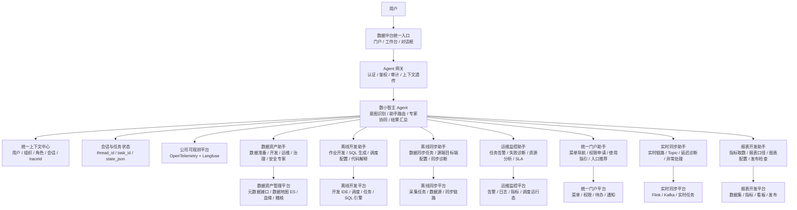
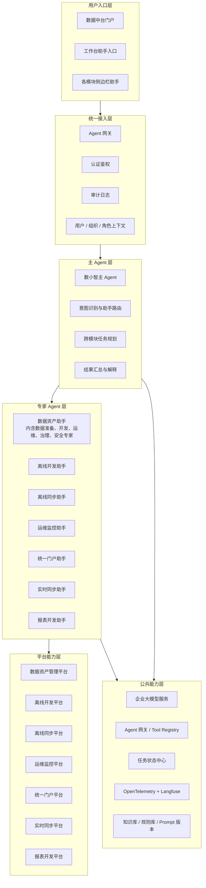
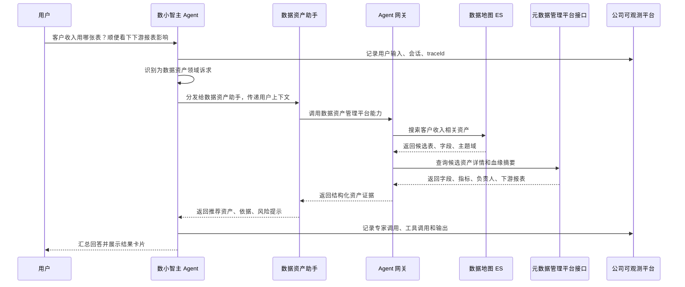

# 02 数据资产助手定位与数小智关系

## 1. 定位说明

数小智是数据中台统一智能助手，承担主 Agent 职责。它不直接承载所有专业能力，而是负责理解用户诉求、识别业务域、选择对应专家助手、汇总结果并统一返回。

数据资产助手是数小智下的一个数据资产专家助手，和离线开发助手、离线同步助手、运维监控助手、统一门户助手、实时同步助手、报表开发助手属于平级专业能力模块。

## 2. 整体结构图



## 3. 分层视图



## 2.1 数据资产助手内部专家划分

数据资产助手内部不再按平台模块直接拆 Agent，而是按业务工作视角抽象专家。一个专家对应一个 Agent，平台模块能力通过 Tool Adapter 供专家调用。

| 专家 Agent | 业务定位 | 包含的平台能力 |
| --- | --- | --- |
| 数据准备专家 | 帮用户完成“找到、理解、准备可用数据”的前置工作 | 数据源、元数据查询、查表查列、数据指标、数据建模、血缘查看 |
| 数据开发专家 | 支撑开发过程中的质量规则配置和结果查看 | 配置稽核、查看稽核详情 |
| 数据运维专家 | 支撑稽核和调度运行态处理 | 查看稽核任务运行状态、稽核任务重跑、终止、查看调度 DAG |
| 数据治理专家 | 支撑元数据和存储治理闭环 | AI 元数据治理、查询血缘、查询标准、查询词根、发起存储治理、查看存储治理规则 |
| 数据安全专家 | 支撑安全风险识别和权限办理 | 发起安全扫描、申请数据权限 |

这样划分后，数据地图、数据源、数据标准、数据血缘、安全扫描、数据稽核、数据权限、数据建模、数据指标等不再直接等同于 Agent，而是专家 Agent 可组合调用的工具能力。

## 4. 数小智与数据资产助手的关系



## 5. 主 Agent 职责

数小智主 Agent 负责平台级编排：

1. 识别用户问题属于哪个业务域。
2. 判断应该由哪个专家助手承接，并分发任务。
3. 对跨模块任务进行拆解和多专家协同。
4. 统一管理会话、任务状态、上下文和 traceId。
5. 对多个专家的结果进行汇总、去重、解释和下一步建议生成。
6. 对写操作、跨模块影响操作、批量操作执行统一确认策略。

## 6. 数据资产助手职责

数据资产助手只负责数据资产管理领域内的专业任务：

1. 数据资产搜索、查表、查字段、查指标。
2. 元数据详情查询、字段解释、指标口径解释。
3. 数据地图搜索，基于 Elasticsearch 加速资产检索。
4. 血缘分析、下游影响分析。
5. 数据标准匹配、元数据补全、治理建议生成。
6. 数据稽核规则草案生成和确认后创建。
7. 通过 Agent 网关和平台接口访问底层能力。

## 7. 跨专家协同示例

```text
用户：帮我找客户收入相关表，用它开发一张月度收入报表，并配置每日稽核。

数小智主 Agent 拆解：
1. 数据资产助手：查找客户收入权威表、字段、指标口径、血缘影响。
2. 报表开发助手：根据推荐资产生成报表数据集和图表配置建议。
3. 离线开发助手：必要时生成加工 SQL 或调度任务。
4. 数据稽核助手能力由数据资产助手承接：生成收入金额非空、波动、及时性规则草案。
5. 数小智汇总：返回报表开发建议、数据来源依据、稽核草案和待确认动作。
```

## 8. 设计原则

1. 数小智是主 Agent，负责统一入口、统一意图识别、统一助手分发、统一上下文和结果汇总。
2. 数据资产助手是数小智下的数据资产领域专家助手，不直接替代数小智。
3. 各专家助手平级，分别绑定对应数据中台模块能力。
4. 专家助手通过统一 Agent 网关和各自模块平台接口访问业务系统。
5. 公共能力包括企业大模型、Agent 网关、状态中心、OpenTelemetry、Langfuse、Prompt 管理和知识库。
6. 跨模块任务由数小智拆解，专家助手只处理自己领域内的专业任务。
7. 写操作必须经过用户确认，并由对应业务平台完成审计和权限校验。
