# 03 数据资产助手应用架构设计

## 1. 架构定位

数据资产助手作为数小智主 Agent 下的数据资产领域专家，应用架构上不替代现有数据资产管理平台。原数据资产平台入口网关无法承担 Agent 网关职责，因此需要从 0 到 1 新建 Agent 网关，在其后接入现有 Java API、ES、Oracle / GoldenDB、Activiti、调度平台和可观测平台。

应用架构重点解决：

1. 用户从哪里进入数据资产助手。
2. 请求如何经过 Agent 网关进入 AI 助手服务。
3. 不同 Prompt 如何选择固定问答、单次 Tool、固定状态机、Agentic Loop、流式生成、调度任务、人工确认等不同主控模式。
4. FastAPI、LangGraph、子 Agent、Tool Adapter 如何分工。
5. Tool 如何调用现有 Java API、ES、Activiti、调度平台和平台能力。
6. 用户、页面、资产、任务、证据、统一知识库召回和记忆上下文如何管理。
7. 会话状态、任务状态、助手记忆、观测数据分别放在哪里。

更细的技术架构、部署架构和数据架构不放入主线应用架构图中，统一沉淀在 [06-架构设计](06-架构设计/) 目录：

1. [01-数据资产助手技术架构设计](06-架构设计/01-数据资产助手技术架构设计.md)
2. [02-数据资产助手数据架构设计](06-架构设计/02-数据资产助手数据架构设计.md)
3. [03-数据资产助手部署架构设计](06-架构设计/03-数据资产助手部署架构设计.md)

## 2. 总体应用架构图

```mermaid
flowchart TB
  subgraph Portal[用户入口层]
    Web[数据资产管理平台前端<br/>数小智入口 / 数据资产助手面板<br/>对话框 / 确认卡片 / 任务进度]
  end

  subgraph GatewayLayer[平台接入层]
    Gateway[Agent 网关<br/>登录 / Token / 鉴权 / 审计 / 上下文透传]
    GatewayMock[Agent 网关 Mock<br/>Demo 阶段模拟 user_id / token / trace_id]
  end

  subgraph AssistantService[AI 助手服务层]
    FastAPI[FastAPI AI 助手服务<br/>/assistant/chat<br/>/assistant/confirm<br/>/assistant/tasks]
    Session[会话管理<br/>thread_id / user_id / trace_id]
    Confirm[确认管理<br/>候选表确认 / 治理草案确认 / 提交流程确认]
    Response[响应组装<br/>文本 / 卡片 / 表格 / 任务状态]
  end

  subgraph ContextLayer[上下文管理层]
    ContextMgr[上下文管理器<br/>Context Builder / Store / Policy]
    UserCtx[用户与权限上下文<br/>user / org / role / token / trace_id]
    PageCtx[页面与资产上下文<br/>current page / selected asset / filters]
    TaskCtx[会话与任务上下文<br/>thread_id / task_id / confirmed slots]
    EvidenceCtx[证据上下文<br/>标准 / 血缘 / 安全 / 质量]
    KnowledgeCtx[知识库上下文<br/>制度 / 规则 / 操作指引 / FAQ / 历史经验]
    ContextPolicy[上下文裁剪与脱敏<br/>优先级 / TTL / masking / permission filter]
  end

  subgraph AgentLayer[Agent 编排层]
    MainGraph[LangGraph 主编排<br/>Prompt Router / Control Mode Router / Executor]
    PromptRouter[Prompt Router<br/>Prompt 类型分类 / 风险判断 / 参数抽取]
    ControlRouter[主控模式路由<br/>Skill / Tool / StateMachine / Loop / Stream / Scheduler / Confirm / Handoff]
    SkillCtl[Skill 问答控制器<br/>操作指引 / 规则说明 / 模板回答]
    ToolCtl[单次 Tool 查询控制器<br/>明确查询 / 列表 / 详情]
    StateCtl[固定状态机控制器<br/>办理 / 提交 / 创建 / 审批]
    LoopCtl[Agentic Loop 控制器<br/>诊断 / 影响分析 / 证据补齐]
    StreamCtl[流式生成控制器<br/>报告 / 总结 / 说明]
    SchedulerCtl[调度任务控制器<br/>批量 / 定时 / 异步等待]
    HumanCtl[人工确认控制器<br/>写操作 / 高风险动作]
    HandoffCtl[子 Agent 转交控制器<br/>权限 / 血缘 / 安全 / 指标]
    StateNode[状态流转<br/>等待确认 / 继续执行 / 失败恢复]
    LLM[公司内网私有化大模型<br/>Function Calling / Tool Calling]
  end

  subgraph SubAgentLayer[领域子 Agent 层]
    MapAgent[数据地图 SubAgent<br/>找表 / 找字段 / 候选表解释]
    SourceAgent[数据源 SubAgent<br/>登记 / 连通性 / 采集状态]
    QualityAgent[数据稽核 SubAgent<br/>规则草案 / 稽核结果解释]
    PermissionAgent[数据权限 SubAgent<br/>权限判断 / 申请建议]
    SecurityAgent[安全扫描 SubAgent<br/>敏感识别 / 安全等级]
    LineageAgent[数据血缘 SubAgent<br/>上下游 / SQL任务 / 注释识别]
    GovernanceAgent[元数据治理 SubAgent<br/>中文名 / 备注 / 安全等级 / 流程提交]
    StandardAgent[数据标准 SubAgent<br/>标准查询 / 标准映射]
    ModelingAgent[数据建模 SubAgent<br/>主题域 / 模型建议]
    MetricAgent[数据指标 SubAgent<br/>指标口径 / 指标血缘]
  end

  subgraph ToolLayer[Tool Adapter 层]
    ToolRegistry[Tool Registry<br/>工具注册 / 参数 Schema / 权限标记]
    MapTool[数据地图 Tool<br/>search_data_map / get_asset_detail]
    StandardTool[数据标准 Tool<br/>get_data_standard]
    LineageTool[数据血缘 Tool<br/>query_lineage / get_sql_task_detail]
    SecurityTool[安全扫描 Tool<br/>scan_security_level]
    GovernanceTool[治理 Tool<br/>draft_governance / submit_activiti]
    MemoryTool[助手记忆 Tool<br/>get/save user preference]
  end

  subgraph PlatformLayer[现有平台能力层]
    JavaAPI[现有 Java API<br/>元数据 / 血缘 / 标准 / 安全扫描 / 稽核]
    ES[Elasticsearch<br/>数据地图搜索引擎]
    Activiti[Activiti 流程引擎<br/>治理流程 / 审批 / 待办]
    Scheduler[XXL-JOB / 现有调度平台<br/>轮询 / 补偿 / 超时提醒 / 批量触发]
    Collect[元数据采集服务<br/>采集后同步 ES]
  end

  subgraph DataStateLayer[数据与状态层]
    Redis[Redis<br/>会话运行态 / 待确认状态 / 临时槽位]
    GoldenDB[GoldenDB<br/>任务状态 / 用户确认 / 助手记忆 / 审计摘要]
    KnowledgeBase[统一知识库<br/>治理制度 / 操作手册 / 规则口径 / 经验案例]
    Oracle[Oracle<br/>当前数据资产平台库]
    ModelData[Mock 数据<br/>Demo 阶段样例资产 / 血缘 / 标准 / 安全等级]
  end

  subgraph ObsLayer[可观测与审计层]
    OTel[OpenTelemetry<br/>Trace / Metrics / Logs]
    Langfuse[Langfuse<br/>Prompt / LLM 调用 / Agent Trace / Feedback]
    Audit[平台审计<br/>用户确认 / 流程提交 / Tool 调用摘要]
  end

  Web --> Gateway
  Web -.Demo.-> GatewayMock
  Gateway --> FastAPI
  GatewayMock -.Demo.-> FastAPI

  FastAPI --> Session
  FastAPI --> Confirm
  FastAPI --> ContextMgr
  Session --> ContextMgr
  Confirm --> ContextMgr
  ContextMgr --> MainGraph
  Response --> FastAPI
  FastAPI --> Web

  ContextMgr --> UserCtx
  ContextMgr --> PageCtx
  ContextMgr --> TaskCtx
  ContextMgr --> EvidenceCtx
  ContextMgr --> KnowledgeCtx
  ContextMgr --> ContextPolicy

  MainGraph --> PromptRouter
  PromptRouter --> ControlRouter
  ControlRouter --> SkillCtl
  ControlRouter --> ToolCtl
  ControlRouter --> StateCtl
  ControlRouter --> LoopCtl
  ControlRouter --> StreamCtl
  ControlRouter --> SchedulerCtl
  ControlRouter --> HumanCtl
  ControlRouter --> HandoffCtl
  MainGraph --> StateNode
  MainGraph --> LLM
  SkillCtl --> Response
  ToolCtl --> ToolRegistry
  StateCtl --> Confirm
  StateCtl --> ToolRegistry
  LoopCtl --> ToolRegistry
  StreamCtl --> Response
  SchedulerCtl --> Scheduler
  HumanCtl --> Confirm
  HandoffCtl --> MapAgent
  HandoffCtl --> SourceAgent
  HandoffCtl --> QualityAgent
  HandoffCtl --> PermissionAgent
  HandoffCtl --> SecurityAgent
  HandoffCtl --> LineageAgent
  HandoffCtl --> GovernanceAgent
  HandoffCtl --> StandardAgent
  HandoffCtl --> ModelingAgent
  HandoffCtl --> MetricAgent

  MapAgent --> ToolRegistry
  SourceAgent --> ToolRegistry
  QualityAgent --> ToolRegistry
  PermissionAgent --> ToolRegistry
  SecurityAgent --> ToolRegistry
  LineageAgent --> ToolRegistry
  GovernanceAgent --> ToolRegistry
  StandardAgent --> ToolRegistry
  ModelingAgent --> ToolRegistry
  MetricAgent --> ToolRegistry

  ToolRegistry --> MapTool
  ToolRegistry --> StandardTool
  ToolRegistry --> LineageTool
  ToolRegistry --> SecurityTool
  ToolRegistry --> GovernanceTool
  ToolRegistry --> MemoryTool

  MapTool --> ES
  MapTool --> JavaAPI
  StandardTool --> JavaAPI
  LineageTool --> JavaAPI
  SecurityTool --> JavaAPI
  GovernanceTool --> JavaAPI
  GovernanceTool --> Activiti
  MemoryTool --> GoldenDB
  KnowledgeBase --> ContextMgr
  ContextMgr --> MemoryTool
  ToolRegistry --> Scheduler

  Collect --> JavaAPI
  Collect --> ES
  JavaAPI --> Oracle
  JavaAPI --> GoldenDB
  Activiti --> GoldenDB
  Scheduler --> GoldenDB

  Session --> Redis
  ContextMgr --> Redis
  ContextMgr --> GoldenDB
  ContextMgr --> ES
  ContextMgr --> JavaAPI
  StateNode --> Redis
  Confirm --> GoldenDB
  MainGraph --> GoldenDB
  MapTool -.Demo.-> ModelData
  StandardTool -.Demo.-> ModelData
  LineageTool -.Demo.-> ModelData
  SecurityTool -.Demo.-> ModelData
  GovernanceTool -.Demo.-> ModelData

  Gateway -.-> OTel
  FastAPI -.-> OTel
  MainGraph -.-> OTel
  ToolRegistry -.-> OTel
  LLM -.-> Langfuse
  MainGraph -.-> Langfuse
  Confirm -.-> Audit
  GovernanceTool -.-> Audit
```



## 3. 应用分层说明

| 层级 | 核心模块 | 职责 |
| --- | --- | --- |
| 用户入口层 | 数据资产管理平台前端、数小智入口 | 提供对话入口、候选表确认卡片、治理草案确认、任务进度展示 |
| 平台接入层 | Agent 网关、Agent 网关 Mock | 生产走 Agent 网关；Demo 先用 Agent 网关 Mock 注入用户上下文 |
| AI 助手服务层 | FastAPI、会话管理、确认管理、响应组装 | 承接请求、管理多轮会话、处理用户确认、返回结构化结果 |
| 上下文管理层 | Context Builder、Context Store、Context Policy、Knowledge Retriever | 统一组织用户、页面、资产、会话、任务、证据、知识库召回、记忆和权限上下文，并负责裁剪、脱敏、TTL 和传递策略 |
| Agent 编排层 | LangGraph、Prompt Router、Control Mode Router、状态流转、LLM | 不维护传统细粒度意图体系，先判断 Prompt 类型、风险等级和关键参数，再选择 Skill 问答、单次 Tool、固定状态机、Agentic Loop、流式生成、调度任务、人工确认或子 Agent 转交 |
| 领域子 Agent 层 | 数据地图、血缘、标准、安全扫描、元数据治理等 | 按专业领域拆分能力边界，避免一个 Agent 承担所有逻辑 |
| Tool Adapter 层 | Tool Registry、各类 Tool | 封装现有 Java API、ES、Activiti，统一入参、出参、异常和审计 |
| 现有平台能力层 | Java API、ES、Activiti、调度平台、元数据采集 | 复用已有平台能力，不重复建设业务系统；调度平台负责轮询、补偿、超时提醒和批量触发 |
| 数据与状态层 | 统一知识库、Redis、GoldenDB、Oracle、Mock 数据 | 统一知识库提供制度、规则、操作指引和历史经验；Redis 存运行态，GoldenDB 存任务态和助手记忆，Oracle/GoldenDB 承载平台业务数据 |
| 可观测与审计层 | OpenTelemetry、Langfuse、平台审计 | 跟踪请求链路、模型调用、Tool 调用、用户确认和流程提交 |

## 3.1 多主控模式说明

数据资产助手不采用传统的细粒度意图识别体系，也不采用“所有请求都走 Agentic Loop”的单一模式，而是采用 `Prompt Router + Control Mode Router` 的多主控模式架构。系统先识别 Prompt 的任务类型、风险等级和关键参数，再选择最合适的执行控制器。

| Prompt 类型 | 主控模式 | 典型问题 | 说明 |
| --- | --- | --- | --- |
| 操作指引 / 规则说明 | Skill 问答控制器 | 如何登记数据源、字段命名规范是什么 | 直接返回标准说明、入口、注意事项，不需要 Loop |
| 明确查询 | 单次 Tool 查询控制器 | 查一下表字段、查安全等级、查负责人 | 工具和输出明确，走确定性 Tool |
| 办理 / 提交 / 创建 | 固定状态机控制器 | 帮我登记数据源、提交治理流程、创建稽核规则 | 流程固定，涉及写操作时必须确认和审计 |
| 诊断 / 分析 / 排查 | Agentic Loop 控制器 | 为什么查不到表、这张表能不能下线 | 根据中间结果动态选择只读 Tool，补齐证据 |
| 报告 / 总结 / 说明生成 | 流式生成控制器 | 生成治理报告、整理评审口径 | 已有证据后进行长文本生成，提升等待体验 |
| 批量 / 定时 / 等待 | 调度任务控制器 | 每天检查缺备注表、流程完成后提醒 | 交给调度平台轮询、补偿、提醒，不让模型挂起等待 |
| 写操作 / 高风险动作 | 人工确认控制器 | 修改备注、提交审批、下线资产 | 必须停在确认节点，不能由 Loop 直接执行 |
| 跨领域专业问题 | 子 Agent 转交控制器 | 权限问题、血缘问题、安全风险、指标口径 | 由对应子 Agent 承接专业判断和工具组合 |

主控模式路由的核心判断口径：

```text
如果下一步动作可以在设计阶段写死，用固定流程。
如果下一步动作必须看中间结果再决定，用 Agentic Loop。
如果只是说明规则或操作步骤，用 Skill 模板。
如果只是查一个明确对象，用单次 Tool。
如果要等外部系统一段时间返回，用调度系统。
如果涉及写操作或生产影响，必须进入人工确认。
```

## 4. 单表元数据治理应用链路

```mermaid
flowchart LR
  User[用户输入表名] --> Front[数据资产平台前端]
  Front --> Gateway[Agent 网关 / Agent 网关 Mock]
  Gateway --> API[FastAPI AI 助手服务]
  API --> Graph[LangGraph 主编排]

  Graph --> MapAgent[数据地图 SubAgent]
  MapAgent --> MapTool[search_data_map_tool]
  MapTool --> Candidate[同名表候选<br/>数据源ID / schema / 表名]
  Candidate --> ConfirmTable[用户二次确认唯一表]

  ConfirmTable --> Context[上下文管理层<br/>固化已确认表 / 读取知识 / 读取偏好 / 裁剪证据]
  Context --> Knowledge[统一知识库<br/>字段规范 / 治理规则 / 历史经验]
  Context --> MemoryTool[助手记忆 Tool]
  MemoryTool --> PrefDB[助手库表<br/>agent_user_preference]

  Context --> StandardAgent[数据标准 SubAgent]
  Context --> LineageAgent[数据血缘 SubAgent]
  Context --> SecurityAgent[安全扫描 SubAgent]

  StandardAgent --> StandardTool[get_data_standard_tool]
  LineageAgent --> LineageTool[query_upstream_lineage_tool<br/>get_sql_task_detail_tool]
  SecurityAgent --> SecurityTool[scan_security_level_tool]

  StandardTool --> Evidence[治理依据汇总]
  LineageTool --> Evidence
  SecurityTool --> Evidence

  Evidence --> GovernanceAgent[元数据治理 SubAgent]
  GovernanceAgent --> Draft[治理草案<br/>中文名 / 备注 / 安全等级]
  Draft --> ConfirmDraft[用户确认提交]
  ConfirmDraft --> ActivitiTool[submit_activiti_process_tool]
  ActivitiTool --> Activiti[Activiti 流程实例]
  ActivitiTool --> Scheduler[调度平台<br/>注册流程轮询 / 超时提醒]
  Activiti --> Result[返回流程实例ID / 当前节点 / 待办人]
  Scheduler --> Result
```



## 5. Demo 与生产差异

| 模块 | Demo 阶段 | 生产阶段 |
| --- | --- | --- |
| Agent 网关 | Agent 网关 Mock | Agent 网关 |
| 用户身份 | Mock user_id / token / trace_id | Agent 网关登录接口获取 token 并透传 |
| 数据地图 | Mock 表候选数据 | ES 数据地图搜索引擎 / 平台搜索接口 |
| 元数据详情 | Mock 字段与备注 | 现有元数据 Java API |
| 数据标准 | Mock 标准结果 | 数据标准 Java API |
| 数据血缘 | Mock 上游血缘和 SQL 任务 | 现有血缘 Java API / 离线开发任务接口 |
| 安全扫描 | Mock 安全等级 | 安全扫描 Java API |
| 流程提交 | Mock Activiti 流程实例 ID | 现有 Activiti 流程接口 |
| 调度系统 | Demo 内存定时器 / 手动刷新 | XXL-JOB / 现有企业调度平台 |
| 统一知识库 | Mock 规则说明 / Mock 操作指引 / Mock 历史经验 | 已建设统一知识库，按任务类型提供制度、规则、操作指引、FAQ 和历史经验召回 |
| 上下文管理 | Demo 内存上下文包 / Mock 知识召回 / Mock 偏好 / Mock 页面态 | Context Builder + Knowledge Retriever + Redis + GoldenDB + 权限过滤 + 脱敏策略 |
| 助手记忆 | Mock 偏好数据 | 助手库表 |
| 状态存储 | 本地内存 / Redis 可选 | Redis + GoldenDB |
| 可观测 | 预埋 trace_id | OpenTelemetry + Langfuse |

## 6. 架构落地原则

1. 数据资产助手不直接操作平台数据库，优先通过现有 Java API、ES 和 Activiti 接口完成业务动作。
2. FastAPI 只作为 AI 助手服务入口和 Tool Adapter 承载层，不承接现有平台的核心业务逻辑。
3. LangGraph 负责会话内状态流转、主控模式路由和 Agent 编排，子 Agent 负责领域判断，Tool 负责确定性接口调用。
4. Agentic Loop 只用于路径不确定的诊断、分析、影响评估和证据补齐，不作为所有请求的默认主控。
5. 调度系统负责会话外的异步轮询、失败补偿、超时提醒和批量触发，不直接承担大模型推理。
6. 写操作必须经过用户确认，确认记录落库后再提交 Activiti。
7. 内网登录密码、token、数据库连接串等敏感信息必须脱敏，不进入 Langfuse 明文记录。
8. 统一知识库作为公共知识来源，不在数据资产助手内重复建设；上下文管理层负责按任务召回、裁剪、引用和版本追溯。
9. 上下文管理层负责在进入 LangGraph 和 LLM 前完成上下文汇聚、裁剪、脱敏和权限过滤。
10. Demo 先用 Mock 数据跑通主链路，再逐步替换为真实接口。
