# 03 数据资产助手应用架构设计

## 1. 架构定位

数据资产助手作为数小智主 Agent 下的数据资产领域专家，应用架构上不替代现有数据资产管理平台，而是在现有平台 Gateway、Java API、ES、Oracle / GoldenDB、Activiti、可观测平台之上增加一层 AI 编排与工具适配能力。

应用架构重点解决：

1. 用户从哪里进入数据资产助手。
2. 请求如何经过现有 Gateway 进入 AI 助手服务。
3. FastAPI、LangGraph、子 Agent、Tool Adapter 如何分工。
4. Tool 如何调用现有 Java API、ES、Activiti 和平台能力。
5. 会话状态、任务状态、助手记忆、观测数据分别放在哪里。

更细的技术架构、部署架构和数据架构不放入主线应用架构图中，统一沉淀在 [06-架构设计](06-架构设计/) 目录：

1. [01-数据资产助手技术架构设计](06-架构设计/01-数据资产助手技术架构设计.md)
2. [02-数据资产助手数据架构设计](06-架构设计/02-数据资产助手数据架构设计.md)
3. [03-数据资产助手部署架构设计](06-架构设计/03-数据资产助手部署架构设计.md)

## 2. 总体应用架构图

```mermaid
flowchart TB
  subgraph Portal[用户入口层]
    Web[数据资产管理平台前端<br/>数小智入口 / 数据资产助手面板<br/>对话框 / 确认卡片 / 任务进度]
  end

  subgraph GatewayLayer[平台接入层]
    Gateway[现有数据资产管理 Gateway<br/>登录 / Token / 鉴权 / 审计 / 上下文透传]
    GatewayMock[Gateway Mock<br/>Demo 阶段模拟 user_id / token / trace_id]
  end

  subgraph AssistantService[AI 助手服务层]
    FastAPI[FastAPI AI 助手服务<br/>/assistant/chat<br/>/assistant/confirm<br/>/assistant/tasks]
    Session[会话管理<br/>thread_id / user_id / trace_id]
    Confirm[确认管理<br/>候选表确认 / 治理草案确认 / 提交流程确认]
    Response[响应组装<br/>文本 / 卡片 / 表格 / 任务状态]
  end

  subgraph AgentLayer[Agent 编排层]
    MainGraph[LangGraph 主编排<br/>Router / Planner / Executor / Aggregator]
    Intent[意图识别与槽位抽取]
    StateNode[状态流转<br/>等待确认 / 继续执行 / 失败恢复]
    LLM[公司内网私有化大模型<br/>Function Calling / Tool Calling]
  end

  subgraph SubAgentLayer[领域子 Agent 层]
    MapAgent[数据地图 SubAgent<br/>找表 / 找字段 / 候选表解释]
    SourceAgent[数据源 SubAgent<br/>登记 / 连通性 / 采集状态]
    QualityAgent[数据稽核 SubAgent<br/>规则草案 / 稽核结果解释]
    PermissionAgent[数据权限 SubAgent<br/>权限判断 / 申请建议]
    SecurityAgent[安全扫描 SubAgent<br/>敏感识别 / 安全等级]
    LineageAgent[数据血缘 SubAgent<br/>上下游 / SQL任务 / 注释识别]
    GovernanceAgent[元数据治理 SubAgent<br/>中文名 / 备注 / 安全等级 / 流程提交]
    StandardAgent[数据标准 SubAgent<br/>标准查询 / 标准映射]
    ModelingAgent[数据建模 SubAgent<br/>主题域 / 模型建议]
    MetricAgent[数据指标 SubAgent<br/>指标口径 / 指标血缘]
  end

  subgraph ToolLayer[Tool Adapter 层]
    ToolRegistry[Tool Registry<br/>工具注册 / 参数 Schema / 权限标记]
    MapTool[数据地图 Tool<br/>search_data_map / get_asset_detail]
    StandardTool[数据标准 Tool<br/>get_data_standard]
    LineageTool[数据血缘 Tool<br/>query_lineage / get_sql_task_detail]
    SecurityTool[安全扫描 Tool<br/>scan_security_level]
    GovernanceTool[治理 Tool<br/>draft_governance / submit_activiti]
    MemoryTool[助手记忆 Tool<br/>get/save user preference]
  end

  subgraph PlatformLayer[现有平台能力层]
    JavaAPI[现有 Java API<br/>元数据 / 血缘 / 标准 / 安全扫描 / 稽核]
    ES[Elasticsearch<br/>数据地图搜索引擎]
    Activiti[Activiti 流程引擎<br/>治理流程 / 审批 / 待办]
    Collect[元数据采集服务<br/>采集后同步 ES]
  end

  subgraph DataStateLayer[数据与状态层]
    Redis[Redis<br/>会话运行态 / 待确认状态 / 临时槽位]
    GoldenDB[GoldenDB<br/>任务状态 / 用户确认 / 助手记忆 / 审计摘要]
    Oracle[Oracle<br/>当前数据资产平台库]
    ModelData[Mock 数据<br/>Demo 阶段样例资产 / 血缘 / 标准 / 安全等级]
  end

  subgraph ObsLayer[可观测与审计层]
    OTel[OpenTelemetry<br/>Trace / Metrics / Logs]
    Langfuse[Langfuse<br/>Prompt / LLM 调用 / Agent Trace / Feedback]
    Audit[平台审计<br/>用户确认 / 流程提交 / Tool 调用摘要]
  end

  Web --> Gateway
  Web -.Demo.-> GatewayMock
  Gateway --> FastAPI
  GatewayMock -.Demo.-> FastAPI

  FastAPI --> Session
  FastAPI --> Confirm
  FastAPI --> MainGraph
  Response --> FastAPI
  FastAPI --> Web

  MainGraph --> Intent
  MainGraph --> StateNode
  MainGraph --> LLM
  MainGraph --> MapAgent
  MainGraph --> SourceAgent
  MainGraph --> QualityAgent
  MainGraph --> PermissionAgent
  MainGraph --> SecurityAgent
  MainGraph --> LineageAgent
  MainGraph --> GovernanceAgent
  MainGraph --> StandardAgent
  MainGraph --> ModelingAgent
  MainGraph --> MetricAgent

  MapAgent --> ToolRegistry
  SourceAgent --> ToolRegistry
  QualityAgent --> ToolRegistry
  PermissionAgent --> ToolRegistry
  SecurityAgent --> ToolRegistry
  LineageAgent --> ToolRegistry
  GovernanceAgent --> ToolRegistry
  StandardAgent --> ToolRegistry
  ModelingAgent --> ToolRegistry
  MetricAgent --> ToolRegistry

  ToolRegistry --> MapTool
  ToolRegistry --> StandardTool
  ToolRegistry --> LineageTool
  ToolRegistry --> SecurityTool
  ToolRegistry --> GovernanceTool
  ToolRegistry --> MemoryTool

  MapTool --> ES
  MapTool --> JavaAPI
  StandardTool --> JavaAPI
  LineageTool --> JavaAPI
  SecurityTool --> JavaAPI
  GovernanceTool --> JavaAPI
  GovernanceTool --> Activiti
  MemoryTool --> GoldenDB

  Collect --> JavaAPI
  Collect --> ES
  JavaAPI --> Oracle
  JavaAPI --> GoldenDB
  Activiti --> GoldenDB

  Session --> Redis
  StateNode --> Redis
  Confirm --> GoldenDB
  MainGraph --> GoldenDB
  MapTool -.Demo.-> ModelData
  StandardTool -.Demo.-> ModelData
  LineageTool -.Demo.-> ModelData
  SecurityTool -.Demo.-> ModelData
  GovernanceTool -.Demo.-> ModelData

  Gateway -.-> OTel
  FastAPI -.-> OTel
  MainGraph -.-> OTel
  ToolRegistry -.-> OTel
  LLM -.-> Langfuse
  MainGraph -.-> Langfuse
  Confirm -.-> Audit
  GovernanceTool -.-> Audit
```

## 3. 应用分层说明

| 层级 | 核心模块 | 职责 |
| --- | --- | --- |
| 用户入口层 | 数据资产管理平台前端、数小智入口 | 提供对话入口、候选表确认卡片、治理草案确认、任务进度展示 |
| 平台接入层 | 现有 Gateway、Gateway Mock | 生产走现有 Gateway；Demo 先用 Gateway Mock 注入用户上下文 |
| AI 助手服务层 | FastAPI、会话管理、确认管理、响应组装 | 承接请求、管理多轮会话、处理用户确认、返回结构化结果 |
| Agent 编排层 | LangGraph、意图识别、状态流转、LLM | 识别意图、规划步骤、调度子 Agent、控制人工确认节点 |
| 领域子 Agent 层 | 数据地图、血缘、标准、安全扫描、元数据治理等 | 按专业领域拆分能力边界，避免一个 Agent 承担所有逻辑 |
| Tool Adapter 层 | Tool Registry、各类 Tool | 封装现有 Java API、ES、Activiti，统一入参、出参、异常和审计 |
| 现有平台能力层 | Java API、ES、Activiti、元数据采集 | 复用已有平台能力，不重复建设业务系统 |
| 数据与状态层 | Redis、GoldenDB、Oracle、Mock 数据 | Redis 存运行态，GoldenDB 存任务态和助手记忆，Oracle/GoldenDB 承载平台业务数据 |
| 可观测与审计层 | OpenTelemetry、Langfuse、平台审计 | 跟踪请求链路、模型调用、Tool 调用、用户确认和流程提交 |

## 4. 单表元数据治理应用链路

```mermaid
flowchart LR
  User[用户输入表名] --> Front[数据资产平台前端]
  Front --> Gateway[Gateway / Gateway Mock]
  Gateway --> API[FastAPI AI 助手服务]
  API --> Graph[LangGraph 主编排]

  Graph --> MapAgent[数据地图 SubAgent]
  MapAgent --> MapTool[search_data_map_tool]
  MapTool --> Candidate[同名表候选<br/>数据源ID / schema / 表名]
  Candidate --> ConfirmTable[用户二次确认唯一表]

  ConfirmTable --> Context[填写或读取常用空间 / 项目 / 开发账号]
  Context --> MemoryTool[助手记忆 Tool]
  MemoryTool --> PrefDB[助手库表<br/>agent_user_preference]

  Context --> StandardAgent[数据标准 SubAgent]
  Context --> LineageAgent[数据血缘 SubAgent]
  Context --> SecurityAgent[安全扫描 SubAgent]

  StandardAgent --> StandardTool[get_data_standard_tool]
  LineageAgent --> LineageTool[query_upstream_lineage_tool<br/>get_sql_task_detail_tool]
  SecurityAgent --> SecurityTool[scan_security_level_tool]

  StandardTool --> Evidence[治理依据汇总]
  LineageTool --> Evidence
  SecurityTool --> Evidence

  Evidence --> GovernanceAgent[元数据治理 SubAgent]
  GovernanceAgent --> Draft[治理草案<br/>中文名 / 备注 / 安全等级]
  Draft --> ConfirmDraft[用户确认提交]
  ConfirmDraft --> ActivitiTool[submit_activiti_process_tool]
  ActivitiTool --> Activiti[Activiti 流程实例]
  Activiti --> Result[返回流程实例ID / 当前节点 / 待办人]
```

## 5. Demo 与生产差异

| 模块 | Demo 阶段 | 生产阶段 |
| --- | --- | --- |
| Gateway | Gateway Mock | 现有数据资产管理 Gateway |
| 用户身份 | Mock user_id / token / trace_id | Gateway 登录接口获取 token 并透传 |
| 数据地图 | Mock 表候选数据 | ES 数据地图搜索引擎 / 平台搜索接口 |
| 元数据详情 | Mock 字段与备注 | 现有元数据 Java API |
| 数据标准 | Mock 标准结果 | 数据标准 Java API |
| 数据血缘 | Mock 上游血缘和 SQL 任务 | 现有血缘 Java API / 离线开发任务接口 |
| 安全扫描 | Mock 安全等级 | 安全扫描 Java API |
| 流程提交 | Mock Activiti 流程实例 ID | 现有 Activiti 流程接口 |
| 助手记忆 | Mock 偏好数据 | 助手库表 |
| 状态存储 | 本地内存 / Redis 可选 | Redis + GoldenDB |
| 可观测 | 预埋 trace_id | OpenTelemetry + Langfuse |

## 6. 架构落地原则

1. 数据资产助手不直接操作平台数据库，优先通过现有 Java API、ES 和 Activiti 接口完成业务动作。
2. FastAPI 只作为 AI 助手服务入口和 Tool Adapter 承载层，不承接现有平台的核心业务逻辑。
3. LangGraph 负责状态流转和编排，子 Agent 负责领域判断，Tool 负责确定性接口调用。
4. 写操作必须经过用户确认，确认记录落库后再提交 Activiti。
5. 内网登录密码、token、数据库连接串等敏感信息必须脱敏，不进入 Langfuse 明文记录。
6. Demo 先用 Mock 数据跑通主链路，再逐步替换为真实接口。
