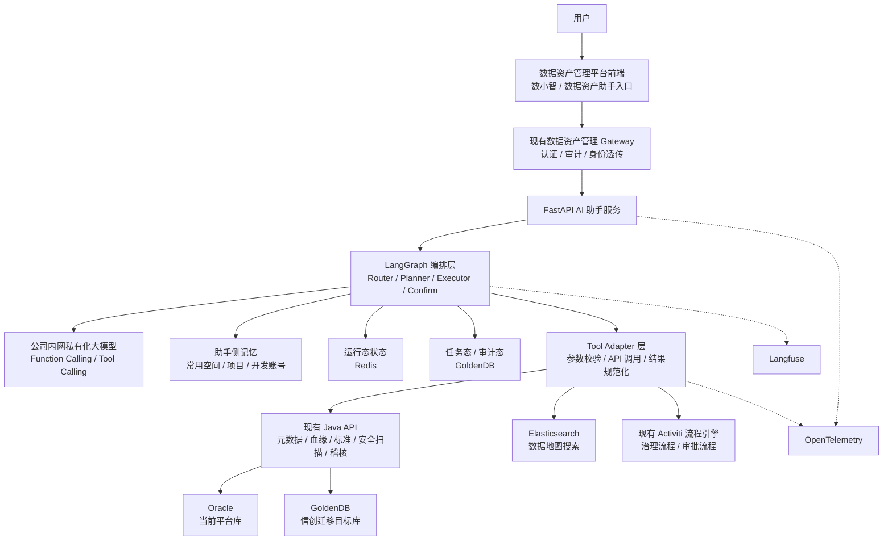
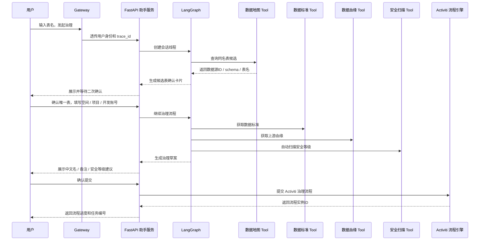

# 05 数据资产助手技术选型方案

## 1. 方案定位

本文档用于沉淀数据资产助手从 Demo 到生产落地的技术选型结论、待确认问题和分阶段实施边界。

当前不是重新做大方向选型，而是在已有平台基础上确定工程落地方式：

```text
现有数据资产管理平台能力
  -> 现有 Gateway 统一入口
  -> FastAPI AI 助手服务
  -> LangGraph Agent 编排
  -> Tool Adapter 调用现有 Java API
  -> Activiti 流程引擎承接治理类任务
  -> 公司 OpenTelemetry + Langfuse 可观测平台
```

## 2. 已确定技术选型

| 选型项 | 结论 | 说明 |
| --- | --- | --- |
| 大模型 | 公司内网大模型，私有化部署 | 满足内网数据安全要求，支持 Function Calling / Tool Calling |
| Agent 编排 | LangGraph | 用于 Router、Planner、子 Agent 调度、状态流转和人工确认节点 |
| 服务框架 | Python + FastAPI | 作为 AI 助手服务入口，对接现有 Gateway 和 LangGraph |
| 入口网关 | 复用现有数据资产管理 Gateway 服务 | 负责认证、身份透传、审计、统一入口，不新建独立前端入口 |
| 平台后端库 | Oracle / GoldenDB | Oracle 是当前数据资产管理平台后端库，GoldenDB 是信创迁移目标库 |
| 数据地图搜索 | Elasticsearch | 元数据采集后同步到 ES，用于提升数据地图搜索速度 |
| 状态存储 | Redis + GoldenDB 两者结合 | Redis 承载短期会话和运行态，GoldenDB 承载长期任务和审计态 |
| 流程引擎 | 现有 Activiti 流程引擎 | 单表元数据治理等写操作提交到已有流程体系 |
| 记忆能力 | 助手侧记忆 | 记录用户常用空间、项目、开发账号等偏好信息 |
| 可观测 | 公司现有 OpenTelemetry + Langfuse 平台 | 复用公司可观测平台，不重复建设 |
| Demo 数据 | Mock 数据 | 先跑通 Demo，预留真实接口适配层 |

## 3. 总体技术架构



## 4. 大模型选型

### 4.1 选型结论

采用公司内网私有化部署大模型，前提是支持 Function Calling / Tool Calling。

### 4.2 主要原因

1. 数据资产、元数据、血缘、字段信息、空间项目信息都属于企业内部数据，优先使用内网模型。
2. 数据资产助手不是纯问答场景，必须通过 Tool Calling 调用现有平台接口。
3. 元数据治理、数据源登记、稽核规则生成等场景需要结构化输出，Function Calling 更容易约束入参和结果。
4. 后续可以把关键工具调用过程纳入 Langfuse 观测，便于分析模型是否正确选 Tool、是否漏调 Tool。

### 4.3 模型能力要求

| 能力 | 要求 |
| --- | --- |
| Function Calling / Tool Calling | 必须支持 |
| JSON 结构化输出 | 必须支持 |
| 中文业务语义理解 | 必须支持 |
| 多轮上下文 | 必须支持 |
| 长上下文 | 建议支持，用于血缘摘要、SQL 任务代码、字段列表分析 |
| 私有化部署 | 必须支持 |
| 调用日志可观测 | 建议支持，至少能记录 request_id、trace_id、token、耗时 |

## 5. 状态存储选型

### 5.1 选型结论

采用 Redis + GoldenDB 两者结合。

```text
Redis：短期、高频、可过期的会话运行态。
GoldenDB：长期、可追溯、可审计的任务状态和用户偏好。
```

### 5.2 推荐分工

| 数据类型 | 推荐存储 | 说明 |
| --- | --- | --- |
| 当前会话上下文 | Redis | thread_id、最近几轮对话、临时槽位 |
| LangGraph 中间状态 | Redis | 当前节点、待确认动作、临时执行计划 |
| 用户常用空间 / 项目 / 开发账号 | GoldenDB 或助手侧记忆库 | 需要长期保存，支持用户更新 |
| Agent 任务记录 | GoldenDB | task_id、任务类型、执行状态、创建人、更新时间 |
| 用户确认记录 | GoldenDB | 写操作、流程提交前的二次确认留痕 |
| Tool 调用摘要 | GoldenDB + 可观测平台 | 业务审计放库，调用链细节进 OTel / Langfuse |
| Trace / Span / Prompt 调用 | OpenTelemetry + Langfuse | 不建议放业务库 |

## 6. Tool 接入方式选型分析

当前建议一期采用 FastAPI 内 Tool Adapter 方案。这里先给出三种可选方式和优劣势，并补充首批 Tool 清单草案，后续由业务和接口负责人继续补充。

### 6.1 方案 A：FastAPI 直接调用现有 Java API

```text
LangGraph Node -> Python Tool 函数 -> requests/httpx -> 现有 Java API
```

| 维度 | 分析 |
| --- | --- |
| 优点 | 实现最快，Demo 和一期最容易落地；不改造现有 Java 服务；接口链路短 |
| 缺点 | Python 侧会散落大量接口调用逻辑；工具协议不统一时，后期维护成本较高 |
| 适合阶段 | Demo / 一期试点 |
| 风险 | 需要做好超时、重试、错误码规范、接口鉴权和 trace_id 透传 |

### 6.2 方案 B：在 FastAPI 内建设 Tool Adapter 层

```text
LangGraph Node -> Tool Registry -> Tool Adapter -> 现有 Java API
```

| 维度 | 分析 |
| --- | --- |
| 优点 | 对 Agent 暴露统一 Tool 协议；便于 Mock 和真实接口切换；后续容易升级为 MCP |
| 缺点 | 前期需要多设计一层工具注册、参数校验、错误处理规范 |
| 适合阶段 | 推荐作为一期正式方案 |
| 风险 | 需要控制 Adapter 不要变成新的业务系统，只做协议转换和结果规范化 |

### 6.3 方案 C：直接建设 MCP Server

```text
LangGraph / 多 Agent -> MCP Client -> Metadata MCP / Lineage MCP / Security MCP
```

| 维度 | 分析 |
| --- | --- |
| 优点 | 工具能力标准化、平台化，方便数小智下多个专家助手复用 |
| 缺点 | 前期建设成本高；接口协议未稳定前容易返工；Demo 会被基础设施拖慢 |
| 适合阶段 | 二期或三期，等 Tool 协议稳定后再做 |
| 风险 | 过早 MCP 化会增加部署、鉴权、审计、版本治理复杂度 |

### 6.4 推荐结论

建议采用分阶段策略：

```text
Demo 阶段：
  使用 Mock Tool Adapter，验证 LangGraph 编排和用户交互。

一期阶段：
  在 FastAPI 内建设 Tool Adapter 层，对接现有 Java API。

二期阶段：
  把稳定、高复用的 Tool 沉淀为 Skill 使用规范。

三期阶段：
  将血缘、元数据、数据标准、安全扫描等高复用能力升级为 MCP Server。
```

优先级建议：

| 能力 | Demo | 一期 Tool Adapter | 后续 MCP |
| --- | --- | --- | --- |
| 数据地图搜索 | Mock | 对接 ES / 平台搜索接口 | 可选 |
| 元数据详情 | Mock | 对接元数据 Java API | 建议 |
| 数据血缘 | Mock | 对接现有血缘 Java API | 建议优先 MCP 化 |
| 数据标准 | Mock | 对接数据标准 Java API | 建议 |
| 安全扫描 | Mock | 对接安全扫描 Java API | 建议 |
| Activiti 流程提交 | Mock | 对接现有流程接口 | 暂不优先 MCP 化 |

### 6.5 首批 Tool 清单草案

首批 Tool 以单表元数据治理 Demo 为主线，先覆盖“找表、确认表、补全治理信息、提交流程”。

| Tool 名称 | 所属子 Agent | 主要用途 | Demo 实现 | 一期真实接口 |
| --- | --- | --- | --- | --- |
| search_data_map_tool | 数据地图 | 根据自然语言表名搜索同名表候选 | Mock 同名表列表 | ES 数据地图搜索接口 / 平台搜索接口 |
| get_asset_detail_tool | 数据地图 | 获取表、字段、负责人、主题域等元数据详情 | Mock 表字段详情 | 元数据 Java API |
| get_user_common_context_tool | 助手记忆 | 获取用户常用空间、项目、开发账号 | Mock 用户偏好 | 助手库表 |
| save_user_common_context_tool | 助手记忆 | 保存用户确认后的常用空间、项目、开发账号 | Mock 保存 | 助手库表 |
| get_data_standard_tool | 数据标准 | 获取命名规范、字段标准、码值标准 | Mock 标准结果 | 数据标准 Java API |
| query_upstream_lineage_tool | 数据血缘 | 获取当前表上游血缘和加工链路 | Mock 血缘结果 | 血缘 Java API |
| get_sql_task_detail_tool | 数据血缘 | 查看 SQL 加工任务信息 | Mock SQL 任务 | 离线开发 / 血缘任务接口 |
| extract_sql_comment_tool | 数据血缘 | 识别加工任务中的代码注释，并生成目标表备注建议 | 本地 LLM 解析 | LLM + SQL 任务接口 |
| scan_security_level_tool | 安全扫描 | 自动识别字段敏感等级和表安全等级 | Mock 安全等级 | 安全扫描 Java API |
| draft_metadata_governance_tool | 元数据治理 | 汇总标准、血缘、安全扫描结果，生成治理草案 | 本地规则 + LLM | 元数据治理服务 |
| submit_activiti_process_tool | 元数据治理 | 用户确认后提交单表治理流程 | Mock 流程实例 ID | Activiti 流程接口 |
| query_process_status_tool | 元数据治理 | 查询治理流程进度 | Mock 流程状态 | Activiti 流程接口 |

后续可补充字段：

| 字段 | 说明 |
| --- | --- |
| Tool 入参 | 例如 table_name、datasource_id、schema、table_id、space_id、project_id |
| Tool 出参 | 统一包含 success、data、error_code、error_message、evidence |
| 是否写操作 | 写操作必须用户确认 |
| 是否需要脱敏 | 涉及密码、Token、敏感字段样例时必须脱敏 |
| 超时策略 | 默认超时时间、重试次数、失败降级方式 |
| 审计字段 | user_id、trace_id、thread_id、task_id |

## 7. 身份透传与权限上下文

### 7.1 当前结论

采用“调用 Gateway 登录接口获取 token，然后透传 token 和用户上下文”的方案。

虽然元数据治理场景不需要单独校验权限，但助手调用平台接口、展示数据、提交流程时仍然必须携带用户身份和上下文。

### 7.2 推荐传递内容

| 上下文字段 | 说明 |
| --- | --- |
| user_id | 当前登录用户 |
| user_name | 展示和审计使用 |
| tenant_id / org_id | 多组织、多租户场景 |
| role_codes | 辅助平台接口做权限判断 |
| access_token | 调用现有 Java API 的认证凭证 |
| token_expire_time | 判断 token 是否需要刷新 |
| trace_id | 串联 Gateway、FastAPI、Java API、可观测平台 |
| space_id | 中台空间 |
| project_id | 中台项目 |
| dev_account | 开发账号 |

### 7.3 推荐调用链路

```text
数据资产平台前端
  -> 现有 Gateway 登录接口
  -> 获取 access_token / 用户信息
  -> 前端请求现有 Gateway 的助手入口
  -> Gateway 转发给 FastAPI AI 助手服务
  -> FastAPI Tool Adapter 调用现有 Java API 时透传 token
```

推荐原则：

1. FastAPI AI 助手服务不直接面向前端暴露，统一走现有 Gateway。
2. Gateway 负责登录、认证、基础审计和请求转发。
3. FastAPI 只接收 Gateway 转发的可信请求。
4. Tool Adapter 调用 Java API 时透传 token、user_id、trace_id。
5. token 过期时优先由 Gateway 或前端重新获取，不建议助手服务保存用户明文密码。

### 7.4 待确认问题

1. Gateway 登录接口返回的 token 类型、有效期和刷新机制。
2. Gateway 转发到 FastAPI 时使用 Header、Cookie 还是请求体传递用户上下文。
3. 现有 Java API 是否全部支持透传 Gateway token。
4. Activiti 流程接口是否支持使用用户 token 作为流程发起人。
5. token、密码、开发账号等敏感字段的脱敏和日志屏蔽规则。

## 8. 任务执行模式

### 8.1 选型结论

治理类写操作提交到现有 Activiti 流程引擎。

流程发起人采用用户身份，不使用助手服务账号代发。助手只负责生成草案、组织入参和提交动作，流程归属、审批留痕、后续待办都应该落在真实用户身份上。

### 8.2 适用场景

| 场景 | 执行模式 |
| --- | --- |
| 查表、查字段、查血缘 | 同步查询，直接返回 |
| 生成治理建议 | 同步生成草案，等待用户确认 |
| 单表元数据治理 | 用户确认后提交 Activiti 流程 |
| 数据源登记 | 用户确认后提交现有登记 / 审批流程 |
| 数据稽核规则创建 | 用户确认后调用稽核平台或流程接口 |
| 批量修改 / 发布 / 下线 | 必须进入流程审批 |

### 8.3 单表元数据治理推荐链路



## 9. 助手侧记忆

### 9.1 选型结论

用户常用空间、项目、开发账号采用助手侧记忆。

记忆数据落在助手库表中，不放在 Prompt 中长期保存，也不依赖浏览器本地缓存作为唯一来源。

### 9.2 记忆内容

| 记忆项 | 说明 |
| --- | --- |
| 常用空间 | 用户多次治理时自动预填 |
| 常用项目 | 与空间联动 |
| 常用开发账号 | 发起开发或治理流程时预填 |
| 最近治理对象 | 便于继续上一次任务 |
| 常用查询偏好 | 例如默认环境、默认数据源类型 |

### 9.3 使用原则

1. 记忆只做预填和推荐，不替用户直接确认。
2. 提交流程前必须展示实际使用的空间、项目、开发账号。
3. 用户可以修改、覆盖、清除记忆。
4. 敏感信息不进入 Prompt 明文，必要时只传 ID 或脱敏展示。

### 9.4 助手库表建议

助手侧记忆建议单独建设库表，和平台核心业务表保持低耦合。

```text
agent_user_preference
  - id
  - user_id
  - preference_type
  - preference_key
  - preference_value
  - source
  - last_used_time
  - created_time
  - updated_time
```

建议优先保存以下类型：

| preference_type | 示例 | 说明 |
| --- | --- | --- |
| common_space | space_id / space_name | 常用中台空间 |
| common_project | project_id / project_name | 常用项目 |
| common_dev_account | dev_account | 常用开发账号 |
| recent_asset | table_id / table_name | 最近治理或查询的资产 |
| default_env | dev / test / prod | 默认环境偏好 |

### 9.5 LangGraph 状态持久化建议

LangGraph 状态建议采用“Redis 运行态 + GoldenDB 任务态”的方式。

### Redis Key 建议

| Key | 用途 | 过期策略 |
| --- | --- | --- |
| agent:thread:{thread_id} | 当前会话上下文、最近消息、当前节点 | 24 小时或 7 天 |
| agent:pending_confirm:{confirm_id} | 待用户确认的候选表、治理草案、提交流程入参 | 24 小时 |
| agent:runtime:{task_id} | LangGraph 当前执行状态、临时槽位 | 24 小时 |
| agent:lock:{task_id} | 防止重复提交流程 | 5 到 30 分钟 |

### GoldenDB 表建议

| 表名 | 用途 |
| --- | --- |
| agent_task | Agent 任务主表，保存 task_id、user_id、task_type、status |
| agent_task_step | 子步骤执行记录，保存节点、Tool、耗时、结果摘要 |
| agent_user_confirm | 用户确认记录，保存确认内容、确认时间、确认人 |
| agent_user_preference | 助手侧记忆，保存常用空间、项目、开发账号 |
| agent_tool_call_audit | Tool 调用审计摘要，保存 trace_id、tool_name、success、error_code |

### 状态保存原则

1. Redis 保存可恢复的短期运行态，不作为唯一审计依据。
2. GoldenDB 保存任务主线、用户确认和关键 Tool 调用摘要。
3. OpenTelemetry + Langfuse 保存调用链、Prompt、模型响应和耗时，但敏感字段必须脱敏。
4. 写操作提交前，必须把用户确认内容落库，再调用 Activiti。

## 10. Demo 范围

### 10.1 选型结论

先跑 Demo，使用 Mock 数据，预留真实接口。入口先使用 Gateway Mock，模拟现有 Gateway 注入用户身份、token、trace_id 和组织上下文。

### 10.2 Demo 目标

1. 验证 Gateway Mock 到 FastAPI 的调用方式。
2. 验证 LangGraph 能完成多轮状态流转和用户确认。
3. 验证公司内网模型的 Function Calling / Tool Calling 能力。
4. 验证数据地图候选表确认流程。
5. 验证单表元数据治理草案生成。
6. 验证 Activiti 提交流程的接口预留点。
7. 验证 OpenTelemetry + Langfuse 的 trace 串联方式。

### 10.3 Demo Mock 数据

| Mock 能力 | 内容 |
| --- | --- |
| 数据地图搜索 | 同名表候选、数据源 ID、schema、表名、表中文名 |
| 元数据详情 | 字段列表、字段类型、已有中文名、备注 |
| 数据标准 | 标准字段、命名规范、码值规则 |
| 数据血缘 | 当前表上游表、加工任务、SQL 注释 |
| 安全扫描 | 字段敏感识别、安全等级建议 |
| Activiti | 返回模拟流程实例 ID 和流程状态 |
| 助手记忆 | 模拟常用空间、项目、开发账号 |
| Gateway Mock | 模拟 user_id、token、trace_id、org_id |

## 11. 分阶段实施计划

### 11.1 阶段 0：方案确认

目标：确认技术边界和接口责任。

交付物：

1. 技术选型方案。
2. Demo 技术架构图。
3. 数据流向图。
4. 子 Agent 功能设计，详见附录：[92-附录-数据资产助手子Agent功能设计](92-附录-数据资产助手子Agent功能设计/README.md)。
5. Tool 清单和接口字段草案。

### 11.2 阶段 1：Mock Demo

目标：用 Mock 数据跑通端到端链路。

范围：

1. FastAPI 助手服务。
2. LangGraph 主编排。
3. Gateway Mock。
4. 数据地图 Mock Tool。
5. 数据标准 Mock Tool。
6. 数据血缘 Mock Tool。
7. 安全扫描 Mock Tool。
8. Activiti Mock Tool。
9. 助手侧记忆 Mock。
10. OpenTelemetry / Langfuse 预埋。

验收标准：

1. 用户输入表名后能返回同名表候选。
2. 用户确认唯一表后能补齐空间、项目、开发账号。
3. 系统能生成中文名、备注、安全等级治理草案。
4. 用户确认后能返回模拟 Activiti 流程实例 ID。
5. 每次会话能查到 trace_id 和关键 Tool 调用记录。

### 11.3 阶段 2：一期试点接真实接口

目标：替换 Mock Tool，接入现有平台真实接口。

范围：

1. 数据地图搜索接 ES 或平台搜索接口。
2. 元数据详情接现有 Java API。
3. 血缘查询接现有血缘 API。
4. 数据标准接现有标准 API。
5. 安全扫描接现有扫描 API。
6. Activiti 提交流程接现有流程接口。
7. Redis + GoldenDB 状态存储落库。
8. Gateway 身份透传方案落地。

验收标准：

1. 真实表名能定位到真实资产。
2. 治理草案的标准、血缘、安全等级有真实来源。
3. 流程可以进入现有 Activiti。
4. 任务状态可追踪、可恢复、可审计。

### 11.4 阶段 3：Skill 沉淀

目标：把稳定场景沉淀为可复用的专家能力。

优先沉淀：

1. 单表元数据治理 Skill。
2. 血缘分析 Skill。
3. SQL 加工任务注释识别 Skill。
4. 数据标准匹配 Skill。
5. 安全等级解释 Skill。

### 11.5 阶段 4：MCP 平台化

目标：把高复用 Tool 平台化，供数小智下多个专家助手共享。

优先 MCP 化：

1. Metadata MCP。
2. Lineage MCP。
3. Standard MCP。
4. Security MCP。

暂不优先 MCP 化：

1. 单一场景专用 Tool。
2. 协议还不稳定的写操作。
3. 强依赖具体流程表单的 Activiti 提交流程。

## 12. 待确认事项

| 编号 | 问题 | 当前状态 | 建议下一步 |
| --- | --- | --- | --- |
| 1 | Tool 接入方式 | 建议一期采用 FastAPI 内 Tool Adapter；首批 Tool 清单已代梳理 | 由你补充 Tool 入参、出参、真实接口地址和负责人 |
| 2 | 身份透传方案 | 调用 Gateway 登录接口获取 token，然后透传 | 确认 token 返回字段、有效期、刷新机制和 Header 规范 |
| 3 | Activiti 发起人身份 | 使用用户身份 | 确认 Activiti 流程接口是否支持用户 token 直接发起 |
| 4 | 助手记忆落库位置 | 助手库表 | Review agent_user_preference 表结构是否满足平台规范 |
| 5 | LangGraph 状态持久化方式 | 已给出 Redis Key 和 GoldenDB 表建议 | 由你 review 是否符合公司数据库设计规范 |
| 6 | Langfuse 数据脱敏策略 | 内网登录密码必须脱敏 | 补充 token、手机号、身份证号、数据库连接串等字段脱敏规则 |
| 7 | Demo 是否接真实 Gateway | 先用 Gateway Mock | Demo 跑通后再切换真实 Gateway 联调 |

### 12.1 Tool 清单待补充模板

| Tool 名称 | 真实接口地址 | 请求方式 | 入参 | 出参 | 负责人 | 备注 |
| --- | --- | --- | --- | --- | --- | --- |
| search_data_map_tool | 待补充 | 待补充 | 待补充 | 待补充 | 待补充 | 数据地图搜索 |
| get_asset_detail_tool | 待补充 | 待补充 | 待补充 | 待补充 | 待补充 | 元数据详情 |
| get_data_standard_tool | 待补充 | 待补充 | 待补充 | 待补充 | 待补充 | 数据标准 |
| query_upstream_lineage_tool | 待补充 | 待补充 | 待补充 | 待补充 | 待补充 | 上游血缘 |
| get_sql_task_detail_tool | 待补充 | 待补充 | 待补充 | 待补充 | 待补充 | SQL 加工任务 |
| scan_security_level_tool | 待补充 | 待补充 | 待补充 | 待补充 | 待补充 | 安全等级扫描 |
| submit_activiti_process_tool | 待补充 | 待补充 | 待补充 | 待补充 | 待补充 | 提交治理流程 |

## 13. 推荐结论

推荐采用如下落地路径：

```text
先用 Mock Demo 证明链路
  -> 再用 Tool Adapter 对接现有 Java API
  -> 稳定后沉淀 Skill
  -> 高复用能力再 MCP 化
```

当前最关键的不是更换技术栈，而是把以下工程边界落实清楚：

1. Gateway 如何把用户身份和 trace_id 传给 FastAPI。
2. FastAPI 内部 Tool Adapter 如何统一封装 Java API。
3. Redis + GoldenDB 如何分工保存会话状态、任务状态和助手记忆。
4. 单表元数据治理如何提交到现有 Activiti。
5. Langfuse 中哪些数据需要脱敏或禁止记录。
