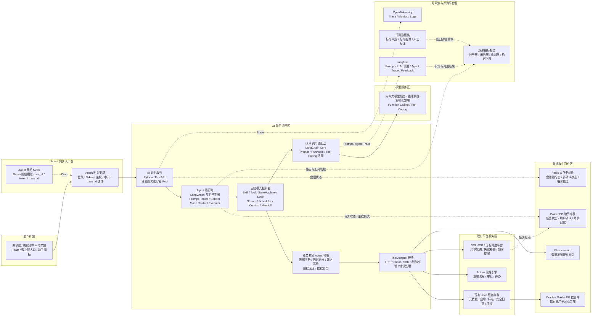
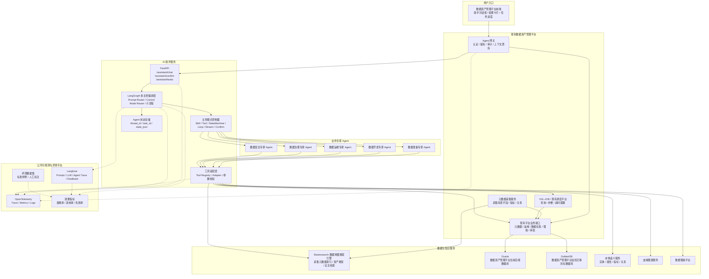
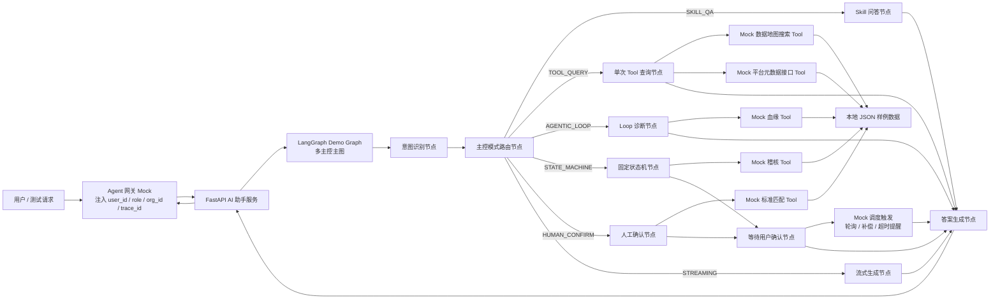
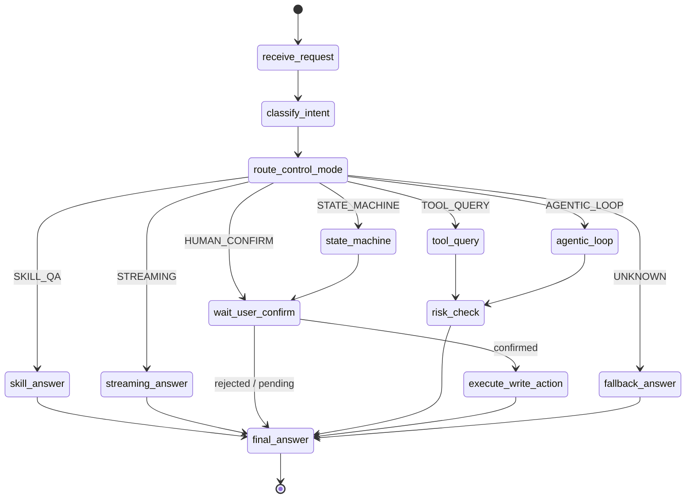
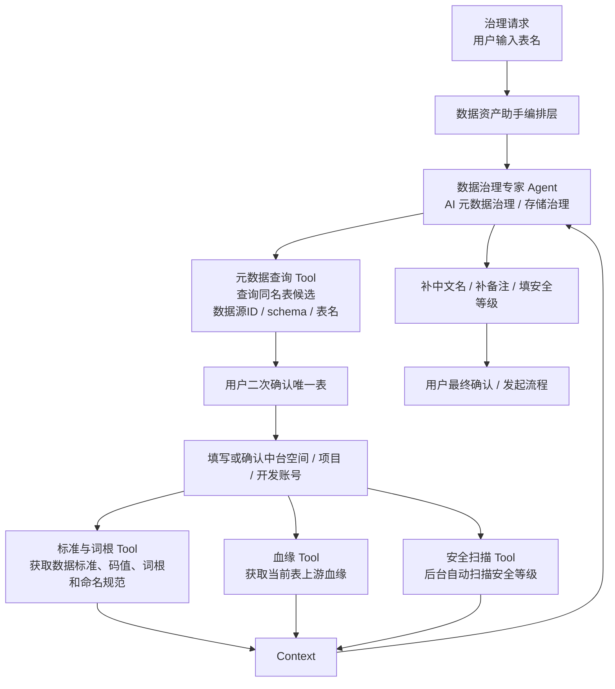
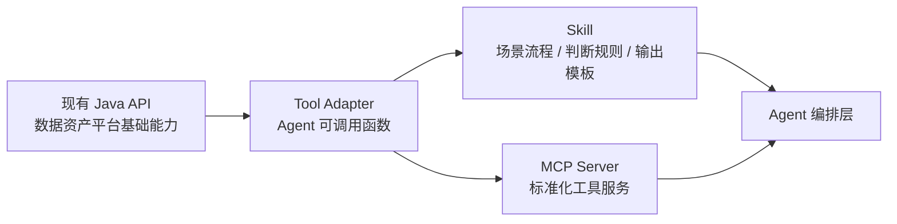
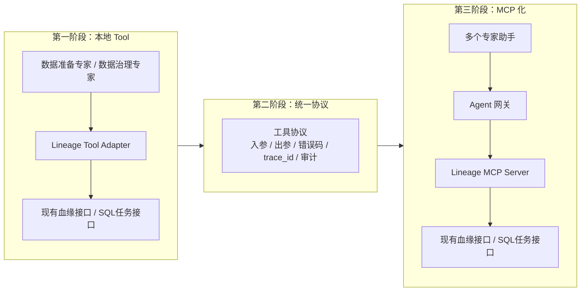

# 01 数据资产助手技术架构设计

## 1. Demo 建设目标

本 Demo 用于验证数据资产助手的最小可行链路，不直接连接生产 Oracle、GoldenDB、Elasticsearch 和公司可观测与评测平台，先用 Mock Adapter 模拟现有平台能力。

Demo 重点验证：

1. 前端请求统一经过 Agent 网关。
2. Agent 网关将用户身份、组织、角色、traceId 转发给 FastAPI AI 助手服务。
3. FastAPI 调用 LangGraph 完成 Prompt Router、Control Mode Router、工具调用和结果生成。
4. 工具层模拟数据地图搜索、平台元数据接口、血缘、标准、稽核能力。
5. 多主控模式至少覆盖 Skill 问答、单次 Tool、固定状态机、Agentic Loop、流式生成、人工确认和调度任务边界。
6. 调度层预留异步轮询、失败补偿、超时提醒和批量任务触发边界。
7. 可观测与评测层预留 OpenTelemetry + Langfuse + 评测数据集 + 效果指标接入点。
8. 写操作先生成草案，必须经过用户确认后再执行。

## 2. 总体技术架构

V2 版本改为部署技术架构视角，重点表达浏览器、Agent 网关、AI 助手服务、LangGraph 多主控运行时、调度系统、内网模型服务、现有 Java 服务、数据中间件和可观测与评测平台分别部署在哪里、如何通信。



> 正式评审图见：[01-数据资产助手技术架构图.drawio](01-数据资产助手技术架构图.drawio)。

## 2.1 原始总体技术架构



## 3. Demo 运行时架构

Demo 阶段不依赖真实外部系统，采用 Mock 实现，方便本地快速跑通。



## 4. LangGraph 多主控节点设计



## 4.1 数据资产助手内部业务专家 Agent 架构

```mermaid
flowchart TB
  AssetRouter[数据资产助手编排层<br/>Prompt Router / Control Mode Router / Executor / Aggregator] --> PrepareExpert[数据准备专家 Agent<br/>数据源 / 查表查列 / 指标 / 建模 / 血缘]
  AssetRouter --> DevExpert[数据开发专家 Agent<br/>配置稽核 / 查看稽核详情]
  AssetRouter --> OpsExpert[数据运维专家 Agent<br/>稽核任务状态 / 重跑 / 终止 / 调度 DAG]
  AssetRouter --> GovernanceExpert[数据治理专家 Agent<br/>AI 元数据治理 / 存储治理]
  AssetRouter --> SecurityExpert[数据安全专家 Agent<br/>安全扫描 / 数据权限申请]

  PrepareExpert --> MetadataTool[元数据查询 Tool<br/>查表 / 查列 / 资产详情]
  PrepareExpert --> SourceTool[数据源 Tool<br/>登记 / 连通性 / 元数据采集]
  PrepareExpert --> MetricTool[指标 Tool<br/>指标定义 / 口径 / 血缘]
  PrepareExpert --> ModelingTool[建模 Tool<br/>主题域 / 逻辑模型 / 物理模型]
  PrepareExpert --> LineageTool[血缘 Tool<br/>上下游 / 字段血缘]

  DevExpert --> QualityTool[稽核 Tool<br/>配置稽核 / 查看稽核详情]
  OpsExpert --> QualityOpsTool[稽核运维 Tool<br/>运行状态 / 重跑 / 终止]
  OpsExpert --> SchedulerTool[调度 Tool<br/>调度 DAG / 任务依赖]

  GovernanceExpert --> MetadataGovernTool[AI 元数据治理 Tool<br/>中文名 / 备注 / 安全等级候选]
  GovernanceExpert --> StandardTool[标准与词根 Tool<br/>标准 / 词根 / 码值]
  GovernanceExpert --> LineageTool
  GovernanceExpert --> StorageGovernTool[存储治理 Tool<br/>发起治理 / 规则查询]

  SecurityExpert --> SecurityTool[安全扫描 Tool<br/>发起扫描 / 查看风险]
  SecurityExpert --> PermissionTool[数据权限 Tool<br/>权限判断 / 权限申请]

  MetadataTool --> DataMap[Elasticsearch 数据地图搜索引擎]
  SourceTool --> SourcePlatform[数据源管理 / 元数据采集服务]
  MetricTool --> MetricPlatform[指标平台 / 指标目录]
  ModelingTool --> ModelingPlatform[数据建模平台 / 模型评审]
  LineageTool --> LineagePlatform[血缘图谱服务 / 离线开发任务服务]
  QualityTool --> QualityPlatform[数据稽核平台]
  QualityOpsTool --> QualityPlatform
  SchedulerTool --> SchedulerPlatform[调度平台]
  MetadataGovernTool --> MetadataPlatform[元数据管理平台接口]
  StandardTool --> StandardPlatform[数据标准平台 / 词根 / 码值服务]
  StorageGovernTool --> StoragePlatform[存储治理平台 / 规则服务]
  SecurityTool --> SecurityPlatform[安全扫描平台 / 安全策略服务]
  PermissionTool --> PermissionPlatform[权限服务 / 审批流程]

  MetadataPlatform --> PlatformDB[Oracle / GoldenDB<br/>数据资产管理平台后端数据库]
  SourcePlatform --> DataMap
  SchedulerPlatform --> PlatformDB
```



## 4.2 业务专家协同编排示例

以单表元数据治理为例，用户先通过自然语言填写表名。数据资产助手编排层先路由到数据治理专家，数据治理专家调用元数据查询能力查询同名表候选，展示数据源 ID、schema、表名等信息让用户二次确认唯一表；然后汇聚数据标准、词根、血缘、安全扫描等平台能力，把结构化上下文用于 AI 元数据治理，生成单表治理流程。



## 4.3 可观测与评测架构

可观测与评测层是横切能力，不阻塞主业务链路，但必须旁路采集每次关键执行证据。

| 能力 | 组件 | 采集内容 | 主要用途 |
| --- | --- | --- | --- |
| 链路观测 | OpenTelemetry | trace_id、span、接口耗时、错误码、Tool 调用耗时 | 定位链路故障、统计成功率和性能 |
| 模型观测 | Langfuse | Prompt、模型输入输出摘要、Agent Trace、Feedback | 分析模型是否正确路由、是否正确调用工具 |
| 评测数据集 | 评测样例库 | 标准问题、权威资产、标准答案、人工标注、回归样本 | 支撑上线前回归评测和版本对比 |
| 效果指标 | 指标计算服务 | 意图准确率、查表命中率、审核通过率、人工修改率、驳回率、高置信命中率 | 回答“助手有没有变好、有没有业务价值” |
| 反馈闭环 | 用户确认与审批结果 | 采纳、修改、驳回、审批通过、审批退回 | 反哺评测集、Prompt 调优和工具策略优化 |

关键原则：

1. 可观测回答“这次调用发生了什么”，可评测回答“这个能力效果如何”。
2. 评测指标不能只看生成覆盖率，还要看人工采纳率、修改率、驳回率和低置信误采纳率。
3. 生产环境的评测数据必须脱敏，只保存摘要、哈希、外部对象引用和人工反馈结果。
4. 每次模型、Prompt、Tool Adapter、主控路由规则变更后，都应基于固定评测集做回归对比。

## 5. 后端模块划分

```text
data_asset_agent_demo/
  app/
    main.py                       # FastAPI 入口
    api/
      assistant.py                # /assistant/chat、/assistant/confirm
    core/
      config.py                   # 配置
      context.py                  # user_id、role、org_id、trace_id 上下文
      observability.py            # OpenTelemetry / Langfuse 接入点
      evaluation.py               # 评测样例、反馈回流和效果指标接入点
    graph/
      state.py                    # LangGraph State 定义
      builder.py                  # StateGraph 构建
      nodes.py                    # 意图识别、路由、答案生成节点
    agents/
      data_prepare.py             # 数据准备专家 Agent
      data_development.py         # 数据开发专家 Agent
      data_operations.py          # 数据运维专家 Agent
      data_governance.py          # 数据治理专家 Agent
      data_security.py            # 数据安全专家 Agent
    tools/
      registry.py                 # 工具注册
      es_data_map.py              # 数据地图搜索 Tool，Demo 阶段 Mock
      metadata_api.py             # 现有平台元数据接口 Tool，Demo 阶段 Mock
      lineage_tool.py             # 血缘 Tool，Demo 阶段 Mock
      quality_tool.py             # 稽核 Tool，Demo 阶段 Mock
      standard_tool.py            # 标准匹配 Tool，Demo 阶段 Mock
    data/
      assets.json                 # 表、字段、指标样例
      lineage.json                # 血缘样例
      standards.json              # 数据标准样例
      quality_rules.json          # 稽核规则模板样例
      eval_cases.json             # 评测样例，记录标准问题、标准答案和权威资产
```

## 6. API 设计

### 6.1 对话接口

```http
POST /assistant/chat
```

请求示例：

```json
{
  "question": "客户收入用哪张表？",
  "session_id": "S_10001",
  "thread_id": "T_10001",
  "user_context": {
    "user_id": "u001",
    "org_id": "data_governance",
    "role": "data_steward",
    "trace_id": "trace-demo-001"
  }
}
```

响应示例：

```json
{
  "intent": "FIND_ASSET",
  "answer": "建议优先使用 dwd_customer_income_df。",
  "cards": [
    {
      "type": "asset_recommendation",
      "asset_id": "asset_001",
      "asset_name": "dwd_customer_income_df",
      "confidence": 0.91,
      "evidence": [
        "命中客户、收入两个业务概念",
        "该表为认证宽表",
        "下游 12 张报表引用"
      ]
    }
  ],
  "need_confirm": false,
  "trace_id": "trace-demo-001"
}
```

### 6.2 用户确认接口

```http
POST /assistant/confirm
```

用于稽核规则创建、元数据治理提交审核等写操作。

```json
{
  "thread_id": "T_10001",
  "task_id": "TASK_10001",
  "confirmed": true,
  "payload": {
    "action": "publish_quality_rule"
  }
}
```

## 7. Demo 优先实现范围

第一版 Demo 建议采用“两条主链路 + 两个支撑查询”，详细设计见：[../07-数据资产助手Demo设计.md](../07-数据资产助手Demo设计.md)。

1. **单表元数据治理主链路**
   - 问：“帮我治理 dwd_customer_income_df 这张表。”
   - 调用 Mock 数据地图、用户偏好、数据标准、血缘、安全扫描和 Activiti Tool。
   - 返回同名表确认卡片、治理上下文确认卡片、治理草案卡片和流程实例 ID。

2. **数据源登记后采集与安全扫描主链路**
   - 问：“帮我登记一个生产 MySQL 数据源，同时采集元数据并做安全扫描。”
   - 调用 Mock 数据源登记、元数据采集、安全扫描和工单 Tool。
   - 返回登记流程、采集任务、安全扫描任务和安全等级确认工单状态。

3. **数据地图查表支撑查询**
   - 问：“客户收入用哪张表？”
   - 调用 Mock 数据地图搜索 + Mock 平台元数据详情。
   - 返回资产推荐卡片。

4. **血缘查询与 SQL 注释识别支撑查询**
   - 问：“dwd_customer_income_df 的上游来源和加工任务说明是什么？”
   - 调用 Mock 血缘数据和 SQL 任务数据。
   - 返回血缘摘要、加工任务说明和目标表备注建议。

## 8. 生产化替换点

Demo 阶段使用 Mock Adapter，生产化时逐步替换为真实接口。

| Demo 模块 | 生产替换对象 |
| --- | --- |
| Agent 网关 Mock | Agent 网关 |
| Mock ES Tool | Elasticsearch 数据地图搜索索引 |
| Mock Metadata Tool | 现有数据资产管理平台元数据接口 |
| Mock Lineage Tool | 血缘图谱服务 |
| Mock Quality Tool | 数据稽核平台 |
| Mock Observability / Evaluation | 公司 OpenTelemetry + Langfuse + 评测数据集 + 效果指标平台 |
| 本地 JSON 状态 | Redis / GoldenDB / 专用状态表 |

## 9. 技术栈确认

```text
Python 3.11+
FastAPI
LangGraph
LangChain Core
Pydantic
Uvicorn
Elasticsearch Python Client，生产接入数据地图搜索时使用
Oracle / GoldenDB Driver，通常由现有平台后端使用，AI 助手优先通过平台接口访问
OpenTelemetry SDK，生产接入时使用
Langfuse SDK，生产接入时使用
评测数据集与指标计算服务，生产接入时使用
```

## 10. Java API、Tool、Skill、MCP 分层演进

详细说明见：[03-JavaAPI_Tool_Skill_MCP分层演进.md](../93-附录-AI知识储备/03-JavaAPI_Tool_Skill_MCP分层演进.md)。

整体关系：

```text
现有 Java API 能力 = 基础业务能力层
Tool = Agent 调用 API 的轻量封装
Skill = Agent 使用 Tool 的方法论、规则和流程沉淀
MCP = Tool 能力成熟后的平台化、标准化、跨 Agent 复用
```



## 10.1 血缘能力 Tool 到 MCP 的分阶段演进



实施原则：

1. Demo 和早期落地阶段，先把现有接口封装成本地 Tool Adapter。
2. Tool 稳定后，沉淀血缘分析 Skill，包括意图分类、影响分析、SQL 注释识别和输出模板。
3. 同时沉淀统一入参、出参、错误码、审计和观测字段。
4. 当数据资产助手、数据建模助手、数据指标助手、报表开发助手都需要复用血缘能力时，再升级为 MCP Server。
