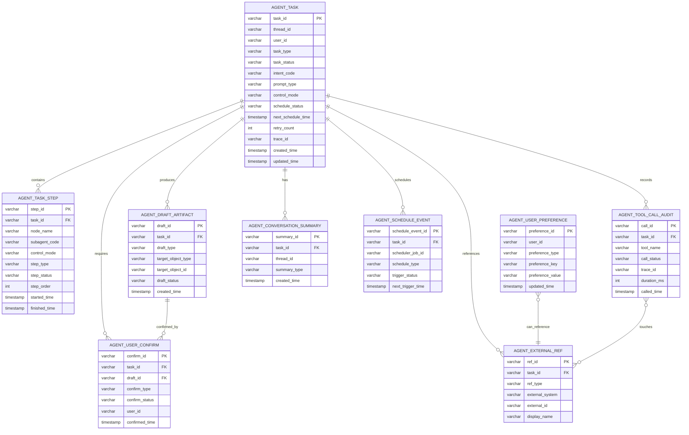
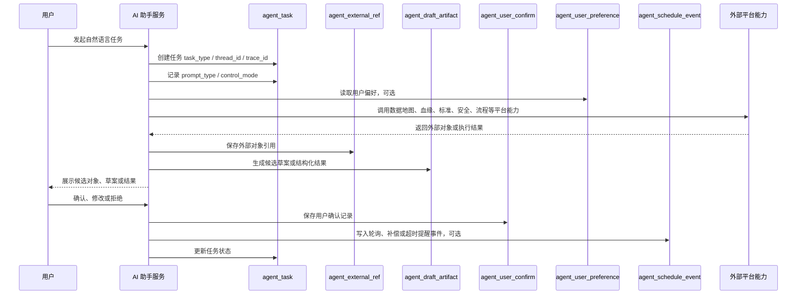

# 02 数据资产助手数据架构设计

## 1. 设计定位

数据资产助手的数据架构只承载助手运行所需的数据，不替代现有数据资产管理平台的业务库。

数据资产助手侧主要保存：

1. Agent 任务状态。
2. Prompt 分类、主控模式和 LangGraph 执行步骤。
3. 用户确认记录。
4. Tool 调用审计摘要。
5. 用户常用空间、项目、开发账号等助手记忆。
6. 候选草案和结构化结果。
7. 调度触发、轮询、补偿、超时提醒等任务推进记录。
8. 与现有数据资产平台对象的引用关系。

不在助手库中重复保存：

1. 平台元数据明细。
2. ES 数据地图索引。
3. 血缘图谱完整数据。
4. 数据标准主数据。
5. Activiti 流程表。
6. 调度平台自身作业定义和执行日志。
7. Oracle / GoldenDB 中现有平台业务表。

## 2. 数据分层

```text
Redis 运行态
  - 会话临时状态
  - LangGraph 当前节点
  - 当前主控模式
  - 待确认上下文
  - 短期锁

GoldenDB 助手库表
  - 任务主表
  - 任务步骤表
  - 用户确认表
  - Tool 调用审计表
  - 用户偏好表
  - 候选草案表
  - 调度事件表
  - 外部对象引用表

现有平台数据
  - 元数据、血缘、标准、安全扫描、稽核、流程、调度、平台审计
  - 通过 Java API / ES / Activiti / 调度平台引用，不重复落助手库
```

## 3. 数据模型总览



## 4. 核心表结构设计

### 4.1 agent_task：Agent 任务主表

用于记录一次用户诉求对应的主任务，例如查表、查血缘、生成稽核草案、生成元数据补全建议、提交流程等。

| 字段 | 类型 | 约束 | 说明 |
| --- | --- | --- | --- |
| id | bigint | PK | 自增主键 |
| task_id | varchar(64) | UK, NOT NULL | 任务业务 ID |
| thread_id | varchar(64) | NOT NULL | LangGraph / 会话线程 ID |
| user_id | varchar(64) | NOT NULL | 发起用户 ID |
| user_name | varchar(128) |  | 发起用户名称 |
| org_id | varchar(64) |  | 组织或租户 ID |
| task_type | varchar(64) | NOT NULL | 任务类型，如 find_asset / query_lineage / metadata_suggestion / quality_rule |
| intent_code | varchar(64) |  | 意图编码，如 GOVERN_METADATA |
| prompt_type | varchar(64) |  | Prompt 类型，如 guide / query / process / diagnose / generate / schedule / write |
| control_mode | varchar(64) |  | 主控模式，如 skill_qa / tool_query / state_machine / agentic_loop / streaming / scheduler / human_confirm / handoff |
| task_status | varchar(32) | NOT NULL | running / waiting_confirm / success / failed / canceled |
| current_node | varchar(128) |  | 当前 LangGraph 节点 |
| schedule_status | varchar(32) |  | none / waiting / scheduled / retrying / timeout / done |
| next_schedule_time | timestamp |  | 下一次调度轮询或补偿时间 |
| retry_count | int | DEFAULT 0 | 当前任务级补偿重试次数 |
| max_retry_count | int |  | 最大补偿重试次数，可按任务类型配置 |
| trace_id | varchar(128) |  | 链路追踪 ID |
| source_channel | varchar(64) |  | web / api / demo |
| request_text | clob |  | 用户原始问题，敏感信息脱敏后保存 |
| error_code | varchar(64) |  | 失败编码 |
| error_message | varchar(512) |  | 失败摘要 |
| created_time | timestamp | NOT NULL | 创建时间 |
| updated_time | timestamp | NOT NULL | 更新时间 |

建议索引：

| 索引 | 字段 |
| --- | --- |
| uk_agent_task_task_id | task_id |
| idx_agent_task_user_time | user_id, created_time |
| idx_agent_task_thread | thread_id |
| idx_agent_task_status | task_status |
| idx_agent_task_control_mode | control_mode, created_time |
| idx_agent_task_schedule | schedule_status, next_schedule_time |
| idx_agent_task_trace | trace_id |

### 4.2 agent_task_step：任务步骤表

用于记录 LangGraph 节点、子 Agent 执行、Tool 调用前后的阶段性状态。

| 字段 | 类型 | 约束 | 说明 |
| --- | --- | --- | --- |
| id | bigint | PK | 自增主键 |
| step_id | varchar(64) | UK, NOT NULL | 步骤 ID |
| task_id | varchar(64) | FK, NOT NULL | 关联 agent_task.task_id |
| parent_step_id | varchar(64) |  | 父步骤 ID |
| step_order | int | NOT NULL | 步骤顺序 |
| node_name | varchar(128) | NOT NULL | LangGraph 节点名称 |
| subagent_code | varchar(64) |  | 子 Agent 编码 |
| control_mode | varchar(64) |  | 当前步骤所属主控模式 |
| step_type | varchar(64) |  | intent / control_route / skill / tool / state_machine / loop / stream / scheduler / confirm / handoff / answer |
| step_status | varchar(32) | NOT NULL | running / success / failed / skipped |
| input_summary | varchar(1024) |  | 入参摘要，敏感信息脱敏 |
| output_summary | varchar(1024) |  | 出参摘要 |
| error_code | varchar(64) |  | 错误编码 |
| error_message | varchar(512) |  | 错误摘要 |
| started_time | timestamp |  | 开始时间 |
| finished_time | timestamp |  | 结束时间 |
| duration_ms | int |  | 耗时 |

建议索引：

| 索引 | 字段 |
| --- | --- |
| uk_agent_task_step_step_id | step_id |
| idx_agent_task_step_task_order | task_id, step_order |
| idx_agent_task_step_node | node_name |

### 4.3 agent_user_confirm：用户确认记录表

用于保存候选对象确认、草案确认、流程提交确认等关键用户确认动作。

| 字段 | 类型 | 约束 | 说明 |
| --- | --- | --- | --- |
| id | bigint | PK | 自增主键 |
| confirm_id | varchar(64) | UK, NOT NULL | 确认记录 ID |
| task_id | varchar(64) | FK, NOT NULL | 关联任务 |
| draft_id | varchar(64) |  | 关联候选草案 |
| confirm_type | varchar(64) | NOT NULL | table_select / draft_submit / process_submit |
| confirm_status | varchar(32) | NOT NULL | pending / confirmed / rejected / expired |
| confirm_title | varchar(256) |  | 确认标题 |
| confirm_content_json | clob |  | 确认内容 JSON，敏感信息脱敏 |
| user_id | varchar(64) | NOT NULL | 确认用户 |
| confirmed_time | timestamp |  | 确认时间 |
| expire_time | timestamp |  | 过期时间 |
| created_time | timestamp | NOT NULL | 创建时间 |

建议索引：

| 索引 | 字段 |
| --- | --- |
| uk_agent_user_confirm_id | confirm_id |
| idx_agent_user_confirm_task | task_id |
| idx_agent_user_confirm_status | confirm_status, expire_time |

### 4.4 agent_tool_call_audit：Tool 调用审计摘要表

用于保存 Tool 调用摘要，不保存完整敏感入参和返回内容。

| 字段 | 类型 | 约束 | 说明 |
| --- | --- | --- | --- |
| id | bigint | PK | 自增主键 |
| call_id | varchar(64) | UK, NOT NULL | Tool 调用 ID |
| task_id | varchar(64) | FK, NOT NULL | 关联任务 |
| step_id | varchar(64) |  | 关联步骤 |
| tool_name | varchar(128) | NOT NULL | Tool 名称 |
| subagent_code | varchar(64) |  | 子 Agent 编码 |
| call_status | varchar(32) | NOT NULL | success / failed / timeout |
| request_summary | varchar(1024) |  | 请求摘要 |
| response_summary | varchar(1024) |  | 响应摘要 |
| external_system | varchar(64) |  | java_api / es / activiti / llm |
| external_api | varchar(256) |  | 外部接口路径或能力名 |
| error_code | varchar(64) |  | 错误编码 |
| error_message | varchar(512) |  | 错误摘要 |
| trace_id | varchar(128) |  | 链路追踪 ID |
| duration_ms | int |  | 调用耗时 |
| called_time | timestamp | NOT NULL | 调用时间 |

建议索引：

| 索引 | 字段 |
| --- | --- |
| uk_agent_tool_call_id | call_id |
| idx_agent_tool_call_task | task_id |
| idx_agent_tool_call_tool | tool_name, called_time |
| idx_agent_tool_call_trace | trace_id |

### 4.5 agent_user_preference：用户偏好与助手记忆表

用于保存用户常用空间、项目、开发账号等助手侧记忆。

| 字段 | 类型 | 约束 | 说明 |
| --- | --- | --- | --- |
| id | bigint | PK | 自增主键 |
| preference_id | varchar(64) | UK, NOT NULL | 偏好 ID |
| user_id | varchar(64) | NOT NULL | 用户 ID |
| preference_type | varchar(64) | NOT NULL | common_space / common_project / common_dev_account |
| preference_key | varchar(128) | NOT NULL | 偏好键 |
| preference_value | varchar(1024) | NOT NULL | 偏好值，敏感信息脱敏或加密 |
| display_name | varchar(256) |  | 展示名称 |
| source | varchar(64) |  | user_confirm / system_infer |
| use_count | int | DEFAULT 0 | 使用次数 |
| last_used_time | timestamp |  | 最近使用时间 |
| created_time | timestamp | NOT NULL | 创建时间 |
| updated_time | timestamp | NOT NULL | 更新时间 |

建议索引：

| 索引 | 字段 |
| --- | --- |
| uk_agent_user_pref | user_id, preference_type, preference_key |
| idx_agent_user_pref_user | user_id, updated_time |

### 4.6 agent_draft_artifact：候选草案表

用于保存元数据建议、稽核规则草案、SQL 注释识别结果、流程提交草案等可确认的候选产物。

| 字段 | 类型 | 约束 | 说明 |
| --- | --- | --- | --- |
| id | bigint | PK | 自增主键 |
| draft_id | varchar(64) | UK, NOT NULL | 草案 ID |
| task_id | varchar(64) | FK, NOT NULL | 关联任务 |
| draft_type | varchar(64) | NOT NULL | metadata_suggestion / quality_rule / lineage_comment / process_request |
| target_object_type | varchar(64) |  | table / column / task / metric |
| target_object_id | varchar(128) |  | 外部对象 ID |
| draft_status | varchar(32) | NOT NULL | generated / confirmed / submitted / rejected |
| draft_json | clob | NOT NULL | 草案内容 JSON |
| evidence_json | clob |  | 依据 JSON，如标准、血缘、安全扫描结果 |
| confidence | decimal(5,4) |  | 置信度 |
| created_by | varchar(64) |  | 创建用户或 system |
| created_time | timestamp | NOT NULL | 创建时间 |
| updated_time | timestamp | NOT NULL | 更新时间 |

建议索引：

| 索引 | 字段 |
| --- | --- |
| uk_agent_draft_id | draft_id |
| idx_agent_draft_task | task_id |
| idx_agent_draft_target | target_object_type, target_object_id |

### 4.7 agent_external_ref：外部对象引用表

用于记录助手任务中引用到的外部平台对象，避免在助手库中重复存储完整业务数据。

| 字段 | 类型 | 约束 | 说明 |
| --- | --- | --- | --- |
| id | bigint | PK | 自增主键 |
| ref_id | varchar(64) | UK, NOT NULL | 引用 ID |
| task_id | varchar(64) | FK, NOT NULL | 关联任务 |
| ref_type | varchar(64) | NOT NULL | table / column / datasource / standard / lineage_task / process |
| external_system | varchar(64) | NOT NULL | data_map / metadata / lineage / standard / activiti |
| external_id | varchar(256) | NOT NULL | 外部系统对象 ID |
| display_name | varchar(512) |  | 展示名称 |
| datasource_id | varchar(128) |  | 数据源 ID |
| schema_name | varchar(128) |  | schema |
| object_name | varchar(256) |  | 表名、字段名、流程名 |
| extra_json | clob |  | 额外引用信息 |
| created_time | timestamp | NOT NULL | 创建时间 |

建议索引：

| 索引 | 字段 |
| --- | --- |
| uk_agent_external_ref | ref_id |
| idx_agent_external_task | task_id |
| idx_agent_external_object | external_system, external_id |
| idx_agent_external_table | datasource_id, schema_name, object_name |

### 4.8 agent_conversation_summary：会话摘要表

用于保存长会话摘要，降低长期上下文对 Redis 和模型上下文窗口的依赖。

| 字段 | 类型 | 约束 | 说明 |
| --- | --- | --- | --- |
| id | bigint | PK | 自增主键 |
| summary_id | varchar(64) | UK, NOT NULL | 摘要 ID |
| task_id | varchar(64) | FK | 关联任务，可为空 |
| thread_id | varchar(64) | NOT NULL | 会话线程 ID |
| user_id | varchar(64) | NOT NULL | 用户 ID |
| summary_type | varchar(64) | NOT NULL | conversation / task / preference |
| summary_text | clob | NOT NULL | 会话摘要，敏感信息脱敏 |
| token_count | int |  | 摘要 token 估算 |
| created_time | timestamp | NOT NULL | 创建时间 |

建议索引：

| 索引 | 字段 |
| --- | --- |
| uk_agent_summary_id | summary_id |
| idx_agent_summary_thread | thread_id, created_time |
| idx_agent_summary_user | user_id, created_time |

### 4.9 agent_schedule_event：调度事件表

用于记录助手任务与调度系统之间的触发、轮询、补偿和超时提醒历史。调度平台自身的作业定义和完整执行日志仍保留在调度系统内，助手库只保存与 `agent_task` 相关的推进摘要。

| 字段 | 类型 | 约束 | 说明 |
| --- | --- | --- | --- |
| id | bigint | PK | 自增主键 |
| schedule_event_id | varchar(64) | UK, NOT NULL | 调度事件 ID |
| task_id | varchar(64) | FK, NOT NULL | 关联 agent_task.task_id |
| scheduler_job_id | varchar(128) |  | 调度平台作业 ID 或任务实例 ID |
| schedule_type | varchar(64) | NOT NULL | poll / compensate / timeout_remind / batch_trigger |
| trigger_status | varchar(32) | NOT NULL | pending / running / success / failed / skipped |
| trigger_source | varchar(64) |  | xxl_job / platform_scheduler / manual / demo |
| trigger_payload_summary | varchar(1024) |  | 触发参数摘要，敏感信息脱敏 |
| result_summary | varchar(1024) |  | 调度结果摘要 |
| retry_no | int | DEFAULT 0 | 第几次补偿或重试 |
| next_trigger_time | timestamp |  | 下一次触发时间 |
| triggered_time | timestamp |  | 本次触发时间 |
| finished_time | timestamp |  | 本次完成时间 |
| error_code | varchar(64) |  | 失败编码 |
| error_message | varchar(512) |  | 失败摘要 |
| created_time | timestamp | NOT NULL | 创建时间 |

建议索引：

| 索引 | 字段 |
| --- | --- |
| uk_agent_schedule_event_id | schedule_event_id |
| idx_agent_schedule_task | task_id, created_time |
| idx_agent_schedule_next | trigger_status, next_trigger_time |
| idx_agent_schedule_job | scheduler_job_id |

## 5. Redis Key 设计

| Key | Value | TTL | 说明 |
| --- | --- | --- | --- |
| agent:thread:{thread_id} | JSON | 24 小时到 7 天 | 当前会话状态、最近消息、当前节点 |
| agent:runtime:{task_id} | JSON | 24 小时 | LangGraph 当前执行状态、主控模式、临时槽位 |
| agent:pending_confirm:{confirm_id} | JSON | 24 小时 | 待用户确认的候选对象、候选草案、提交流程入参 |
| agent:lock:{task_id} | string | 5 到 30 分钟 | 防止重复提交或重复执行 |
| agent:schedule:{task_id} | JSON | 1 到 7 天 | 调度恢复上下文、下次轮询时间、补偿次数 |
| agent:tool_cache:{tool_name}:{hash} | JSON | 5 到 60 分钟 | 非敏感 Tool 查询缓存，可选 |

Redis 只保存短期运行态，不作为审计依据。关键确认、流程提交、任务状态必须写入 GoldenDB 助手库表。

## 6. 通用任务数据流



## 7. 数据脱敏与保留策略

### 7.1 脱敏原则

以下内容不得明文进入助手库表、Langfuse 或普通日志：

1. 内网登录密码。
2. Token、Session、Cookie。
3. 数据库连接串、账号、密码。
4. 手机号、身份证号、银行卡号等敏感样例值。
5. 生产表中的真实业务明细数据。

### 7.2 保存原则

1. `request_text` 保存前做敏感信息脱敏。
2. `confirm_content_json` 可以保存用户确认内容，但需要避免保存密码和 Token。
3. `tool_call_audit` 只保存请求和响应摘要，不保存完整原始报文。
4. `draft_json` 保存候选草案，`evidence_json` 保存依据摘要和外部引用 ID。
5. 外部平台对象只保存引用 ID，不复制完整元数据、血缘图谱或标准主数据。

### 7.3 保留周期建议

| 数据 | 建议保留周期 |
| --- | --- |
| Redis 运行态 | 1 到 7 天 |
| 任务主表 | 1 到 3 年，按公司审计要求 |
| 用户确认记录 | 1 到 3 年，按流程审计要求 |
| Tool 调用审计摘要 | 6 到 12 个月 |
| 用户偏好 | 长期保留，支持用户清除 |
| 会话摘要 | 3 到 12 个月，可按用户维度清理 |

## 8. 与现有平台数据关系

| 助手侧数据 | 现有平台数据 | 关系 |
| --- | --- | --- |
| agent_external_ref.datasource_id | 数据源管理 | 引用数据源 ID |
| agent_external_ref.external_id | 元数据管理 | 引用表、字段、指标等对象 ID |
| agent_draft_artifact.target_object_id | 元数据管理 | 草案目标对象 |
| agent_tool_call_audit.external_api | Java API | 记录调用过的平台接口能力 |
| agent_external_ref.external_id | Activiti | 引用流程实例 ID |
| agent_schedule_event.scheduler_job_id | 调度平台 | 引用调度作业 ID 或任务实例 ID |
| agent_task.trace_id | OpenTelemetry | 关联链路追踪 |
| agent_tool_call_audit.trace_id | OpenTelemetry / Langfuse | 关联工具调用与模型调用 |

## 8.1 主控模式数据记录

主控模式需要在任务主表和步骤表中显式记录，便于后续审计、统计和问题排查。

| 字段 | 记录位置 | 示例 | 用途 |
| --- | --- | --- | --- |
| prompt_type | agent_task | guide / query / process / diagnose / generate / schedule / write | 识别用户问题类型 |
| control_mode | agent_task | skill_qa / tool_query / state_machine / agentic_loop / streaming / scheduler / human_confirm / handoff | 记录本次任务采用的主控模式 |
| control_mode | agent_task_step | agentic_loop | 记录每个步骤属于哪个主控路径 |
| step_type | agent_task_step | control_route / tool / loop / confirm / answer | 还原执行链路 |

推荐约束：

1. 一个 `agent_task` 必须有明确的 `control_mode`。
2. 如果任务从 Loop 转入人工确认，需要在 `agent_task_step` 中追加 `human_confirm` 步骤。
3. 如果任务进入调度系统，需要在 `agent_schedule_event` 中记录调度事件，并在 `agent_task.control_mode` 或步骤中保留 `scheduler` 痕迹。
4. 写操作不得只记录为 `agentic_loop`，必须有 `human_confirm` 或 `state_machine` 步骤。

## 9. 建模原则

1. 任务主线用 `agent_task` 串联。
2. 执行过程用 `agent_task_step` 记录，并保留 Prompt 类型、主控模式和步骤类型。
3. 用户确认单独落 `agent_user_confirm`，作为写操作前置依据。
4. Tool 调用只保存审计摘要，避免把助手库变成接口报文仓库。
5. 用户偏好独立建表，支持用户修改和清除。
6. 外部对象只保存引用，不复制现有平台主数据。
7. 调度事件只保存任务推进摘要，不复制调度平台完整作业日志。
8. Redis 只做运行态，GoldenDB 做长期任务态和审计态。
