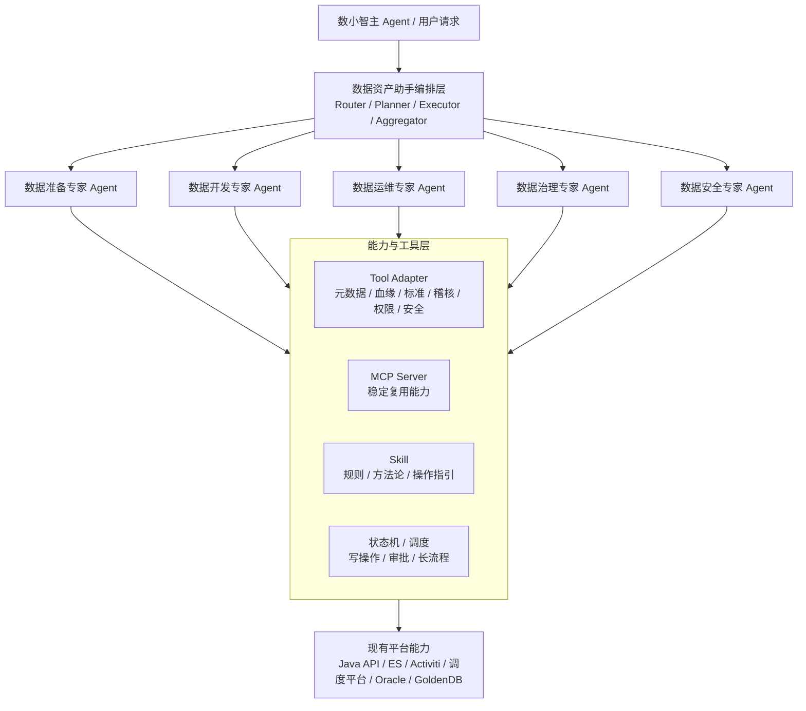

# 92 附录 数据资产助手专家能力与工具设计

## 1. 设计目的

本目录用于说明数据资产助手内部“业务专家 Agent -> 能力 Tool / MCP 服务 -> 现有平台接口”的分层关系。

这里不再把数据地图、数据源、稽核、权限、安全扫描、血缘、标准、建模、指标等平台模块拆成一堆模块级 Agent。数据资产助手内部第一层抽象是业务专家：

1. 数据准备专家 Agent。
2. 数据开发专家 Agent。
3. 数据运维专家 Agent。
4. 数据治理专家 Agent。
5. 数据安全专家 Agent。

专家 Agent 负责理解业务场景、组织上下文、编排流程和生成用户可理解的结果；平台模块能力沉淀为 Tool Adapter、MCP Server、Skill 或固定状态机，由专家按需调用。

## 2. 分层关系

```text
数小智主 Agent
  -> 数据资产助手编排层
    -> 业务专家 Agent
      -> Tool Adapter / MCP Server / Skill / 状态机
        -> 现有 Java API / ES / Activiti / 调度平台 / 数据库
```

各层职责：

| 层级 | 职责 | 示例 |
| --- | --- | --- |
| 数小智主 Agent | 统一入口、助手路由、跨领域转交 | 判断是否交给数据资产助手 |
| 数据资产助手编排层 | Prompt Router、Control Mode Router、专家选择、状态流转 | 选择数据准备专家或数据治理专家 |
| 业务专家 Agent | 场景闭环、上下文组织、跨能力组合、结果解释 | 数据准备专家串联数据源登记、采集、地图更新 |
| Tool Adapter | 单系统接口封装、参数校验、错误码转换 | 元数据查询 Tool、血缘查询 Tool |
| MCP Server | 稳定能力服务化，支持多个专家或多个助手复用 | Lineage MCP、Standard MCP、Permission MCP |
| Skill | 稳定方法论、流程模板、操作指引 | 字段命名规范、治理诊断方法 |
| 状态机 / 调度 | 写操作、审批、长流程、异步补偿 | 数据源登记、权限申请、稽核任务重跑 |

## 3. 专家与能力映射

| 业务专家 Agent | 负责场景 | 主要集成能力 |
| --- | --- | --- |
| 数据准备专家 | 数据源、查表查列、数据指标、数据建模、查看血缘 | 数据地图能力、数据源能力、数据指标能力、数据建模能力、数据血缘能力 |
| 数据开发专家 | 配置稽核、查看稽核详情 | 数据稽核能力、元数据查询能力、数据标准能力 |
| 数据运维专家 | 查看稽核任务运行状态、稽核任务重跑、终止、查看调度 DAG | 数据稽核运维能力、调度 DAG 能力、任务状态能力 |
| 数据治理专家 | AI 元数据治理、查询血缘、查询标准、查询词根、存储治理 | 元数据治理能力、数据标准能力、词根能力、数据血缘能力、安全扫描能力、存储治理能力 |
| 数据安全专家 | 发起安全扫描、申请数据权限 | 安全扫描能力、数据权限能力、敏感字段识别能力 |

## 4. 能力清单

这些能力不是独立 Agent，而是被专家 Agent 调用的 Tool / MCP / Skill / 状态机边界。

| 能力 | 文档 | 主要职责 | 主要归属专家 | 形态建议 |
| --- | --- | --- | --- | --- |
| 数据地图能力 | [01_数据地图能力设计.md](01_数据地图能力设计.md) | 资产搜索、表字段查询、数据地图结果解释 | 数据准备专家、数据治理专家 | Tool，稳定后可 MCP |
| 数据源能力 | [02_数据源能力设计.md](02_数据源能力设计.md) | 数据源登记、连通性、采集任务、状态跟踪 | 数据准备专家 | 状态机 + Tool |
| 数据稽核能力 | [03_数据稽核能力设计.md](03_数据稽核能力设计.md) | 质量规则推荐、稽核配置、结果解释、任务状态 | 数据开发专家、数据运维专家 | Tool + 状态机 |
| 数据权限能力 | [04_数据权限能力设计.md](04_数据权限能力设计.md) | 权限判断、权限申请、敏感字段访问控制 | 数据安全专家 | Tool + 审批状态机 |
| 安全扫描能力 | [05_安全扫描能力设计.md](05_安全扫描能力设计.md) | 敏感数据识别、安全等级、风险扫描 | 数据安全专家、数据治理专家 | Tool + 调度 |
| 数据血缘能力 | [06_数据血缘能力设计.md](06_数据血缘能力设计.md) | 上下游查询、字段血缘、影响分析 | 数据准备专家、数据治理专家 | Tool，稳定后 MCP |
| 元数据治理能力 | [07_元数据治理能力设计.md](07_元数据治理能力设计.md) | 元数据补全、标准映射、治理审核 | 数据治理专家 | 状态机 + Tool |
| 数据标准能力 | [08_数据标准能力设计.md](08_数据标准能力设计.md) | 标准查询、标准映射、标准落标建议 | 数据治理专家、数据准备专家 | Tool，稳定后 MCP |
| 数据建模能力 | [09_数据建模能力设计.md](09_数据建模能力设计.md) | 主题域、逻辑模型、物理模型、表结构建议 | 数据准备专家 | Skill + Tool |
| 数据指标能力 | [10_数据指标能力设计.md](10_数据指标能力设计.md) | 指标定义、口径解释、指标血缘、指标治理 | 数据准备专家 | Tool，稳定后 MCP |

## 5. 编排关系

详细规则见：[专家能力与工具协同编排关系.md](专家能力与工具协同编排关系.md)。



## 6. 统一填写口径

每个能力文档按以下维度补充：

1. **能力定位**：这个能力负责什么，不负责什么。
2. **归属专家**：主要被哪些专家调用。
3. **典型问题**：用户会怎么问。
4. **触发条件**：Router 或专家如何决定调用该能力。
5. **必要槽位**：执行任务需要哪些参数。
6. **依赖工具 / MCP**：调用哪些平台接口、搜索引擎、审批或调度服务。
7. **执行流程**：从用户问题到结果返回的步骤。
8. **输出结构**：返回自然语言、卡片、JSON、候选动作还是任务状态。
9. **确认与风控**：哪些操作必须用户确认，哪些要权限校验。
10. **观测与评测**：需要记录哪些 trace、耗时、成功率、采纳率和评测指标。

## 7. 优先级建议

第一阶段建议优先做：

1. 数据准备专家：整合查表、查字段、查指标、查看血缘和数据源准备能力。
2. 数据治理专家：优先落 AI 元数据治理，复用标准、词根、血缘和安全扫描能力。
3. 数据开发专家：先支持配置稽核、查看稽核详情。
4. 数据安全专家：用于安全扫描和数据权限申请，限制敏感字段和写操作风险。

第二阶段再扩展：

1. 数据运维专家。
2. 存储治理能力。
3. 数据建模能力。
4. 指标治理能力。
5. 调度 DAG 分析能力。
