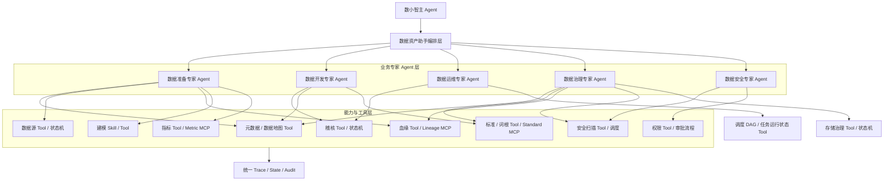
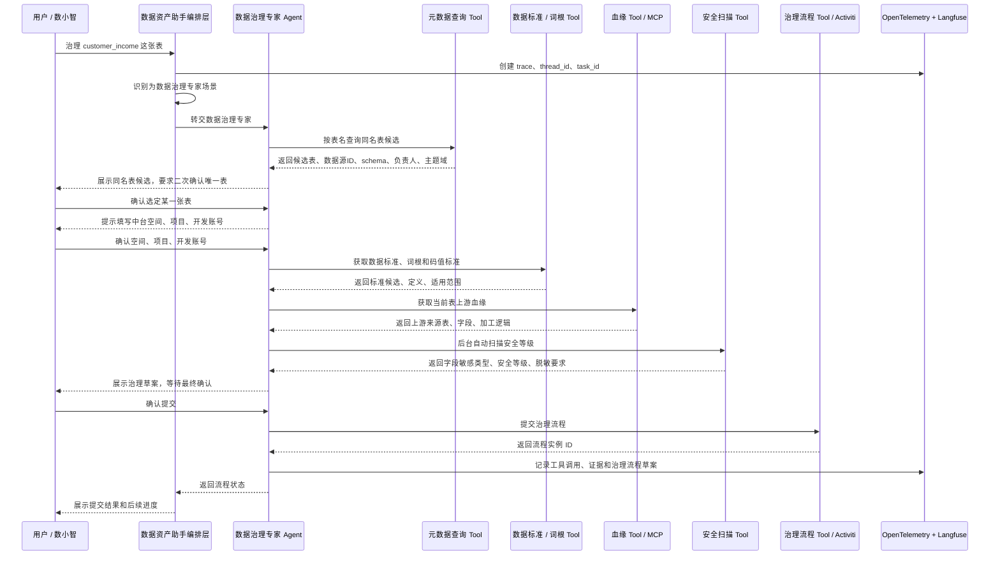

# 专家能力与工具协同编排关系

## 1. 设计原则

数据资产助手内部第一层是业务专家 Agent，不再把每个平台模块都建成模块级 Agent。专家 Agent 负责业务闭环，模块能力以 Tool Adapter、MCP Server、Skill 或状态机的形式被调用。

推荐：

```text
数据资产助手编排层
  -> 选择业务专家 Agent
  -> 专家 Agent 组织上下文和执行计划
  -> 调用 Tool / MCP / Skill / 状态机
  -> 汇总证据、确认点、风险和结果
```

不推荐：

```text
数据地图模块 Agent -> 直接调用数据标准模块 Agent -> 再调用安全扫描模块 Agent
```

这样可以保证：

1. 专家边界清晰。
2. 工具和 MCP 能被多个专家复用。
3. 权限、审计、观测统一经过 Agent 网关和编排层。
4. 写操作、审批、长流程不被 Agentic Loop 绕过。
5. LangGraph 状态可恢复。
6. 便于数小智主 Agent 做上层协同。

## 2. 分层关系



## 3. 协同模式

### 3.1 专家主导，能力取证

一个业务专家负责主流程，多个能力 Tool / MCP 提供证据。

```text
例：单表元数据治理
主专家：数据治理专家
调用能力：元数据查询、数据标准、词根、数据血缘、安全扫描、治理流程提交
```

### 3.2 固定流程，状态机推进

流程顺序稳定、涉及写操作或审批时，不使用自由 Loop 做主控。

```text
例：数据源准备
主专家：数据准备专家
流程：数据源登记 -> 审批 -> 连通性检测 -> 元数据采集 -> 数据地图更新 -> 空间绑定
能力形态：状态机 + Tool + 调度
```

### 3.3 只读诊断，Loop 取证

问题路径不确定时，专家可在只读 Tool 白名单内使用 Agentic Loop 取证。

```text
例：这张表为什么地图里查不到？
主专家：数据准备专家
调用能力：数据源状态、采集任务、ES 同步、权限、数据地图查询
```

### 3.4 MCP 复用

当一个能力稳定且被多个专家或多个助手复用时，再沉淀为 MCP Server。

```text
例：血缘能力
数据准备专家、数据治理专家、指标助手、报表助手都需要复用
=> Lineage MCP Server
```

## 4. 元数据治理协同示例

场景：

```text
用户：帮我治理 customer_income 这张表。
```

推荐编排：



## 5. 专家上下文结构

编排层传给业务专家的上下文建议统一为：

```json
{
  "task_id": "",
  "thread_id": "",
  "expert_type": "DATA_GOVERNANCE_EXPERT",
  "user_context": {
    "user_id": "",
    "org_id": "",
    "role": "",
    "trace_id": ""
  },
  "asset_context": {
    "asset_id": "",
    "datasource_id": "",
    "schema_name": "",
    "table_name": "",
    "columns": []
  },
  "confirmed_context": {
    "workspace": "",
    "project": "",
    "dev_account": "",
    "from_user_preference": false
  },
  "evidence_context": {
    "metadata": [],
    "standards": [],
    "lineage": [],
    "security": [],
    "quality": []
  },
  "available_tools": [
    "metadata.search",
    "standard.match",
    "lineage.query",
    "security.scan",
    "governance.submit"
  ]
}
```

## 6. 专家输出结构

```json
{
  "expert": "DATA_GOVERNANCE_EXPERT",
  "task_id": "",
  "answer": "",
  "selected_asset": {
    "asset_id": "",
    "datasource_id": "",
    "schema_name": "",
    "table_name": ""
  },
  "evidence": {
    "standards": [],
    "lineage": [],
    "security_scan": []
  },
  "actions": [
    {
      "type": "SUBMIT_GOVERNANCE_FLOW",
      "need_confirm": true,
      "tool": "governance.submit"
    }
  ],
  "trace_id": ""
}
```

## 7. 专家与能力协同矩阵

| 主专家 | 常用能力 / Tool / MCP | 协同目的 |
| --- | --- | --- |
| 数据准备专家 | 数据地图、数据源、数据血缘、数据建模、数据指标、数据权限 | 找表查列、准备数据源、查看血缘、补充指标和建模上下文 |
| 数据开发专家 | 数据稽核、元数据查询、数据标准、血缘查询 | 生成稽核规则草案、查看稽核详情、判断字段和口径 |
| 数据运维专家 | 稽核运行状态、重跑、终止、调度 DAG、告警 | 查询任务状态、重跑失败任务、终止异常任务、解释 DAG |
| 数据治理专家 | 元数据治理、数据标准、词根、血缘、安全扫描、存储治理 | AI 元数据治理、治理诊断、存储治理建议和流程提交 |
| 数据安全专家 | 安全扫描、数据权限、敏感字段识别、脱敏策略 | 发起安全扫描、申请权限、解释安全风险 |

## 8. 编排控制规则

1. 平台模块能力不再作为第一层 Agent 拆分，第一层只保留业务专家 Agent。
2. 专家 Agent 不直接调用现有平台库，必须通过 Tool Adapter、MCP Server 或状态机。
3. 每次能力调用必须携带 `thread_id`、`task_id`、`trace_id`。
4. 只读能力可以并行执行。
5. 写操作必须进入确认节点或固定状态机。
6. 涉及同名表时，必须先展示数据源 ID、schema、表名、负责人等候选信息，由用户二次确认唯一表。
7. 中台空间、项目、开发账号必须由用户确认；允许使用用户历史常用配置预填。
8. 同一个任务内禁止形成专家之间的循环调用。
9. 能力 Tool / MCP 只返回结构化证据或动作结果，最终用户答案由专家 Agent 和编排层汇总。
10. 现有平台接口优先封装为本地 Tool Adapter；当多个专家或多个助手需要复用且协议稳定后，再升级为 MCP Server。
11. 当某个场景的判断逻辑、调用顺序、输出模板稳定后，沉淀为 Skill；Skill 负责方法论，Tool / MCP 负责真实接口调用。
