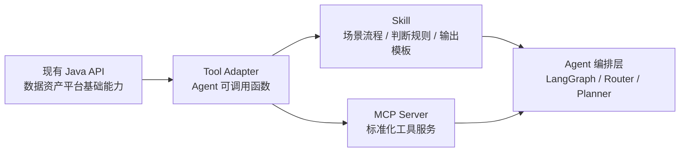

# Java API、Tool、Skill、MCP 分层演进

## 1. 核心结论

数据资产助手建设中，现有 Java API、Tool、Skill、MCP 不是互相替代关系，而是分层协作关系。

```text
现有 Java API 能力 = 基础业务能力层
Tool = Agent 调用 API 的轻量封装
Skill = Agent 使用 Tool 的方法论、规则和流程沉淀
MCP = Tool 能力成熟后的平台化、标准化、跨 Agent 复用
```

可以简化理解为：

```text
Java API -> Tool -> Skill -> MCP
```

但需要注意：

```text
Skill 不替代 Tool。
MCP 不替代 Skill。
Tool 负责拿数据和做动作。
Skill 负责告诉 Agent 怎么判断、怎么调用、怎么解释、什么时候确认。
MCP 负责把稳定 Tool 能力平台化复用。
```

## 2. 四层职责

| 层级 | 定位 | 解决的问题 | 示例 |
| --- | --- | --- | --- |
| Java API | 现有平台基础能力 | 业务系统已经具备的确定性能力 | 血缘查询、元数据查询、数据标准、安全扫描、稽核配置 |
| Tool | Agent 调用封装 | Agent 如何调用 API、组织入参、解析出参、处理异常 | query_table_lineage_tool、search_data_map_tool |
| Skill | 专业方法论沉淀 | 什么时候调哪个 Tool、多个 Tool 怎么组合、结果怎么解释 | 血缘分析规则、SQL 注释识别规则、元数据填充流程 |
| MCP | 工具平台化复用 | 多个 Agent 共享同一组稳定工具能力 | Lineage MCP Server、Metadata MCP Server |

## 3. 推荐演进路径



推荐阶段：

1. **先接 Java API**
   - 盘点现有数据资产平台能力。
   - 明确哪些接口可直接复用。

2. **先封装 Tool**
   - 让 Agent 能够调用现有接口。
   - 快速验证业务流程是否跑通。

3. **沉淀 Skill**
   - 当调用流程、判断规则、答案格式稳定后，沉淀成 Skill。
   - Skill 记录“怎么做”，不是“去哪里取数据”。

4. **再升级 MCP**
   - 当多个 Agent 都需要复用同一批 Tool，且工具协议稳定后，封装为 MCP Server。

## 4. 血缘能力示例

```text
Java API：
现有血缘查询接口、字段血缘接口、影响分析接口、SQL 任务详情接口。

Tool：
query_table_lineage_tool
query_column_lineage_tool
query_upstream_lineage_tool
get_sql_task_detail_tool
extract_comments_from_sql_tool

Skill：
血缘意图分类规则
血缘影响分析规则
SQL 注释识别规则
目标表备注填充规则
血缘结果回答模板

MCP：
Lineage MCP Server，供数据资产助手、数据建模助手、数据指标助手、报表开发助手复用。
```

## 5. Skill 适合沉淀什么

Skill 适合沉淀稳定的专业经验和工作流，例如：

```text
如何判断用户是在问上游还是下游。
表级血缘、字段级血缘、指标血缘怎么区分。
影响分析要看哪些对象。
SQL 加工任务注释怎么提取。
SQL 注释如何转成目标表备注建议。
哪些场景必须用户确认。
哪些信息不能直接展示。
回答结构应该怎么组织。
```

Skill 不适合直接承担实时接口调用。实时查询、写回、提交流程仍然应该由 Tool 或 MCP 完成。

## 6. MCP 适合什么时候做

满足以下条件时，适合将 Tool 升级为 MCP：

1. 多个 Agent 都需要复用同一类工具能力。
2. 工具入参、出参、错误码、超时策略已经稳定。
3. 需要统一工具注册、统一鉴权、统一审计、统一观测。
4. 工具能力需要独立部署、版本管理和灰度升级。

典型例子：

```text
血缘能力：数据资产助手、数据建模助手、数据指标助手、报表开发助手都会使用。
元数据能力：数据地图、元数据治理、数据标准、数据指标都会使用。
安全能力：数据权限、安全扫描、元数据治理都会使用。
```

## 7. 数据资产助手落地原则

1. 现有 Java API 是确定性的基础能力，不重复建设。
2. Demo 和早期落地阶段，优先封装本地 Tool Adapter。
3. 当某类场景的判断逻辑、调用顺序、输出模板稳定后，沉淀为 Skill。
4. 当 Tool 被多个 Agent 复用且协议稳定后，再 MCP 化。
5. Skill、Tool、MCP 都需要接入统一可观测体系，至少贯通 `trace_id`、`thread_id`、`task_id`。

