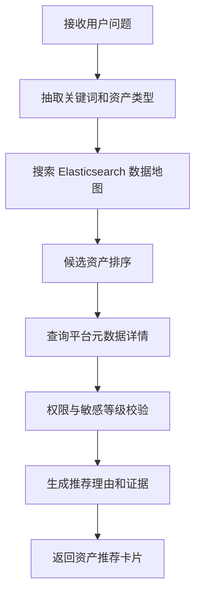

# 数据地图 SubAgent 功能设计

## 1. 子 Agent 定位

数据地图 SubAgent 负责数据资产搜索与解释，是数据资产助手中最核心的只读查询能力。它主要面向“找表、找字段、找指标、找口径、找负责人、看资产详情”等场景。

## 2. 职责边界

负责：

- 资产关键词搜索。
- 表、字段、指标、主题域、标签查询。
- 基于 Elasticsearch 数据地图搜索引擎召回候选资产。
- 结合元数据管理平台接口补充资产详情。
- 生成推荐理由、置信度和证据说明。

不负责：

- 直接修改元数据。
- 直接创建数据源。
- 直接配置稽核规则。
- 直接审批权限。

## 3. 典型用户问题

待补充：

```text
客户收入用哪张表？
客户手机号字段在哪些表里？
帮我找订单主题域下的核心表。
某个指标口径在哪里维护？
这张表负责人是谁？
```

## 4. 触发意图

待补充：

| 意图编码 | 说明 | 示例 |
| --- | --- | --- |
| FIND_ASSET | 查找数据资产 | 客户收入用哪张表 |
| FIND_COLUMN | 查找字段 | 手机号字段在哪 |
| FIND_METRIC | 查找指标 | GMV 指标口径 |
| GET_ASSET_DETAIL | 查看资产详情 | 这张表谁负责 |

## 5. 必要槽位

待补充：

| 槽位 | 是否必填 | 说明 |
| --- | --- | --- |
| keyword | 是 | 用户搜索关键词 |
| asset_type | 否 | 表、字段、指标、报表、接口 |
| domain | 否 | 主题域 |
| system | 否 | 来源系统 |
| env | 否 | PRD、UAT、DEV |
| user_context | 是 | 用户、组织、角色、权限上下文 |

## 6. 依赖工具

待补充：

| 工具 | 用途 | 数据来源 |
| --- | --- | --- |
| search_data_map | 搜索数据地图 | Elasticsearch |
| get_asset_detail | 查询资产详情 | 数据资产管理平台接口 |
| get_column_list | 查询字段列表 | 数据资产管理平台接口 |
| get_metric_definition | 查询指标定义 | 数据资产管理平台接口 |
| check_asset_permission | 检查可见权限 | 权限服务 |

## 7. 执行流程



## 8. 输出结构

待补充：

```json
{
  "agent": "DATA_MAP_AGENT",
  "intent": "FIND_ASSET",
  "answer": "",
  "cards": [
    {
      "type": "asset_recommendation",
      "asset_id": "",
      "asset_name": "",
      "asset_type": "",
      "confidence": 0.0,
      "evidence": []
    }
  ],
  "need_confirm": false
}
```

## 9. 确认与风控

待补充：

- 查询类操作默认不需要用户确认。
- 返回敏感字段时需要标记脱敏或不可见。
- 无权限资产可以返回名称摘要，但不返回字段明细，具体规则待确认。

## 10. Demo 范围

待补充：

- 支持“客户收入用哪张表？”
- 支持“客户手机号字段在哪些表里？”
- 返回 3 个候选资产和推荐理由。

