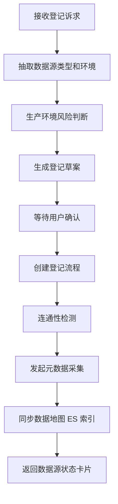

# 数据源 SubAgent 功能设计

## 1. 子 Agent 定位

数据源 SubAgent 负责数据源登记、连接检测、元数据采集任务发起和状态跟踪。它主要承接“新增数据源、检测数据源、采集元数据、查看数据源状态”等场景。

## 2. 职责边界

负责：

- 识别数据源登记诉求。
- 预填数据源登记信息。
- 跟踪审批、连通性检测、元数据采集、数据地图同步状态。
- 生成下一步操作建议。

不负责：

- 保存明文连接密码。
- 绕过审批直接登记生产数据源。
- 直接修改底层数据库。

## 3. 典型用户问题

待补充：

```text
帮我登记一个生产 MySQL 数据源。
这个 Oracle 数据源连通性正常吗？
帮我采集这个数据源的表结构。
某个数据源为什么还没出现在数据地图里？
```

## 4. 触发意图

待补充：

| 意图编码 | 说明 | 示例 |
| --- | --- | --- |
| REGISTER_DATASOURCE | 登记数据源 | 新增生产 MySQL 数据源 |
| CHECK_DATASOURCE | 检测数据源 | 看下连接是否正常 |
| COLLECT_METADATA | 采集元数据 | 采集表结构 |
| QUERY_DATASOURCE_STATUS | 查询状态 | 为什么还没同步到数据地图 |

## 5. 必要槽位

待补充：

| 槽位 | 是否必填 | 说明 |
| --- | --- | --- |
| datasource_type | 是 | Oracle、MySQL、Hive、Kafka 等 |
| env | 是 | PRD、UAT、DEV |
| system_name | 否 | 所属业务系统 |
| owner | 否 | 负责人 |
| collect_now | 否 | 是否立即采集 |
| scan_security | 否 | 是否安全扫描 |

## 6. 依赖工具

待补充：

| 工具 | 用途 | 数据来源 |
| --- | --- | --- |
| open_datasource_register | 打开登记流程 | 数据源平台 |
| check_connectivity | 连通性检测 | 数据源平台 |
| create_collect_task | 创建元数据采集任务 | 元数据采集服务 |
| query_collect_status | 查询采集状态 | 采集任务服务 |
| sync_data_map_index | 同步数据地图索引 | Elasticsearch |

## 7. 执行流程



## 8. 输出结构

待补充：

```json
{
  "agent": "DATASOURCE_AGENT",
  "intent": "REGISTER_DATASOURCE",
  "task_id": "",
  "answer": "",
  "status": "",
  "need_confirm": true,
  "next_actions": []
}
```

## 9. 确认与风控

待补充：

- 生产数据源登记必须确认。
- 创建采集任务前需要确认采集范围。
- 密码、密钥、连接串敏感部分不得进入 LLM Prompt 和 Langfuse 明文。

## 10. Demo 范围

待补充：

- 生成数据源登记草案。
- Mock 连通性检测成功。
- Mock 元数据采集完成并同步到 ES。

