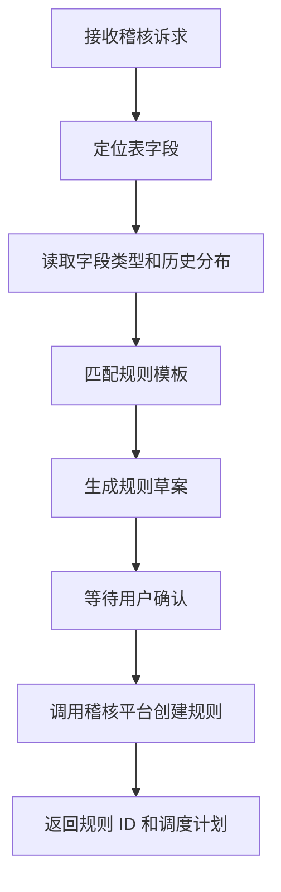

# 数据稽核 SubAgent 功能设计

## 1. 子 Agent 定位

数据稽核 SubAgent 负责数据质量规则推荐、规则草案生成、稽核配置和结果解释。它主要承接“配置非空、唯一性、波动、及时性、码值一致性”等质量场景。

## 2. 职责边界

负责：

- 识别质量规则诉求。
- 定位目标表、字段、指标。
- 根据字段类型、历史分布、标准要求推荐规则模板。
- 生成规则草案。
- 用户确认后调用稽核平台创建或发布规则。

不负责：

- 未经确认直接发布规则。
- 直接修改调度系统。
- 代替业务负责人确认规则口径。

## 3. 典型用户问题

待补充：

```text
给客户收入表配置每日金额非空稽核。
收入金额波动超过 30% 告警。
帮我看下这张表最近稽核为什么失败。
手机号字段要不要配置格式校验？
```

## 4. 触发意图

待补充：

| 意图编码 | 说明 | 示例 |
| --- | --- | --- |
| DRAFT_QUALITY_RULE | 生成规则草案 | 配置每日非空稽核 |
| CREATE_QUALITY_RULE | 创建质量规则 | 确认创建 |
| QUERY_QUALITY_RESULT | 查询稽核结果 | 最近为什么失败 |
| EXPLAIN_QUALITY_ISSUE | 解释质量问题 | 波动原因是什么 |

## 5. 必要槽位

待补充：

| 槽位 | 是否必填 | 说明 |
| --- | --- | --- |
| table_name | 是 | 目标表 |
| column_name | 视规则而定 | 目标字段 |
| rule_type | 是 | 非空、唯一、波动、及时性、码值 |
| schedule | 否 | 每日、每小时、每周 |
| threshold | 否 | 阈值 |
| alert_receiver | 否 | 告警接收人 |

## 6. 依赖工具

待补充：

| 工具 | 用途 | 数据来源 |
| --- | --- | --- |
| get_asset_detail | 查询表字段详情 | 元数据接口 |
| get_quality_templates | 查询规则模板 | 稽核平台 |
| query_quality_history | 查询历史稽核结果 | 稽核平台 |
| draft_quality_rule | 生成规则草案 | 规则服务 |
| publish_quality_rule | 发布规则 | 稽核平台 |

## 7. 执行流程



## 8. 输出结构

待补充：

```json
{
  "agent": "QUALITY_AGENT",
  "intent": "DRAFT_QUALITY_RULE",
  "answer": "",
  "rule_draft": {
    "table_name": "",
    "column_name": "",
    "rule_type": "",
    "threshold": "",
    "schedule": ""
  },
  "need_confirm": true
}
```

## 9. 确认与风控

待补充：

- 生成草案不需要确认。
- 创建、发布、修改、停用规则必须确认。
- 涉及告警接收人、调度频率、生产表扫描范围时需要二次确认。

## 10. Demo 范围

待补充：

- 支持“给客户收入表配置每日金额非空稽核”。
- 返回规则草案和确认动作。

