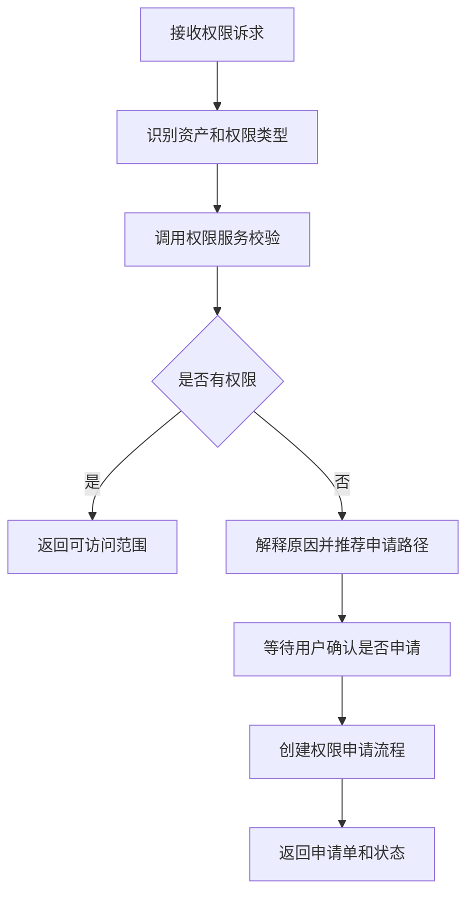

# 数据权限 SubAgent 功能设计

## 1. 子 Agent 定位

数据权限 SubAgent 负责数据资产访问权限判断、权限申请建议、敏感字段可见性控制和风险提示。它是数据资产助手中重要的安全边界组件。

## 2. 职责边界

负责：

- 判断当前用户是否可查看资产、字段、样例数据、血缘详情。
- 解释无权限原因。
- 推荐权限申请路径。
- 对敏感字段和高安全等级资产做提示。

不负责：

- 绕过权限直接返回敏感数据。
- 代替审批人审批权限。
- 直接修改权限策略。

## 3. 典型用户问题

待补充：

```text
我能看这张表吗？
为什么我看不到手机号字段？
帮我申请客户收入表权限。
这个字段为什么只能脱敏展示？
```

## 4. 触发意图

待补充：

| 意图编码 | 说明 | 示例 |
| --- | --- | --- |
| CHECK_PERMISSION | 检查权限 | 我能看这张表吗 |
| EXPLAIN_PERMISSION | 解释权限限制 | 为什么看不到字段 |
| APPLY_PERMISSION | 发起权限申请 | 帮我申请权限 |
| MASKING_POLICY_QUERY | 查询脱敏策略 | 为什么脱敏展示 |

## 5. 必要槽位

待补充：

| 槽位 | 是否必填 | 说明 |
| --- | --- | --- |
| asset_id | 是 | 资产 ID |
| user_id | 是 | 用户 ID |
| org_id | 是 | 组织 |
| permission_type | 否 | 查表、字段、样例、下载、开发 |
| reason | 申请时必填 | 申请原因 |

## 6. 依赖工具

待补充：

| 工具 | 用途 | 数据来源 |
| --- | --- | --- |
| check_asset_permission | 检查资产权限 | 权限服务 |
| check_column_permission | 检查字段权限 | 权限服务 |
| query_masking_policy | 查询脱敏策略 | 安全策略服务 |
| create_permission_apply | 创建权限申请 | 权限申请流程 |
| query_permission_status | 查询申请状态 | 工作流平台 |

## 7. 执行流程



## 8. 输出结构

待补充：

```json
{
  "agent": "PERMISSION_AGENT",
  "intent": "CHECK_PERMISSION",
  "allowed": false,
  "visible_scope": [],
  "reason": "",
  "apply_suggestion": {},
  "need_confirm": false
}
```

## 9. 确认与风控

待补充：

- 权限检查不需要确认。
- 发起权限申请需要用户确认申请范围和原因。
- 敏感字段、样例数据、下载导出需要更严格的权限校验。

## 10. Demo 范围

待补充：

- Mock 当前用户可查看表名和普通字段。
- Mock 手机号字段只能脱敏展示。
- 返回权限申请建议。

