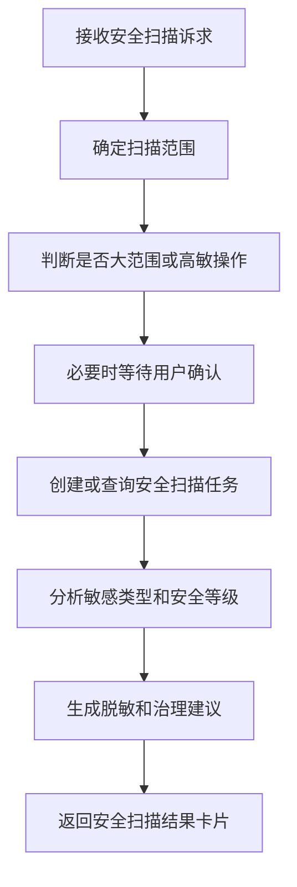

# 安全扫描 SubAgent 功能设计

## 1. 子 Agent 定位

安全扫描 SubAgent 负责敏感数据识别、安全等级识别、风险扫描和安全治理建议。它主要承接“扫描敏感字段、识别数据安全等级、解释风险、生成整改建议”等场景。

## 2. 职责边界

负责：

- 识别表、字段、样例统计中的敏感信息类型。
- 判断字段安全等级和脱敏要求。
- 查询或发起安全扫描任务。
- 输出风险说明和治理建议。

不负责：

- 直接展示生产敏感样例值。
- 绕过安全策略修改安全等级。
- 未确认直接发起大范围扫描。

## 3. 典型用户问题

待补充：

```text
帮我扫描这张表有没有敏感字段。
客户手机号字段应该是什么安全等级？
这个数据源接入后要不要安全扫描？
最近安全扫描发现了哪些高风险字段？
```

## 4. 触发意图

待补充：

| 意图编码 | 说明 | 示例 |
| --- | --- | --- |
| SCAN_SENSITIVE_DATA | 扫描敏感数据 | 扫描这张表 |
| CLASSIFY_SECURITY_LEVEL | 判断安全等级 | 手机号是什么等级 |
| QUERY_SCAN_RESULT | 查询扫描结果 | 最近有哪些高风险 |
| DRAFT_SECURITY_FIX | 生成整改建议 | 怎么治理这些字段 |

## 5. 必要槽位

待补充：

| 槽位 | 是否必填 | 说明 |
| --- | --- | --- |
| asset_id | 是 | 表、字段、数据源 ID |
| scan_scope | 是 | 表、字段、库、数据源 |
| scan_type | 否 | 敏感识别、等级识别、合规检查 |
| sample_allowed | 否 | 是否允许读取样例统计 |

## 6. 依赖工具

待补充：

| 工具 | 用途 | 数据来源 |
| --- | --- | --- |
| query_security_level | 查询安全等级 | 安全策略服务 |
| create_security_scan_task | 创建扫描任务 | 安全扫描平台 |
| query_security_scan_result | 查询扫描结果 | 安全扫描平台 |
| suggest_masking_policy | 推荐脱敏策略 | 安全策略服务 |
| submit_security_review | 提交安全治理审核 | 工作流平台 |

## 7. 执行流程



## 8. 输出结构

待补充：

```json
{
  "agent": "SECURITY_SCAN_AGENT",
  "intent": "SCAN_SENSITIVE_DATA",
  "answer": "",
  "risk_level": "",
  "sensitive_columns": [],
  "suggestions": [],
  "need_confirm": false
}
```

## 9. 确认与风控

待补充：

- 查询已有扫描结果不需要确认。
- 发起大范围扫描需要确认。
- 不允许把敏感样例值原文写入 Prompt、日志、Langfuse。

## 10. Demo 范围

待补充：

- Mock 识别手机号、身份证号、银行卡号字段。
- 返回安全等级和脱敏建议。

