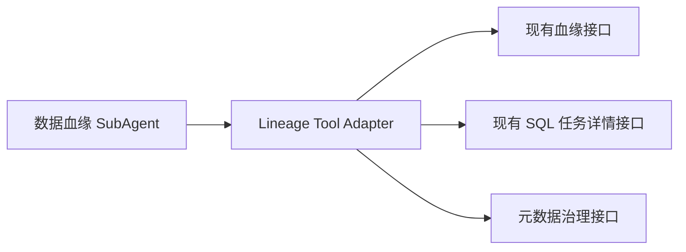
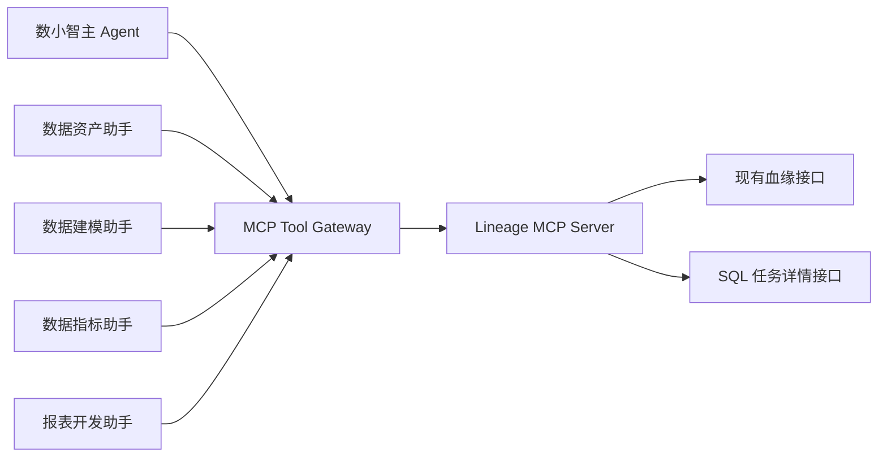
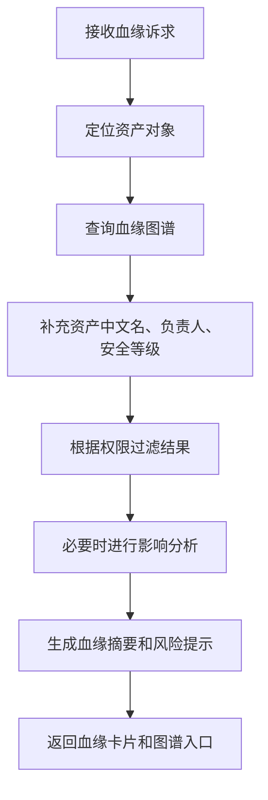
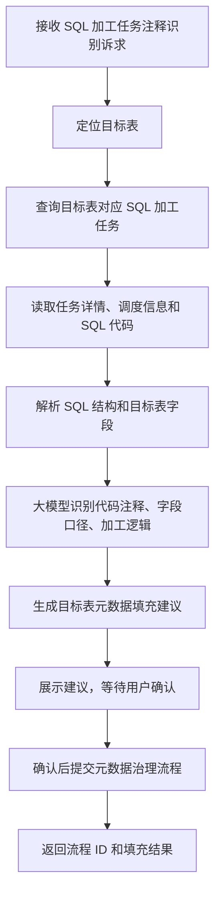

# 数据血缘 SubAgent 功能设计

## 1. 子 Agent 定位

数据血缘 SubAgent 负责表级、字段级、指标级和报表级血缘查询，以及变更影响分析。它还负责查看 SQL 加工任务信息，识别加工任务代码注释，并将可沉淀的注释信息整理为目标表元数据填充建议。它主要承接“上游是什么、下游影响谁、字段从哪里来、这张表由哪个 SQL 任务加工、任务注释能否补充到目标表”等场景。

## 2. 职责边界

负责：

- 查询表、字段、指标、报表血缘。
- 解释加工路径和上下游关系。
- 分析变更、下线、字段改名、口径调整的影响。
- 查看 SQL 加工任务信息，包括任务名称、任务 ID、调度周期、负责人、SQL 代码、目标表。
- 通过大模型识别 SQL 代码中的表级注释、字段注释、业务逻辑注释、口径说明。
- 将加工任务注释转换为目标表中文名、字段备注、业务含义、加工逻辑说明等元数据填充建议。
- 输出血缘摘要、影响清单和风险提示。

不负责：

- 直接修改血缘关系。
- 直接下线资产。
- 代替负责人确认变更影响。
- 未经用户确认直接写回目标表元数据。

## 3. 典型用户问题

待补充：

```text
这张表上游是什么？
dwd_customer_income_df 下游影响哪些报表？
income_amt 字段是怎么加工出来的？
下线这张表会影响谁？
这张表是哪个 SQL 任务加工出来的？
帮我看一下加工任务里的注释，能不能补充到目标表备注里。
把 SQL 里的字段注释识别出来，填充到目标表元数据。
```

## 4. 触发意图

待补充：

| 意图编码 | 说明 | 示例 |
| --- | --- | --- |
| QUERY_LINEAGE | 查询血缘 | 上游是什么 |
| QUERY_COLUMN_LINEAGE | 查询字段血缘 | 字段怎么来的 |
| ANALYZE_IMPACT | 影响分析 | 下线影响谁 |
| EXPLAIN_LINEAGE_PATH | 解释路径 | 这两个表什么关系 |
| QUERY_SQL_TASK | 查看 SQL 加工任务 | 这张表由哪个任务加工 |
| EXTRACT_SQL_COMMENTS | 识别 SQL 注释 | 解析任务里的注释 |
| DRAFT_METADATA_FROM_SQL_COMMENTS | 生成目标表元数据填充建议 | 把注释补充到目标表 |

## 5. 必要槽位

待补充：

| 槽位 | 是否必填 | 说明 |
| --- | --- | --- |
| asset_id | 是 | 表、字段、指标、报表 ID |
| direction | 是 | upstream、downstream、both |
| depth | 否 | 查询深度 |
| object_type | 否 | table、column、metric、report |
| impact_action | 影响分析时必填 | 下线、改名、改类型、改口径 |
| task_id | 查看任务时选填 | SQL 加工任务 ID |
| target_table | 识别注释时必填 | 加工目标表 |
| sql_code | 识别注释时选填 | SQL 代码，由任务服务返回或用户提供 |

## 6. 依赖工具

现阶段建议先将现有血缘接口封装为数据血缘 SubAgent 的本地 Tool。待血缘能力稳定、多个专家助手复用需求明确后，再演进为 MCP Server。

```text
第一阶段：
数据血缘 SubAgent -> Lineage Tool Adapter -> 现有血缘接口

第二阶段：
数据血缘 SubAgent -> MCP Tool Gateway -> Lineage MCP Server -> 现有血缘接口
```

| 工具 | 用途 | 数据来源 |
| --- | --- | --- |
| search_asset | 定位资产 | 数据地图 ES |
| query_table_lineage | 表级血缘 | 血缘服务 |
| query_column_lineage | 字段级血缘 | 血缘服务 |
| query_metric_lineage | 指标血缘 | 血缘服务 |
| analyze_change_impact | 变更影响分析 | 血缘服务 + 元数据接口 |
| query_sql_task_by_target | 按目标表查询 SQL 加工任务 | 离线开发 / 调度平台 |
| get_sql_task_detail | 获取 SQL 任务详情和代码 | 离线开发 / 调度平台 |
| extract_comments_from_sql | 识别 SQL 注释和口径说明 | LLM + SQL 解析器 |
| draft_target_metadata_from_comments | 生成目标表元数据填充建议 | LLM + 元数据规则 |
| submit_metadata_comment_fill | 提交目标表备注填充 | 元数据治理服务 |

## 6.1 Tool 与 MCP 演进策略

血缘能力的完整演进不是 Tool 和 MCP 二选一，而是：

```text
现有血缘 Java API -> Lineage Tool Adapter -> 血缘分析 Skill -> Lineage MCP Server
```

其中：

```text
Tool 负责调用现有血缘接口和 SQL 任务接口。
Skill 负责沉淀血缘分析方法论、SQL 注释识别规则、元数据填充规则和回答模板。
MCP 负责在能力稳定后支撑多 Agent 复用。
```

### 6.1.1 第一阶段：本地 Tool Adapter

第一阶段优先封装本地 Tool Adapter，目标是快速验证血缘 Agent 的业务流程。



适合第一阶段封装为 Tool 的能力：

| Tool | 说明 |
| --- | --- |
| query_table_lineage | 调用现有表级血缘接口 |
| query_column_lineage | 调用现有字段级血缘接口 |
| query_upstream_lineage | 查询上游血缘 |
| query_downstream_lineage | 查询下游血缘 |
| analyze_change_impact | 调用现有影响分析接口 |
| query_sql_task_by_target | 根据目标表查询加工任务 |
| get_sql_task_detail | 查询 SQL 任务详情和代码 |
| extract_comments_from_sql | 使用大模型识别 SQL 注释 |

第一阶段重点验证：

1. 现有血缘接口入参是否能被自然语言稳定映射。
2. 血缘接口返回结构是否足够支撑答案解释。
3. SQL 加工任务和血缘节点能否关联。
4. 大模型识别 SQL 注释后，是否能稳定生成目标表元数据建议。
5. 需要展示给用户确认的字段有哪些。

### 6.1.2 第二阶段：沉淀统一工具协议

当本地 Tool 稳定后，沉淀统一工具协议，同时开始沉淀血缘分析 Skill。

```text
工具名称
入参结构
出参结构
错误码
trace_id / task_id / user_context
超时策略
脱敏策略
审计字段
```

血缘 Skill 可沉淀内容：

```text
血缘意图分类规则
上游 / 下游 / 字段级 / 指标级血缘判断规则
影响分析规则
SQL 注释识别规则
目标表备注填充规则
血缘结果回答模板
写回前确认规则
```

建议统一出参：

```json
{
  "success": true,
  "code": "OK",
  "message": "",
  "data": {},
  "trace_id": "",
  "source_system": "lineage_service"
}
```

### 6.1.3 第三阶段：升级为 Lineage MCP Server

当血缘能力需要被多个 Agent 复用时，再升级为 MCP：



适合 MCP 化的条件：

1. 数据资产助手、数据建模助手、数据指标助手、报表开发助手都需要复用血缘能力。
2. 工具入参、出参、错误码已经稳定。
3. 需要统一注册、统一鉴权、统一审计、统一观测。
4. 血缘工具需要独立部署和版本管理。

### 6.1.4 阶段结论

```text
先 Tool，后 MCP。

Tool 用于快速验证业务流程；
MCP 用于能力稳定后的平台化复用。
```

## 7. 执行流程



## 7.1 SQL 加工任务注释识别流程



## 8. 输出结构

待补充：

```json
{
  "agent": "LINEAGE_AGENT",
  "intent": "QUERY_LINEAGE",
  "answer": "",
  "lineage_summary": "",
  "sql_task": {
    "task_id": "",
    "task_name": "",
    "schedule": "",
    "owner": "",
    "target_table": ""
  },
  "metadata_comment_suggestions": [
    {
      "field_name": "",
      "suggested_comment": "",
      "source_comment": "",
      "confidence": 0.0
    }
  ],
  "nodes": [],
  "edges": [],
  "impact_list": [],
  "need_confirm": false
}
```

## 9. 确认与风控

待补充：

- 只读血缘查询不需要确认。
- 查看 SQL 加工任务信息不需要确认。
- 基于 SQL 注释生成元数据填充建议不需要确认。
- 将注释填充到目标表元数据或提交治理流程必须用户确认。
- 下线、变更、提交影响评审必须确认。
- 对无权限下游对象进行脱敏展示。

## 10. Demo 范围

待补充：

- 支持查询客户收入表下游报表。
- 支持字段级血缘摘要。
- 返回影响对象清单。
- 支持根据目标表 Mock 查询 SQL 加工任务。
- 支持识别 SQL 代码注释并生成目标表字段备注建议。
- 支持将建议提交给元数据治理流程。

## 11. 分阶段实施计划

| 阶段 | 目标 | 实施内容 | 产出 |
| --- | --- | --- | --- |
| 阶段 1：Tool 快速验证 | 跑通血缘查询和 SQL 注释识别 | 封装本地 Lineage Tool Adapter，对接现有血缘接口和 SQL 任务详情接口 | 可用的血缘 Agent Demo |
| 阶段 2：业务流程固化 | 固化用户问题到工具调用的映射 | 完善意图识别、槽位抽取、血缘解释、SQL 注释识别、目标表备注建议 | 稳定的血缘 Agent 流程 |
| 阶段 3：工具协议沉淀 | 为 MCP 化做准备 | 统一入参、出参、错误码、trace_id、审计字段、脱敏策略 | 血缘工具协议说明 |
| 阶段 4：MCP 化 | 支撑多 Agent 复用 | 建设 Lineage MCP Server，接入 MCP Tool Gateway | 可复用的血缘 MCP 能力 |
| 阶段 5：平台化运营 | 进入生产运营 | 接入 OpenTelemetry + Langfuse，配置告警、评测、工具版本管理 | 可观测、可评测、可演进的血缘工具体系 |
