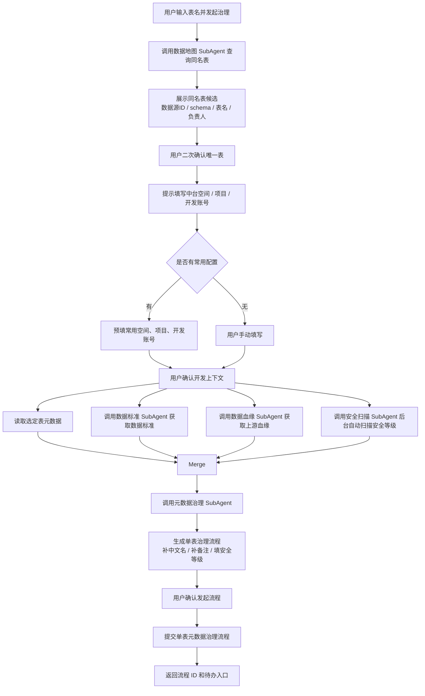

# 元数据治理 SubAgent 功能设计

## 1. 子 Agent 定位

元数据治理 SubAgent 负责单表元数据治理流程的生成与发起，包括补充中文名、补充备注、填写安全等级等治理动作。它通常不是独立完成全部上下文采集，而是由数据资产助手编排层先调用数据地图 SubAgent 完成同名表消歧，再收集用户的中台空间、项目、开发账号信息，然后调度数据标准、数据血缘、安全扫描等辅助子 Agent 获取治理上下文，最后由元数据治理 SubAgent 生成治理流程。

## 2. 职责边界

负责：

- 识别用户对某张表发起元数据治理的诉求。
- 在用户确认唯一表后，基于编排层传入的表信息、中台空间、项目、开发账号、数据标准、上游血缘、安全等级上下文生成单表治理流程。
- 生成补充中文名、补充备注、填写安全等级等治理任务。
- 用户确认后发起单表元数据治理流程。

不负责：

- 未经审核直接覆盖权威元数据。
- 代替负责人确认业务口径。
- 绕过元数据管理平台直接改库。

## 3. 典型用户问题

待补充：

```text
帮我治理 customer_income 这张表。
帮我对 dwd_customer_income_df 发起单表元数据治理。
把客户收入表的中文名、备注、安全等级补齐。
对这张表发起元数据治理流程。
```

## 4. 触发意图

待补充：

| 意图编码 | 说明 | 示例 |
| --- | --- | --- |
| START_TABLE_METADATA_GOVERNANCE | 发起单表元数据治理 | 治理 customer_income 这张表 |
| DISAMBIGUATE_TABLE | 同名表消歧 | 找到所有 customer_income 同名表 |
| COLLECT_DEV_CONTEXT | 收集中台空间、项目、开发账号 | 使用哪个空间和项目 |
| DRAFT_METADATA_GOVERNANCE | 生成治理流程草案 | 补齐中文名、备注、安全等级 |
| MATCH_DATA_STANDARD | 匹配数据标准 | 映射哪个标准 |
| SUBMIT_METADATA_REVIEW | 提交审核 | 确认提交 |

## 5. 必要槽位

待补充：

| 槽位 | 是否必填 | 说明 |
| --- | --- | --- |
| table_name | 是 | 用户自然语言填写的表名 |
| selected_asset_id | 二次确认后必填 | 用户唯一选定的表资产 ID |
| datasource_id | 二次确认后必填 | 数据源 ID |
| schema_name | 二次确认后必填 | Schema |
| workspace | 是 | 中台空间，可使用用户常用值 |
| project | 是 | 中台项目，可使用用户常用值 |
| dev_account | 是 | 开发账号，可使用用户常用值 |
| governance_type | 是 | 单表元数据治理 |
| evidence_required | 否 | 是否必须返回证据 |
| reviewer | 否 | 审核人 |

## 6. 依赖工具

待补充：

| 工具 | 用途 | 数据来源 |
| --- | --- | --- |
| search_same_name_tables | 查询同名表候选 | 数据地图 SubAgent / Elasticsearch |
| get_metadata_detail | 查询选定表当前元数据 | 元数据接口 |
| get_user_common_dev_context | 查询用户常用空间、项目、开发账号 | 用户偏好 / 会话记忆 |
| search_standards | 查询数据标准 | 数据标准 SubAgent |
| query_upstream_lineage | 查询当前表上游血缘 | 数据血缘 SubAgent |
| scan_security_level | 自动扫描安全等级 | 安全扫描 SubAgent |
| create_single_table_governance_flow | 生成单表治理流程 | 元数据治理服务 |
| submit_metadata_review | 提交治理审核 | 审核发布服务 |

## 6.1 依赖的辅助子 Agent

| 辅助子 Agent | 提供内容 | 用途 |
| --- | --- | --- |
| 数据地图 SubAgent | 同名表候选、数据源 ID、schema、表名、字段、负责人、主题域、资产状态 | 表名消歧、用户二次确认唯一表、读取当前元数据 |
| 数据标准 SubAgent | 候选标准、码值标准、标准定义、适用范围 | 生成字段标准映射和备注依据 |
| 数据血缘 SubAgent | 当前表上游血缘、来源表字段、加工逻辑 | 补充字段来源语境和治理证据 |
| 安全扫描 SubAgent | 后台自动扫描出的安全等级、敏感类型、脱敏策略 | 自动填写安全等级信息 |

## 7. 执行流程



## 8. 输出结构

待补充：

```json
{
  "agent": "METADATA_GOVERNANCE_AGENT",
  "intent": "START_TABLE_METADATA_GOVERNANCE",
  "answer": "",
  "selected_table": {
    "asset_id": "",
    "table_name": "",
    "datasource_id": "",
    "schema_name": ""
  },
  "dev_context": {
    "workspace": "",
    "project": "",
    "dev_account": ""
  },
  "governance_flow": {
    "flow_id": "",
    "tasks": [
      "补充中文名信息",
      "补充备注信息",
      "填写安全等级信息"
    ]
  },
  "evidence": {
    "standards": [],
    "upstream_lineage": [],
    "security_scan": []
  },
  "need_confirm": true
}
```

## 9. 确认与风控

待补充：

- 同名表候选必须展示给用户确认，只有用户二次确认后才能进入治理流程。
- 中台空间、项目、开发账号必须由用户确认；可根据历史使用记录预填常用值。
- 安全等级由后台自动扫描结果填充，不依赖用户手工判断。
- 发起单表元数据治理流程必须用户最终确认。
- 低置信度的中文名、备注、标准映射建议必须标记，不允许自动发布。

## 10. Demo 范围

待补充：

- 支持用户输入表名后查询同名表候选。
- 展示数据源 ID、schema、表名、负责人等信息供用户二次确认。
- 支持填写或预填中台空间、项目、开发账号。
- Mock 调用安全扫描、数据标准、数据血缘。
- 生成单表元数据治理流程，包含补中文名、补备注、填安全等级。
