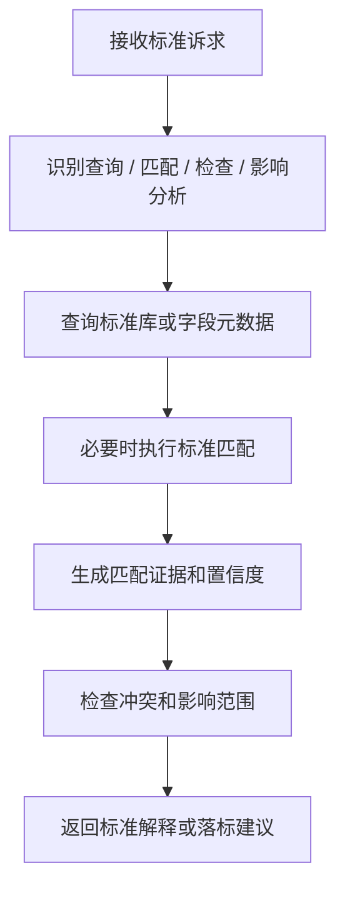

# 数据标准 SubAgent 功能设计

## 1. 子 Agent 定位

数据标准 SubAgent 负责数据标准查询、标准解释、字段与标准的映射建议、标准落标检查和标准变更影响提示。它主要承接“这个字段应该用哪个标准、某个标准定义是什么、哪些字段没有落标”等场景。

## 2. 职责边界

负责：

- 查询数据标准、业务术语、码值标准、命名规范。
- 为表字段推荐匹配的数据标准。
- 检查字段是否已落标、是否存在标准冲突。
- 解释标准定义、适用范围和口径。
- 生成标准落标建议，必要时提交审核。

不负责：

- 未经审核直接发布或废止数据标准。
- 代替标准负责人确认标准口径。
- 绕过元数据管理平台直接修改字段标准映射。

## 3. 典型用户问题

待补充：

```text
客户手机号字段应该映射哪个数据标准？
客户编号的标准定义是什么？
帮我检查这张表哪些字段没有落标。
这个码值标准有哪些取值？
这个标准变更会影响哪些字段？
```

## 4. 触发意图

待补充：

| 意图编码 | 说明 | 示例 |
| --- | --- | --- |
| SEARCH_DATA_STANDARD | 查询数据标准 | 客户编号标准是什么 |
| MATCH_DATA_STANDARD | 标准映射推荐 | 手机号字段映射哪个标准 |
| CHECK_STANDARD_MAPPING | 落标检查 | 哪些字段没有落标 |
| QUERY_CODE_STANDARD | 查询码值标准 | 状态码有哪些取值 |
| ANALYZE_STANDARD_IMPACT | 标准影响分析 | 标准变更影响哪些字段 |

## 5. 必要槽位

待补充：

| 槽位 | 是否必填 | 说明 |
| --- | --- | --- |
| keyword | 查询时必填 | 标准名称、字段名、业务术语 |
| asset_id | 落标检查时必填 | 表或字段 ID |
| standard_type | 否 | 基础标准、指标标准、码值标准、命名标准 |
| domain | 否 | 主题域 |
| confidence_threshold | 否 | 推荐匹配阈值 |

## 6. 依赖工具

待补充：

| 工具 | 用途 | 数据来源 |
| --- | --- | --- |
| search_standards | 查询数据标准 | 标准管理服务 |
| get_standard_detail | 查询标准详情 | 标准管理服务 |
| get_code_values | 查询码值取值 | 码值服务 |
| match_field_standard | 推荐字段标准映射 | 标准服务 + 元数据接口 |
| check_standard_mapping | 检查落标情况 | 元数据接口 |
| submit_standard_mapping_review | 提交标准映射审核 | 审核发布服务 |

## 7. 执行流程



## 8. 输出结构

待补充：

```json
{
  "agent": "DATA_STANDARD_AGENT",
  "intent": "MATCH_DATA_STANDARD",
  "answer": "",
  "standard_candidates": [
    {
      "standard_id": "",
      "standard_name": "",
      "standard_type": "",
      "confidence": 0.0,
      "evidence": []
    }
  ],
  "need_confirm": false
}
```

## 9. 确认与风控

待补充：

- 查询标准不需要确认。
- 提交标准映射、批量落标、修改标准状态必须确认。
- 低置信度匹配只能作为建议，不允许自动写回。

## 10. Demo 范围

待补充：

- 支持“客户手机号字段应该映射哪个数据标准？”
- 返回候选标准、推荐原因和置信度。
- 支持检查一张表的未落标字段。

