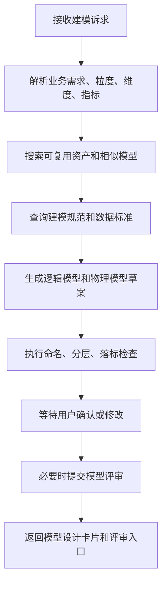

# 数据建模 SubAgent 功能设计

## 1. 子 Agent 定位

数据建模 SubAgent 负责主题域分析、概念模型、逻辑模型、物理模型、表结构设计建议和模型规范检查。它主要承接“怎么设计这张表、字段怎么命名、模型属于哪个主题域、维度事实怎么拆”等场景。

## 2. 职责边界

负责：

- 根据业务需求生成模型设计草案。
- 推荐主题域、实体、属性、主键、外键、分区、索引。
- 检查表命名、字段命名、分层规范、数据标准落标。
- 结合已有资产推荐复用表或避免重复建模。
- 生成模型评审材料和待确认清单。

不负责：

- 未经评审直接创建生产表。
- 代替数据架构师确认核心模型。
- 绕过开发和发布流程直接变更表结构。

## 3. 典型用户问题

待补充：

```text
帮我设计一张客户收入汇总表。
这个需求应该建宽表还是明细表？
这张表字段命名是否符合规范？
客户主题域下已有类似模型吗？
帮我生成逻辑模型和物理表结构草案。
```

## 4. 触发意图

待补充：

| 意图编码 | 说明 | 示例 |
| --- | --- | --- |
| DRAFT_DATA_MODEL | 生成模型草案 | 设计客户收入汇总表 |
| CHECK_MODEL_STANDARD | 模型规范检查 | 字段命名是否规范 |
| FIND_REUSABLE_MODEL | 查找可复用模型 | 有没有类似模型 |
| GENERATE_DDL_DRAFT | 生成 DDL 草案 | 生成物理表结构 |
| ANALYZE_MODEL_IMPACT | 模型影响分析 | 改字段会影响什么 |

## 5. 必要槽位

待补充：

| 槽位 | 是否必填 | 说明 |
| --- | --- | --- |
| business_requirement | 生成模型时必填 | 业务需求描述 |
| subject_domain | 否 | 主题域 |
| model_layer | 否 | ODS、DWD、DWS、ADS 等 |
| grain | 否 | 数据粒度 |
| metrics | 否 | 相关指标 |
| dimensions | 否 | 相关维度 |

## 6. 依赖工具

待补充：

| 工具 | 用途 | 数据来源 |
| --- | --- | --- |
| search_similar_assets | 查找类似模型 | 数据地图 ES |
| get_model_standards | 查询建模规范 | 标准/规范库 |
| get_subject_domain | 查询主题域 | 元数据接口 |
| match_data_standards | 字段标准匹配 | 数据标准服务 |
| draft_model_design | 生成模型草案 | LLM + 规则 |
| submit_model_review | 提交模型评审 | 审核发布服务 |

## 7. 执行流程



## 8. 输出结构

待补充：

```json
{
  "agent": "DATA_MODELING_AGENT",
  "intent": "DRAFT_DATA_MODEL",
  "answer": "",
  "model_draft": {
    "subject_domain": "",
    "model_layer": "",
    "table_name": "",
    "grain": "",
    "columns": []
  },
  "reuse_candidates": [],
  "need_confirm": true
}
```

## 9. 确认与风控

待补充：

- 生成模型草案不需要确认。
- 提交评审、生成建表任务、变更生产模型必须确认。
- 核心公共模型需要架构师或数据负责人审核。

## 10. Demo 范围

待补充：

- 支持“帮我设计一张客户收入汇总表”。
- 返回表名、粒度、字段清单、分区建议和标准映射建议。

