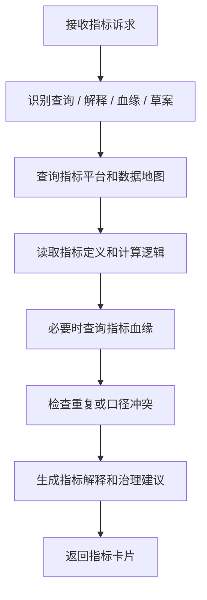

# 数据指标 SubAgent 功能设计

## 1. 子 Agent 定位

数据指标 SubAgent 负责指标查询、指标口径解释、指标血缘、指标映射、指标治理和指标开发建议。它主要承接“这个指标怎么算、指标在哪里、口径是否一致、指标影响哪些报表”等场景。

## 2. 职责边界

负责：

- 查询指标定义、业务口径、技术口径、统计周期、维度。
- 解释指标计算逻辑和来源表字段。
- 分析指标血缘和下游使用情况。
- 识别同名、近似、重复或冲突指标。
- 推荐指标标准化和治理建议。

不负责：

- 未经确认直接发布指标。
- 代替指标负责人确认口径。
- 绕过指标平台直接修改指标定义。

## 3. 典型用户问题

待补充：

```text
客户收入指标怎么算？
GMV 和成交金额是不是一个指标？
这个指标在哪些报表里用了？
帮我找月活用户指标的来源表。
这个新指标应该怎么定义？
```

## 4. 触发意图

待补充：

| 意图编码 | 说明 | 示例 |
| --- | --- | --- |
| QUERY_METRIC | 查询指标 | 客户收入指标怎么算 |
| EXPLAIN_METRIC | 解释指标口径 | GMV 是什么 |
| QUERY_METRIC_LINEAGE | 查询指标血缘 | 来源表是什么 |
| DETECT_METRIC_CONFLICT | 指标冲突识别 | 是否重复指标 |
| DRAFT_METRIC_DEFINITION | 生成指标草案 | 新指标怎么定义 |

## 5. 必要槽位

待补充：

| 槽位 | 是否必填 | 说明 |
| --- | --- | --- |
| metric_name | 查询时必填 | 指标名称 |
| business_domain | 否 | 业务域 |
| statistic_period | 否 | 日、月、季、年 |
| dimensions | 否 | 统计维度 |
| source_asset | 否 | 来源表、字段 |

## 6. 依赖工具

待补充：

| 工具 | 用途 | 数据来源 |
| --- | --- | --- |
| search_metrics | 查询指标 | 指标平台 / 数据地图 ES |
| get_metric_detail | 指标详情 | 指标平台 |
| query_metric_lineage | 指标血缘 | 血缘服务 |
| detect_metric_similarity | 重复指标识别 | 指标平台 + 向量/规则 |
| draft_metric_definition | 生成指标草案 | LLM + 指标规范 |
| submit_metric_review | 提交指标审核 | 审核发布服务 |

## 7. 执行流程



## 8. 输出结构

待补充：

```json
{
  "agent": "DATA_METRIC_AGENT",
  "intent": "QUERY_METRIC",
  "answer": "",
  "metric": {
    "metric_id": "",
    "metric_name": "",
    "business_definition": "",
    "technical_expression": "",
    "owner": ""
  },
  "lineage_summary": "",
  "need_confirm": false
}
```

## 9. 确认与风控

待补充：

- 指标查询和解释不需要确认。
- 新建、变更、废止指标必须确认并走审核。
- 对外部报表广泛使用的指标变更需要影响分析和负责人确认。

## 10. Demo 范围

待补充：

- 支持“客户收入指标怎么算？”
- 返回业务定义、技术口径、来源表字段和下游报表。
- 支持识别一个相似指标冲突示例。

