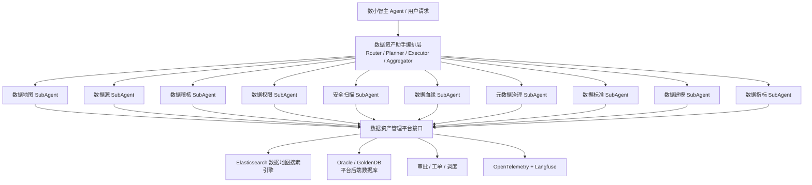

# 数据资产助手子 Agent 功能设计总览

## 1. 设计目的

本文档目录用于拆分数据资产助手内部的领域子 Agent，便于逐个梳理能力边界、触发意图、工具依赖、输入输出、确认点和后续实现优先级。

数据资产助手是数小智主 Agent 下的数据资产领域专家助手。数据资产助手内部再细分多个子 Agent，分别处理数据地图、数据源、数据稽核、数据权限、安全扫描、数据血缘、元数据治理、数据标准、数据建模、数据指标等专业任务。

## 2. 子 Agent 清单

| 子 Agent | 文档 | 主要职责 |
| --- | --- | --- |
| 数据地图 SubAgent | [01_数据地图SubAgent功能设计.md](01_数据地图SubAgent功能设计.md) | 资产搜索、表字段查询、数据地图结果解释 |
| 数据源 SubAgent | [02_数据源SubAgent功能设计.md](02_数据源SubAgent功能设计.md) | 数据源登记、连通性、采集任务、状态跟踪 |
| 数据稽核 SubAgent | [03_数据稽核SubAgent功能设计.md](03_数据稽核SubAgent功能设计.md) | 质量规则推荐、稽核配置、结果解释 |
| 数据权限 SubAgent | [04_数据权限SubAgent功能设计.md](04_数据权限SubAgent功能设计.md) | 权限判断、权限申请、敏感字段访问控制 |
| 安全扫描 SubAgent | [05_安全扫描SubAgent功能设计.md](05_安全扫描SubAgent功能设计.md) | 敏感数据识别、安全等级、风险扫描 |
| 数据血缘 SubAgent | [06_数据血缘SubAgent功能设计.md](06_数据血缘SubAgent功能设计.md) | 上下游查询、字段血缘、影响分析 |
| 元数据治理 SubAgent | [07_元数据治理SubAgent功能设计.md](07_元数据治理SubAgent功能设计.md) | 元数据补全、标准映射、治理审核 |
| 数据标准 SubAgent | [08_数据标准SubAgent功能设计.md](08_数据标准SubAgent功能设计.md) | 标准查询、标准映射、标准落标建议 |
| 数据建模 SubAgent | [09_数据建模SubAgent功能设计.md](09_数据建模SubAgent功能设计.md) | 主题域、逻辑模型、物理模型、表结构建议 |
| 数据指标 SubAgent | [10_数据指标SubAgent功能设计.md](10_数据指标SubAgent功能设计.md) | 指标定义、口径解释、指标血缘、指标治理 |

## 3. 数据资产助手内部编排关系

详细协同规则见：[子Agent协同编排关系.md](子Agent协同编排关系.md)。

## 4. 统一填写口径

每个子 Agent 文档建议按以下维度补充：

1. **职责边界**：这个子 Agent 负责什么，不负责什么。
2. **典型问题**：用户会怎么问。
3. **触发意图**：Router 如何识别并路由过来。
4. **必要槽位**：执行任务需要哪些参数。
5. **依赖工具**：调用哪些平台接口、搜索引擎、审批或调度服务。
6. **执行流程**：从用户问题到结果返回的步骤。
7. **输出结构**：返回自然语言、卡片、JSON、候选动作还是任务状态。
8. **确认与风控**：哪些操作必须用户确认，哪些要权限校验。
9. **观测指标**：需要记录哪些 trace、耗时、成功率和反馈。
10. **Demo 范围**：第一版先实现哪些能力。

## 5. 优先级建议

第一阶段建议优先做：

1. 数据地图 SubAgent：最容易出效果，能支持查表、查字段、查指标。
2. 数据血缘 SubAgent：能支撑影响分析和资产可信解释。
3. 数据稽核 SubAgent：能展示从问答走向“生成规则草案”的能力。
4. 数据权限 SubAgent：用于限制敏感字段和写操作风险。

第二阶段再扩展：

1. 数据源 SubAgent。
2. 安全扫描 SubAgent。
3. 元数据治理 SubAgent。
4. 数据标准 SubAgent。
5. 数据建模 SubAgent。
6. 数据指标 SubAgent。
