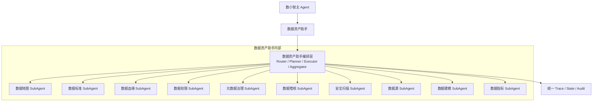
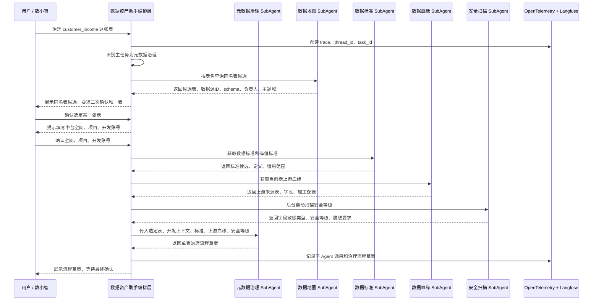

# 子 Agent 协同编排关系

## 1. 设计原则

数据资产助手内部允许多个子 Agent 协同完成一个任务，但不建议子 Agent 之间直接强耦合调用。推荐由数据资产助手编排层统一调度。

```text
推荐：
数据资产助手编排层 -> 调用主任务子 Agent -> 按需调用辅助子 Agent -> 汇总结果

不推荐：
某个子 Agent 直接硬编码调用另一个子 Agent
```

这样可以保证：

1. 调用链可观测。
2. 权限校验统一。
3. 审计记录统一。
4. 避免循环调用。
5. LangGraph 状态可恢复。
6. 便于数小智主 Agent 做上层协同。

## 2. 分层关系



## 3. 协同调用模式

### 3.1 主从协同

一个子 Agent 是主任务 Agent，其他子 Agent 作为辅助证据来源。

```text
例：单表元数据治理
主任务 Agent：元数据治理 SubAgent
辅助 Agent：数据地图、数据标准、数据血缘、安全扫描
```

### 3.2 流水线协同

多个子 Agent 按固定顺序执行。

```text
例：建模到稽核
数据建模 -> 数据标准 -> 数据指标 -> 数据稽核 -> 数据权限
```

### 3.3 并行协同

多个只读子 Agent 并行查询，再由编排层汇总。

```text
例：下线影响分析
数据血缘：下游影响
数据地图：资产热度和使用情况
数据权限：负责人和可见范围
数据稽核：质量运行情况
安全扫描：敏感等级风险
```

## 4. 元数据治理协同示例

场景：

```text
用户：帮我治理 customer_income 这张表。
```

推荐编排：



## 5. 元数据治理输入上下文

编排层传给元数据治理 SubAgent 的上下文建议统一为：

```json
{
  "task_id": "",
  "thread_id": "",
  "user_context": {
    "user_id": "",
    "org_id": "",
    "role": "",
    "trace_id": ""
  },
  "asset_context": {
    "asset_id": "",
    "datasource_id": "",
    "schema_name": "",
    "table_name": "",
    "columns": []
  },
  "dev_context": {
    "workspace": "",
    "project": "",
    "dev_account": "",
    "from_user_preference": false
  },
  "standard_context": {
    "candidates": []
  },
  "lineage_context": {
    "upstream": [],
    "transform_logic": []
  },
  "security_context": {
    "sensitive_columns": [],
    "security_levels": []
  }
}
```

## 6. 元数据治理输出

```json
{
  "agent": "METADATA_GOVERNANCE_AGENT",
  "task_id": "",
  "selected_table": {
    "asset_id": "",
    "datasource_id": "",
    "schema_name": "",
    "table_name": ""
  },
  "dev_context": {
    "workspace": "",
    "project": "",
    "dev_account": ""
  },
  "flow": {
    "flow_type": "single_table_metadata_governance",
    "tasks": [
      "补充中文名信息",
      "补充备注信息",
      "填写安全等级信息"
    ]
  },
  "evidence": {
    "standards": [],
    "upstream_lineage": [],
    "security_scan": []
  },
  "need_confirm": true
}
```

## 7. 协同关系矩阵

| 主任务子 Agent | 常用辅助子 Agent | 协同目的 |
| --- | --- | --- |
| 数据地图 | 数据权限、数据血缘、数据指标、数据标准 | 搜索结果权限过滤、补充证据、解释口径 |
| 数据源 | 安全扫描、数据地图、元数据治理 | 接入后扫描、采集后同步 ES、补充元数据 |
| 数据稽核 | 数据地图、数据标准、数据血缘、数据权限 | 定位表字段、匹配规则要求、判断关键链路、校验配置权限 |
| 数据权限 | 数据地图、安全扫描 | 定位资产、判断敏感等级和脱敏策略 |
| 安全扫描 | 数据地图、数据权限、元数据治理 | 定位资产、校验扫描权限、生成治理建议 |
| 数据血缘 | 数据地图、数据指标、元数据治理 | 定位资产、解释指标链路、识别 SQL 加工任务注释并沉淀到目标表元数据 |
| 元数据治理 | 数据地图、数据标准、数据血缘、安全扫描 | 同名表消歧、获取标准、获取上游血缘、自动扫描安全等级 |
| 数据标准 | 数据地图、元数据治理、数据指标 | 查找落标对象、生成映射建议、关联指标标准 |
| 数据建模 | 数据地图、数据标准、数据指标、数据血缘 | 复用已有资产、字段落标、指标定义、影响分析 |
| 数据指标 | 数据地图、数据标准、数据血缘、数据权限 | 查询指标来源、匹配指标标准、分析下游使用、权限过滤 |

## 8. 编排控制规则

1. 子 Agent 默认不直接调用其他子 Agent，由编排层统一调度。
2. 每次协同调用必须携带 `thread_id`、`task_id`、`trace_id`。
3. 只读辅助调用可以并行执行。
4. 写操作必须进入确认节点。
5. 涉及同名表时，必须先展示数据源 ID、schema、表名、负责人等候选信息，由用户二次确认唯一表。
6. 中台空间、项目、开发账号必须由用户确认；允许使用用户历史常用配置预填。
7. 同一个任务内禁止子 Agent 形成循环调用。
8. 辅助子 Agent 只返回结构化证据，不直接生成最终用户答案。
9. 编排层负责最终答案生成、证据汇总和风险提示。
10. 现有平台接口优先先封装为本地 Tool Adapter；当多个 Agent 需要复用且工具协议稳定后，再升级为 MCP Server。
11. 当某个场景的判断逻辑、调用顺序、输出模板稳定后，沉淀为 Skill；Skill 负责方法论，Tool / MCP 负责真实接口调用。
