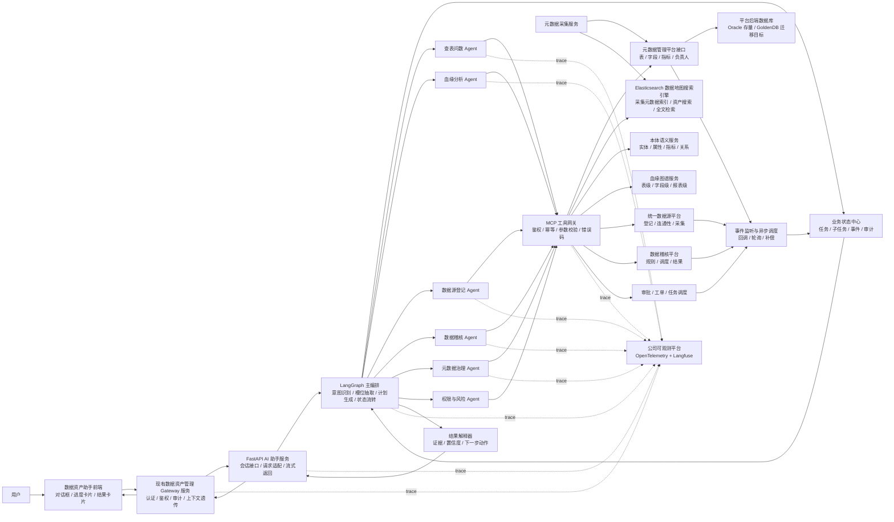
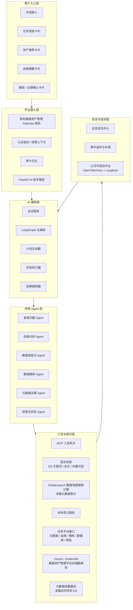
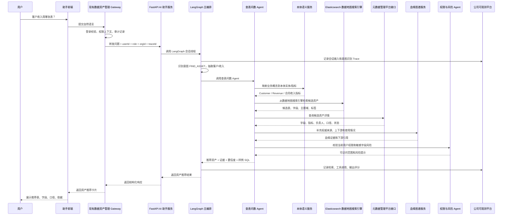
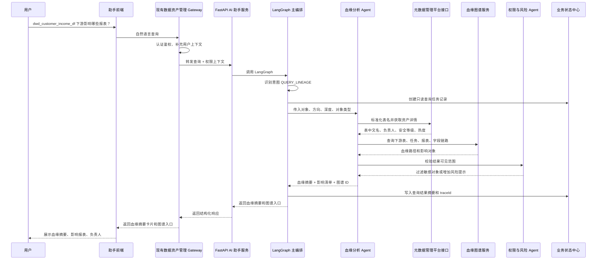
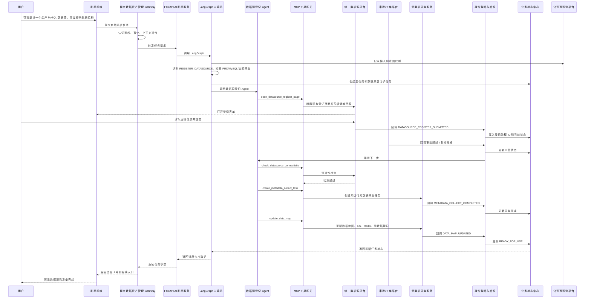
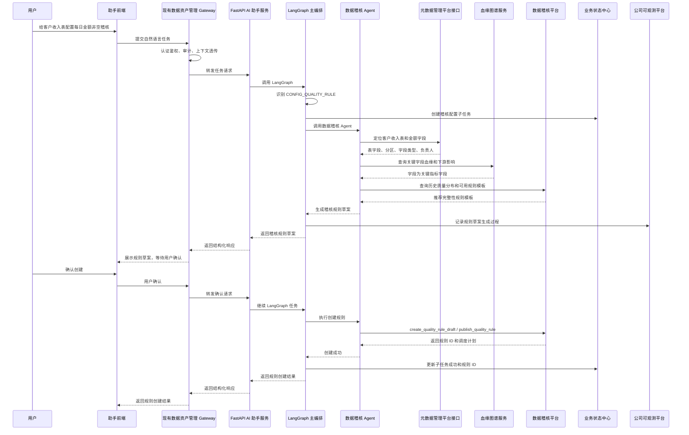
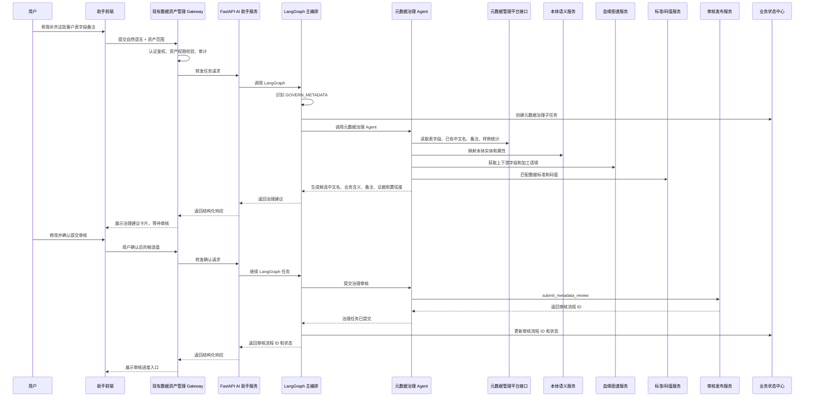
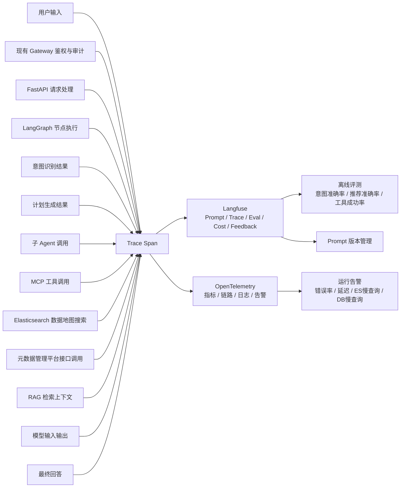

# 数据资产 Agent 助手数据流向图

## 1. 总体数据流

## 2. 组件分层

## 3. 自然语言查表数据流

适用于“客户收入用哪张表”“帮我找某指标口径”“某字段在哪张表”等只读场景。

## 4. 血缘查询数据流

适用于“这张表上游是什么”“这个字段影响哪些报表”“下线这张表影响谁”等场景。

## 5. 数据源登记长流程数据流

适用于“帮我登记一个生产 MySQL 数据源，同时采集元数据并安全扫描”等长流程场景。

## 6. 稽核配置数据流

适用于“给这张表配置每日非空稽核”“收入金额波动超过 30% 告警”等场景。

## 7. 元数据治理数据流

适用于“补齐这批字段备注”“识别重复资产”“把候选元数据提交审核”等场景。

## 8. 观测与评测数据流

公司可观测平台基于 OpenTelemetry 封装，并采用 Langfuse 做 AI 观测。它不参与业务决策，只负责旁路记录、排障、评测和优化。

## 9. 数据流控制原则

1. 查询类链路可以由主 Agent 自动执行，并直接返回结果。
2. 写操作链路先生成草案或计划，再由用户确认后执行。
3. 长流程任务必须进入业务状态中心，不能只依赖大模型上下文。
4. 前端统一调用现有数据资产管理 Gateway 服务，FastAPI AI 助手服务不直接对前端暴露。
5. Gateway 负责认证、鉴权、审计和用户/组织/角色上下文透传。
6. 工具调用统一经过 MCP 工具网关，不能让 Agent 直接访问业务系统。
7. Elasticsearch 是数据地图搜索引擎，元数据采集后同步进入 ES，用于提升资产搜索和全文检索速度。
8. Oracle 是数据资产管理平台当前后端数据库，GoldenDB 是信创迁移目标数据库，Agent 优先通过平台接口访问，不直接绕过平台读写库表。
9. Langfuse 和 OpenTelemetry 只做旁路观测，不保存敏感明文。
10. 血缘、元数据、稽核、数据源登记等平台仍是权威数据源。
11. Agent 输出要结构化保存，便于恢复、审计、评测和二次治理。
