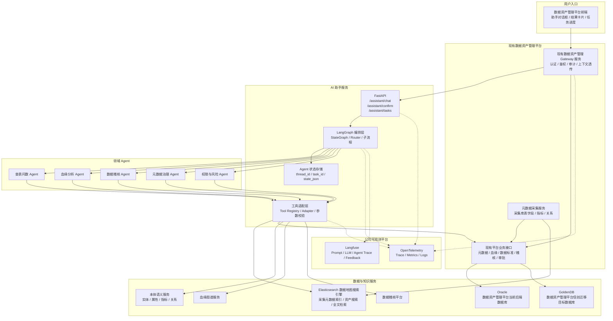
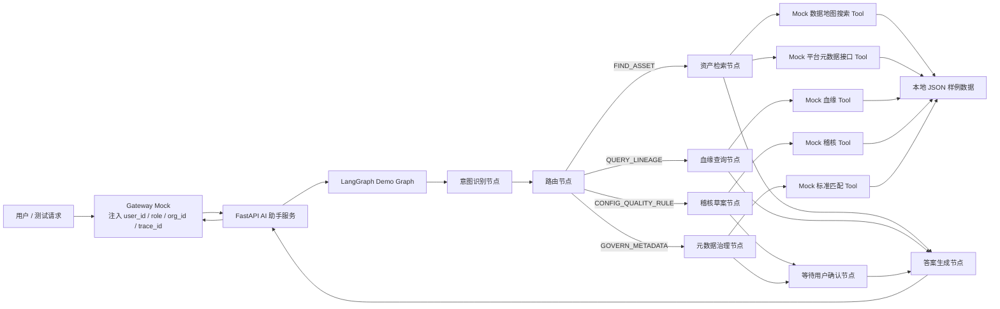
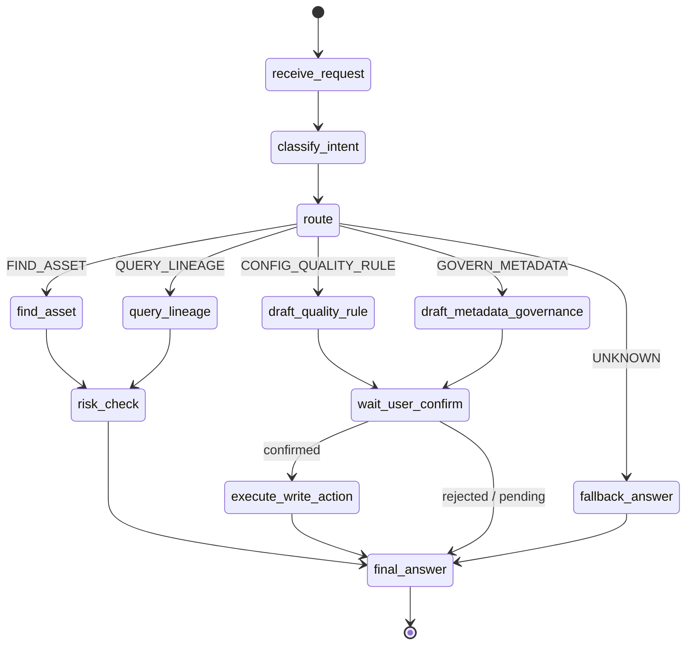
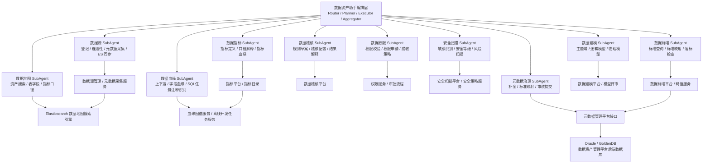
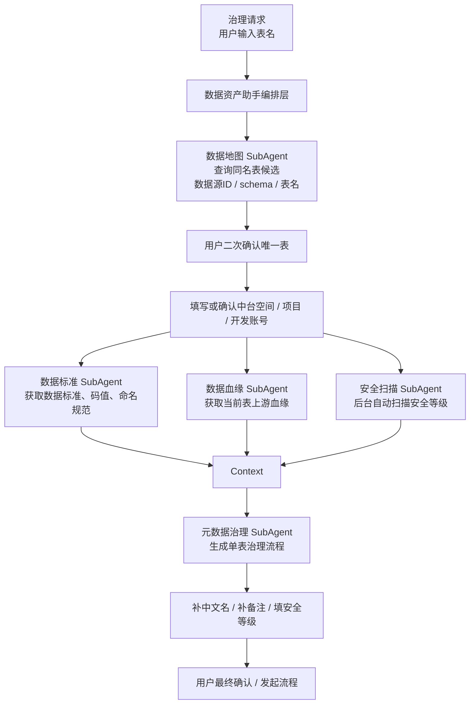
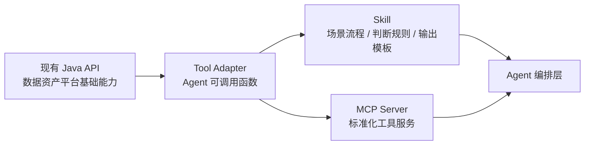
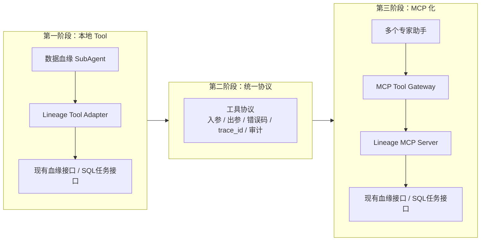

# 数据资产 Agent 助手系统技术架构图

## 1. Demo 建设目标

本 Demo 用于验证数据资产 Agent 助手的最小可行链路，不直接连接生产 Oracle、GoldenDB、Elasticsearch 和公司可观测平台，先用 Mock Adapter 模拟现有平台能力。

Demo 重点验证：

1. 前端请求统一经过现有数据资产管理 Gateway 服务。
2. Gateway 将用户身份、组织、角色、traceId 转发给 FastAPI AI 助手服务。
3. FastAPI 调用 LangGraph 完成意图识别、工具调用、结果生成。
4. 工具层模拟数据地图搜索、平台元数据接口、血缘、标准、稽核能力。
5. 观测层预留 OpenTelemetry + Langfuse 接入点。
6. 写操作先生成草案，必须经过用户确认后再执行。

## 2. 总体技术架构



## 3. Demo 运行时架构

Demo 阶段不依赖真实外部系统，采用 Mock 实现，方便本地快速跑通。



## 4. LangGraph 节点设计



## 4.1 数据资产助手内部子 Agent 架构



## 4.2 子 Agent 协同编排示例

以单表元数据治理为例，用户先通过自然语言填写表名。数据资产助手编排层需要先调用数据地图 SubAgent 查询同名表候选，展示数据源 ID、schema、表名等信息让用户二次确认唯一表；然后提示用户填写或确认中台空间、项目、开发账号；最后再调用数据标准、数据血缘、安全扫描等辅助子 Agent，把结构化上下文传给元数据治理 SubAgent 生成单表治理流程。



## 5. 后端模块划分

```text
data_asset_agent_demo/
  app/
    main.py                       # FastAPI 入口
    api/
      assistant.py                # /assistant/chat、/assistant/confirm
    core/
      config.py                   # 配置
      context.py                  # user_id、role、org_id、trace_id 上下文
      observability.py            # OpenTelemetry / Langfuse 接入点
    graph/
      state.py                    # LangGraph State 定义
      builder.py                  # StateGraph 构建
      nodes.py                    # 意图识别、路由、答案生成节点
    agents/
      data_map.py                 # 数据地图 SubAgent
      datasource.py               # 数据源 SubAgent
      quality.py                  # 数据稽核 SubAgent
      permission.py               # 数据权限 SubAgent
      security_scan.py            # 安全扫描 SubAgent
      lineage.py                  # 数据血缘 SubAgent
      governance.py               # 元数据治理 SubAgent
      standard.py                 # 数据标准 SubAgent
      modeling.py                 # 数据建模 SubAgent
      metric.py                   # 数据指标 SubAgent
    tools/
      registry.py                 # 工具注册
      es_data_map.py              # 数据地图搜索 Tool，Demo 阶段 Mock
      metadata_api.py             # 现有平台元数据接口 Tool，Demo 阶段 Mock
      lineage_tool.py             # 血缘 Tool，Demo 阶段 Mock
      quality_tool.py             # 稽核 Tool，Demo 阶段 Mock
      standard_tool.py            # 标准匹配 Tool，Demo 阶段 Mock
    data/
      assets.json                 # 表、字段、指标样例
      lineage.json                # 血缘样例
      standards.json              # 数据标准样例
      quality_rules.json          # 稽核规则模板样例
```

## 6. API 设计

### 6.1 对话接口

```http
POST /assistant/chat
```

请求示例：

```json
{
  "question": "客户收入用哪张表？",
  "session_id": "S_10001",
  "thread_id": "T_10001",
  "user_context": {
    "user_id": "u001",
    "org_id": "data_governance",
    "role": "data_steward",
    "trace_id": "trace-demo-001"
  }
}
```

响应示例：

```json
{
  "intent": "FIND_ASSET",
  "answer": "建议优先使用 dwd_customer_income_df。",
  "cards": [
    {
      "type": "asset_recommendation",
      "asset_id": "asset_001",
      "asset_name": "dwd_customer_income_df",
      "confidence": 0.91,
      "evidence": [
        "命中客户、收入两个业务概念",
        "该表为认证宽表",
        "下游 12 张报表引用"
      ]
    }
  ],
  "need_confirm": false,
  "trace_id": "trace-demo-001"
}
```

### 6.2 用户确认接口

```http
POST /assistant/confirm
```

用于稽核规则创建、元数据治理提交审核等写操作。

```json
{
  "thread_id": "T_10001",
  "task_id": "TASK_10001",
  "confirmed": true,
  "payload": {
    "action": "publish_quality_rule"
  }
}
```

## 7. Demo 优先实现范围

第一版 Demo 建议只实现 3 条链路：

1. **自然语言查表**
   - 问：“客户收入用哪张表？”
   - 调用 Mock 数据地图搜索 + Mock 平台元数据详情。
   - 返回资产推荐卡片。

2. **血缘查询**
   - 问：“dwd_customer_income_df 下游影响哪些报表？”
   - 调用 Mock 血缘数据。
   - 返回血缘摘要和影响清单。

3. **稽核规则草案**
   - 问：“给客户收入表配置每日金额非空稽核。”
   - 生成规则草案。
   - 返回 `need_confirm=true`，等待用户确认。

## 8. 生产化替换点

Demo 阶段使用 Mock Adapter，生产化时逐步替换为真实接口。

| Demo 模块 | 生产替换对象 |
| --- | --- |
| Gateway Mock | 现有数据资产管理 Gateway 服务 |
| Mock ES Tool | Elasticsearch 数据地图搜索索引 |
| Mock Metadata Tool | 现有数据资产管理平台元数据接口 |
| Mock Lineage Tool | 血缘图谱服务 |
| Mock Quality Tool | 数据稽核平台 |
| Mock Observability | 公司 OpenTelemetry + Langfuse 平台 |
| 本地 JSON 状态 | Redis / GoldenDB / 专用状态表 |

## 9. 技术栈确认

```text
Python 3.11+
FastAPI
LangGraph
LangChain Core
Pydantic
Uvicorn
Elasticsearch Python Client，生产接入数据地图搜索时使用
Oracle / GoldenDB Driver，通常由现有平台后端使用，AI 助手优先通过平台接口访问
OpenTelemetry SDK，生产接入时使用
Langfuse SDK，生产接入时使用
```

## 10. Java API、Tool、Skill、MCP 分层演进

详细说明见：[JavaAPI_Tool_Skill_MCP分层演进.md](JavaAPI_Tool_Skill_MCP分层演进.md)。

整体关系：

```text
现有 Java API 能力 = 基础业务能力层
Tool = Agent 调用 API 的轻量封装
Skill = Agent 使用 Tool 的方法论、规则和流程沉淀
MCP = Tool 能力成熟后的平台化、标准化、跨 Agent 复用
```



## 10.1 血缘能力 Tool 到 MCP 的分阶段演进



实施原则：

1. Demo 和早期落地阶段，先把现有接口封装成本地 Tool Adapter。
2. Tool 稳定后，沉淀血缘分析 Skill，包括意图分类、影响分析、SQL 注释识别和输出模板。
3. 同时沉淀统一入参、出参、错误码、审计和观测字段。
4. 当数据资产助手、数据建模助手、数据指标助手、报表开发助手都需要复用血缘能力时，再升级为 MCP Server。
