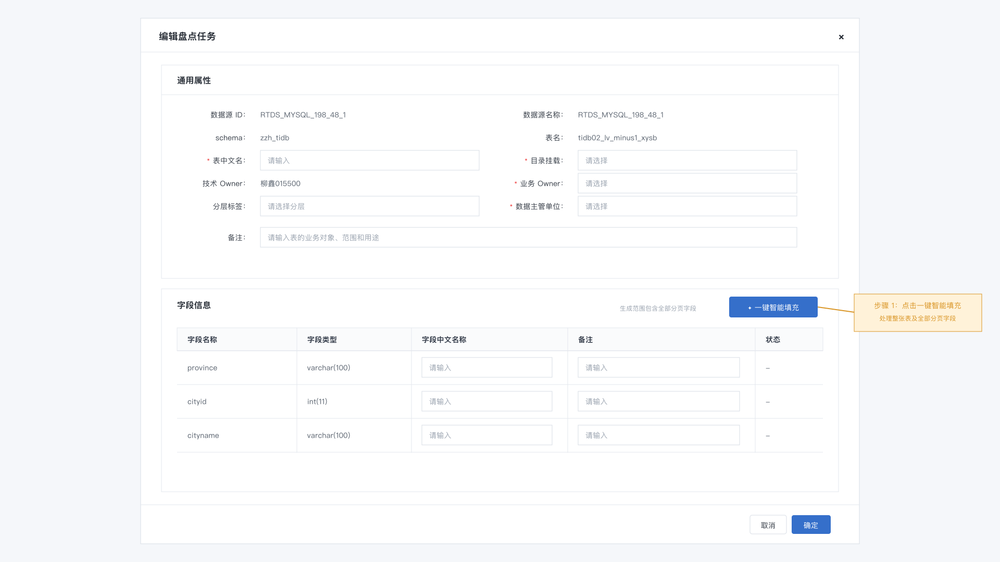
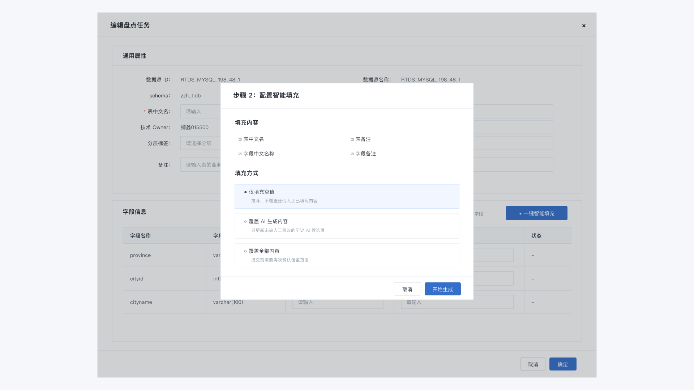
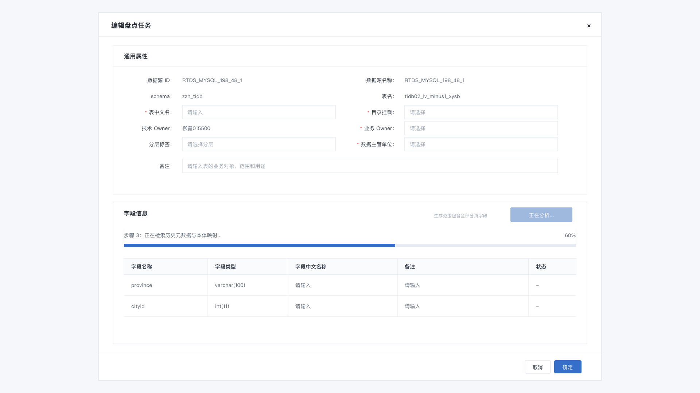
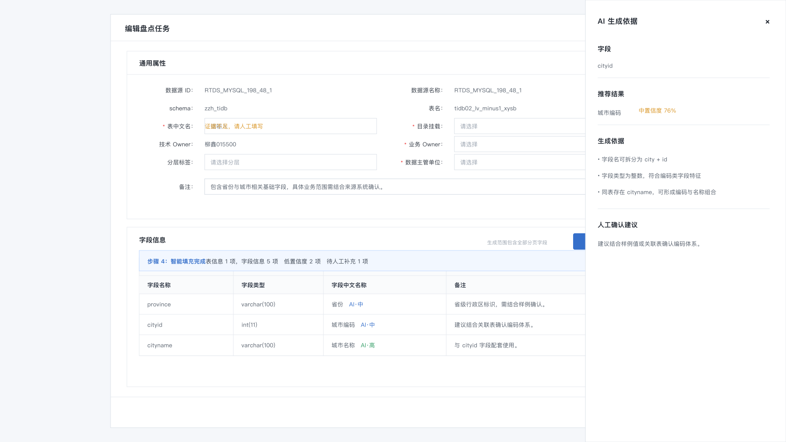

# 基于本体论的数据资产盘点与元数据自动补全设计方案

## 一、建设目标

本方案面向企业数据资产盘点、元数据治理和 AI 数据开发助手建设，目标是用本体论建立统一的业务语义模型，在盘点数据资产的同时，自动补全表、字段、指标、血缘、备注等元数据信息。

核心目标包括：

- 快速识别企业已有数据资产
- 将技术元数据映射到业务实体、属性和指标
- 自动补全字段中文名、字段说明、业务含义、备注信息
- 识别数据资产所属主题域、业务对象和使用场景
- 辅助生成数据目录、指标目录和数据资产说明
- 建立人审反馈闭环，让元数据越用越准

一句话概括：

> 用本体论做数据资产盘点的语义底座，用 AI 做元数据补全和解释生成，用人工审核保证最终可信。

## 二、适用范围

本方案适用于以下数据资产：

- 数据库、数据表、字段
- ODS、DWD、DWS、ADS 等数仓分层资产
- 指标、维度、标签、主题域
- 数据开发任务、调度任务、ETL 作业
- 报表、看板、数据服务 API
- 数据质量规则、权限规则、脱敏规则
- 业务文档、需求文档、口径说明、会议纪要

## 三、总体架构

整体架构可以分为六层：

```text
数据源接入层
  -> 元数据采集层
  -> 本体语义层
  -> AI 自动补全层
  -> 人工审核与治理层
  -> 数据资产服务层
```

### 1. 数据源接入层

接入企业内部各类数据源：

- 关系型数据库：MySQL、PostgreSQL、Oracle、SQL Server
- 大数据平台：Hive、Spark、Flink、湖仓平台
- BI 工具：报表、看板、数据集
- 调度平台：Airflow、DolphinScheduler、DataWorks 等
- 文档系统：需求文档、数据字典、指标口径文档
- 代码仓库：SQL 脚本、ETL 代码、数据服务代码

### 2. 元数据采集层

采集技术元数据、操作元数据和业务辅助信息：

- 库、表、字段、类型、注释、分区、索引
- 表大小、行数、更新时间、更新频率
- 调度任务、依赖关系、上下游血缘
- 查询热度、访问用户、引用报表
- 代码中的 SQL、Join 条件、过滤条件
- 已有字段注释、历史备注、业务文档

### 3. 本体语义层

基于本体论维护统一语义模型：

- 业务实体：客户、合同、项目、产品、组织、订单
- 业务属性：客户名称、客户编码、客户等级、所属区域
- 业务关系：客户签订合同、合同关联项目、项目产生收入
- 指标口径：收入、回款、合同额、客户数、项目数
- 规则约束：重点客户、有效客户、今年、财务确认口径
- 主题域：客户域、合同域、财务域、项目域、产品域

### 4. AI 自动补全层

AI 根据技术元数据、本体模型、业务文档和历史样例，自动生成或推荐：

- 表中文名
- 表业务说明
- 字段中文名
- 字段业务含义
- 字段备注
- 所属实体
- 所属属性
- 所属主题域
- 是否主键、外键、维度、度量、枚举、日期字段
- 敏感级别
- 推荐 Join 关系
- 可能的指标口径

### 5. 人工审核与治理层

AI 自动补全结果需要进入审核流程：

- 数据 Owner 审核
- 业务 Owner 审核
- 数据治理人员复核
- 冲突口径确认
- 敏感字段确认
- 发布到正式数据目录

### 6. 数据资产服务层

最终对外提供：

- 数据资产目录
- 元数据搜索
- 智能问数
- 数据开发助手
- 指标解释
- 血缘追溯
- 权限申请辅助
- 数据质量诊断

## 四、数据资产盘点流程

### 第一步：自动采集资产清单

从数据平台、数据库、调度系统和 BI 系统中自动采集数据资产。

采集对象包括：

- 数据库
- Schema
- 数据表
- 字段
- 分区
- 索引
- 视图
- 任务
- 报表
- 指标

输出结果：

```text
资产清单 = 技术元数据 + 操作元数据 + 使用热度 + 初始血缘
```

### 第二步：资产分层识别

根据命名规则、库表位置、调度链路和使用方式，识别数据资产所属层级。

常见分层：

| 层级 | 说明 |
|---|---|
| ODS | 原始接入层 |
| DWD | 明细数据层 |
| DWS | 汇总服务层 |
| ADS | 应用数据层 |
| DIM | 维度表 |
| FACT | 事实表 |
| APP | 应用结果表 |

识别依据：

- 表名前缀，例如 `ods_`、`dwd_`、`dws_`、`ads_`
- 库名或目录名
- 上下游血缘位置
- 是否被报表或服务直接使用
- 是否包含明细主键或汇总指标

### 第三步：主题域归类

用本体中的业务实体和主题域对资产进行归类。

示例：

```text
crm_customer -> 客户域 -> Customer
contract_info -> 合同域 -> Contract
finance_revenue -> 财务域 -> Revenue / Metric.contract_revenue
project_info -> 项目域 -> Project
```

归类策略：

- 表名、字段名关键词匹配
- 表注释和字段注释语义匹配
- 与已知实体的字段相似度匹配
- 与上下游表的主题域继承
- 与报表、指标、任务名称关联判断

### 第四步：字段语义映射

将物理字段映射到本体属性。

示例：

```text
crm_customer.cust_id -> Customer.customer_id -> 客户编码
crm_customer.cust_name -> Customer.customer_name -> 客户名称
contract.contract_amt -> Contract.signed_amount -> 签约金额
finance_revenue.confirmed_amt -> Metric.contract_revenue -> 合同收入
```

字段映射要记录置信度：

| 字段 | 推荐语义 | 置信度 | 依据 |
|---|---|---:|---|
| cust_id | 客户编码 | 0.96 | 字段名、Join 关系、已有注释 |
| amt | 金额 | 0.55 | 字段名过短，需要人工确认 |
| confirm_dt | 确认日期 | 0.88 | 字段名、指标时间口径 |

### 第五步：资产价值评估

对数据资产进行价值分级，帮助后续治理优先级排序。

评估维度：

- 使用热度：查询次数、引用任务数、引用报表数
- 业务重要性：是否支撑核心指标、管理报表、经营分析
- 权威性：是否为主数据、认证指标、标准模型
- 数据质量：完整性、准确性、及时性、一致性
- 血缘完整度：是否能追溯来源和下游
- 维护状态：是否长期无人维护、是否存在过期资产

资产分级示例：

| 等级 | 定义 | 治理策略 |
|---|---|---|
| A 类 | 核心高价值资产 | 优先补全、强审核、持续监控 |
| B 类 | 常用业务资产 | 标准补全、周期复核 |
| C 类 | 普通资产 | 自动补全、抽样审核 |
| D 类 | 低频或疑似废弃资产 | 标记观察、清理评估 |

## 五、元数据字段自动补全设计

### 1. 需要自动补全的字段

建议补全以下元数据字段：

| 元数据项 | 示例 | 补全方式 |
|---|---|---|
| 表中文名 | 客户主数据表 | AI 生成 + 本体映射 |
| 表业务说明 | 存储客户基础档案信息 | AI 生成 |
| 字段中文名 | 客户编码 | 本体映射优先 |
| 字段业务含义 | 客户在主数据系统中的唯一标识 | 本体属性说明 |
| 字段备注 | 用于关联合同、订单和收入数据 | AI 生成 |
| 所属主题域 | 客户域 | 本体分类 |
| 所属实体 | Customer | 本体映射 |
| 所属属性 | Customer.customer_id | 字段语义映射 |
| 字段角色 | 主键、外键、维度、度量、日期 | 规则 + AI 判断 |
| 枚举说明 | A=重点，B=普通 | 数据探查 + 文档抽取 |
| 敏感级别 | 内部、敏感、机密 | 规则 + AI 判断 |
| 推荐 Join | customer_id 关联客户表 | 血缘 + 字段相似 |
| 数据质量备注 | 近 30 天空值率 0.1% | 质量扫描 |

### 2. 自动补全输入

AI 补全时不能只看字段名，应综合以下上下文：

- 表名
- 表注释
- 字段名
- 字段类型
- 字段注释
- 字段样例值
- 枚举分布
- 是否主键、索引、分区
- 上下游血缘
- SQL 使用片段
- 关联字段和 Join 条件
- 所属库、所属层级
- 业务文档片段
- 本体实体、属性、指标和规则

### 3. 自动补全策略

建议采用“规则 + 检索 + 大模型 + 人审”的组合方式。

```text
字段名规则识别
  -> 本体语义匹配
  -> 历史元数据相似匹配
  -> 业务文档检索增强
  -> LLM 生成候选说明
  -> 置信度评分
  -> 人工审核发布
```

### 4. 补全优先级

优先补全高价值资产：

1. 核心指标来源表
2. 被管理报表引用的表
3. 高频查询表
4. 主数据表和维度表
5. 关键事实表
6. 下游依赖多的公共模型

低价值或疑似废弃资产可先自动标注，不进入强审核。

## 六、备注信息生成设计

备注信息要比字段中文名更有业务价值。建议分为三类备注。

### 1. 字段业务备注

说明字段在业务上的含义。

示例：

```text
字段：customer_level
备注：表示客户分层等级，可用于识别重点客户和客户经营分析。A 类客户通常视为重点客户。
```

### 2. 使用建议备注

说明开发时如何使用。

示例：

```text
字段：confirmed_revenue_amount
备注：用于计算合同收入，建议与 confirmed_date 一起使用。不建议用合同签约金额替代该字段。
```

### 3. 风险提示备注

说明口径、质量、权限或历史问题。

示例：

```text
字段：customer_name
备注：客户名称可能存在历史别名和简称，跨系统关联时建议优先使用 customer_id。
```

## 七、盘点处理确认页的一键智能填充产品设计

### 1. 现状与设计目标

当前技术 Owner 在盘点任务的“处理确认”弹窗中，需要手工填写：

- 表中文名
- 表备注
- 每个字段的字段中文名称
- 每个字段的备注

当单表字段较多或待盘点表较多时，重复录入成本高，且不同人员填写的命名和备注口径容易不一致。因此，在不改变现有“技术 Owner 处理确认 -> 后续审批”流程的前提下，增加“一键智能填充”能力，先生成候选内容，再由技术 Owner 确认或修改。

### 2. 页面入口与布局

在“字段信息”标题栏右侧增加主按钮：

```text
[一键智能填充]
```

按钮说明文案：

```text
根据表名、字段、历史元数据和业务语义生成表及字段的中文名称与备注。
```

点击后默认处理当前弹窗中的整张表，包括所有分页字段，而不只是当前页字段。字段较多时显示处理进度，例如“正在生成 18/126”。

建议同时在表中文名和表备注输入框尾部提供单项“智能生成”图标，供用户只重新生成某一个值。第一期优先实现整表一键填充，单项生成可作为后续增强。

#### 原型排版规则

一键智能填充相关页面统一遵循以下原型规范：

1. 表单标签统一使用固定宽度标签列，文字右对齐，冒号位于标签末尾，保证所有冒号在同一直线上。
2. 同一行输入框、选择框和值区域使用统一起始位置和统一高度；字段表格使用固定列宽，表头与每一行字段严格对齐。
3. 页面主容器、编辑弹窗、配置弹窗和结果摘要不使用大圆角；仅按钮等小型操作控件保留轻微圆角。
4. 每一个操作步骤单独输出一张原型图，不在一张图中混合展示多个交互状态。

#### 分步骤原型图

**步骤 1：进入盘点处理页并点击“一键智能填充”**



**步骤 2：选择填充内容和填充方式**



**步骤 3：展示智能分析与生成进度**



**步骤 4：查看生成结果、置信度和生成依据**



### 3. 一键填充范围

本功能只补充现有盘点页面已经要求维护的内容，不改变原有必填规则。

| 页面字段 | 是否填充 | 生成目标 | 建议长度 |
|---|---|---|---:|
| 表中文名 | 是 | 简洁、可识别的业务表名称 | 5～30 字 |
| 表备注 | 是 | 说明表存储的业务对象、数据范围和主要用途 | 20～150 字 |
| 字段中文名称 | 是 | 与字段真实业务含义一致的标准中文名称 | 2～20 字 |
| 字段备注 | 是 | 说明含义、取值、关联方式或使用限制 | 10～100 字 |

目录挂载、业务 Owner、数据主管单位、分层标签等治理责任字段不建议由 AI 直接写入。一期可以给出候选推荐，但仍由用户选择，避免组织责任和目录归属被错误自动确认。

### 4. 填充规则

点击按钮后弹出轻量配置框：

```text
填充内容：☑ 表中文名  ☑ 表备注  ☑ 字段中文名称  ☑ 字段备注
填充方式：● 仅填充空值  ○ 覆盖 AI 生成内容  ○ 覆盖全部内容
           [取消] [开始生成]
```

规则如下：

1. 默认选择“仅填充空值”，不覆盖任何人工已填写内容。
2. “覆盖 AI 生成内容”只更新上一次由 AI 生成且未被人工修改的值。
3. “覆盖全部内容”必须二次确认，并展示将被覆盖的字段数量。
4. 用户修改过 AI 候选值后，该值立即标记为“人工修改”，后续一键填充默认不覆盖。
5. 表内所有分页字段统一生成；生成完成后保留用户当前页码和滚动位置。
6. 字段中文名称仍按原页面规则校验必填；AI 无法判断时保留为空，并进入“待人工补充”清单。
7. 原始技术字段名、字段类型及其他采集元数据只读，不允许被一键填充修改。

### 5. 生成过程与结果反馈

按钮状态建议设计为：

```text
一键智能填充 -> 正在分析 -> 已生成候选 / 部分生成失败 / 生成失败
```

生成期间不锁定整个弹窗，用户可以继续填写 Owner、主管单位等其他内容；仅禁用重复触发按钮。用户关闭弹窗时，如果生成任务仍在执行或存在未保存结果，需要提示确认。

生成完成后，在弹窗顶部显示结果摘要：

```text
已生成：表信息 2 项，字段信息 36 项
待人工补充：4 项    低置信度：6 项    [只看待处理项]
```

每个 AI 填充值增加轻量标识：

- `AI`：内容由 AI 生成
- `高 / 中 / 低`：置信度等级
- `人工修改`：用户已修改候选内容
- `待补充`：证据不足，AI 未生成

点击置信度标识可查看生成依据，例如字段命名拆解、同类字段、原有注释、本体属性、样例值或上下游关系。默认不在表格中展开依据，避免挤占录入空间。

### 6. 置信度与人审策略

| 置信度 | 判定参考 | 页面处理 |
|---|---|---|
| 高 | 命中已审核本体属性或同源权威元数据，多个证据一致 | 自动写入候选值，普通 `AI` 标识 |
| 中 | 字段命名和上下文基本明确，但缺少权威映射 | 自动写入候选值，提示用户检查 |
| 低 | 仅凭缩写、样例值或弱相似关系推断 | 黄色提示，并计入“低置信度” |
| 无法判断 | 字段名过短、表名无业务含义、证据冲突 | 不填充，标记“待人工补充” |

例如截图中的表名 `tidb02_lv_minus1_xysb` 本身缺少明确业务语义。若系统也没有表注释、历史同名资产、SQL 血缘或业务文档证据，则不应强行生成表中文名和表备注；字段 `province`、`cityid`、`cityname` 可以生成候选，但仍需结合样例值和上下文判断其具体含义。

### 7. 备注生成规范

表备注优先采用以下结构：

```text
存储对象 + 数据范围/粒度 + 主要用途 + 必要风险提示
```

字段备注根据字段类型选择内容，不要求机械拼接全部要素：

```text
业务含义 + 取值或单位 + 关联方式 + 使用限制
```

备注不得生成以下内容：

- 无证据支撑的业务口径、枚举值和计算公式
- “顾名思义”“用于存储某字段”等无信息量描述
- 重复字段中文名但没有补充含义的文本
- 将推测内容表述为确定事实
- 样例数据中的手机号、证件号等敏感明文

### 8. 确认、保存与审批衔接

一键填充只产生当前盘点任务内的候选值，不直接发布为正式元数据。用户点击原有“确定”按钮时：

1. 校验表中文名、字段中文名称等原有必填项。
2. 若存在低置信度候选，提示“仍有 N 项低置信度内容，请确认后提交”，允许用户定位查看。
3. 若存在无法生成的必填项，阻止提交并定位到对应字段。
4. 保存 AI 原始候选、最终提交值、置信度、证据和修改人。
5. 按现有流程流转到后续审批节点，不新增独立审批环节。

后续审批页面需要支持查看“AI 候选值与技术 Owner 最终值”的差异，便于评估生成质量，但审批人只审批最终提交值。

### 9. 异常与降级处理

| 场景 | 页面处理 |
|---|---|
| 部分字段生成失败 | 保留成功结果，失败项标记“待补充”，支持“重试失败项” |
| 服务超时 | 提示任务仍在后台处理，允许稍后刷新结果 |
| 没有足够上下文 | 不生成猜测内容，并说明缺少的证据类型 |
| 用户已填写内容 | 默认跳过，并在结果摘要中显示“已跳过 N 项” |
| 生成期间用户修改同一字段 | 以人工输入为准，不用返回结果覆盖 |
| 网络或服务不可用 | 恢复手工填写，不影响原盘点流程提交 |

### 10. 操作审计与效果指标

每次生成需记录任务 ID、触发人、触发时间、输入元数据版本、模型或规则版本、AI 候选值、置信度、证据、人工最终值和审批结果。

产品上线后重点观察：

- 一键填充使用率
- 表中文名、字段中文名称、备注的生成覆盖率
- AI 候选直接采纳率
- 人工修改率和驳回率
- 单表平均处理时长下降比例
- 低置信度内容误采纳率
- 生成失败率和平均响应时间

第一期验收建议以“默认不覆盖人工内容、全字段可处理、部分失败可降级、操作全程可追溯”为底线，不以生成率替代准确率。

## 八、自动补全结果结构

建议每一次补全结果都保留证据和置信度，避免 AI 生成内容不可追溯。

```json
{
  "asset": "crm_customer.customer_level",
  "generated_metadata": {
    "chinese_name": "客户等级",
    "business_meaning": "表示客户分层等级。",
    "remark": "可用于客户分群、重点客户识别和经营分析。",
    "domain": "客户域",
    "entity": "Customer",
    "attribute": "Customer.customer_level",
    "field_role": "dimension",
    "sensitivity_level": "internal"
  },
  "confidence": 0.92,
  "evidence": [
    "字段名 customer_level 与本体属性 Customer.customer_level 匹配",
    "字段枚举值包含 A、B、C、D",
    "重点客户规则引用该字段"
  ],
  "status": "pending_review",
  "reviewer": "客户数据 Owner"
}
```

## 九、人审与反馈闭环

自动补全不能直接覆盖正式元数据，建议采用审核状态流转：

```text
待补全 -> AI 已推荐 -> 待审核 -> 已发布 -> 已过期 / 待复核
```

审核动作：

- 通过
- 修改后通过
- 驳回
- 标记为不确定
- 标记为废弃资产

反馈要回流模型：

- 审核通过的内容进入高质量样例库
- 被修改的内容进入纠错样例库
- 被驳回的内容进入负样本库
- 高频冲突字段进入治理专题

## 十、元数据补全质量控制

需要建立补全质量指标：

| 指标 | 含义 |
|---|---|
| 补全率 | 已补全字段数 / 总字段数 |
| 审核通过率 | 审核通过数 / AI 推荐数 |
| 人工修改率 | 修改后通过数 / AI 推荐数 |
| 驳回率 | 驳回数 / AI 推荐数 |
| 高置信命中率 | 高置信推荐被通过的比例 |
| 口径冲突数 | 同一概念出现多个不一致定义的数量 |
| 资产覆盖率 | 已盘点资产 / 总资产 |

质量策略：

- 高置信结果可批量审核
- 中置信结果逐条审核
- 低置信结果只做候选提示
- 敏感字段必须人工确认
- 指标口径必须业务 Owner 审核

## 十一、数据开发助手接入方式

数据开发助手可以在三个环节使用盘点和补全结果。

### 1. 开发前找资产

用户问：

```text
我要做客户收入分析，应该用哪些表？
```

助手返回：

- 推荐表
- 推荐字段
- 推荐 Join 路径
- 指标口径
- 数据质量情况
- 权限说明
- 样例 SQL

### 2. 开发中补字段

用户在建表或写 SQL 时，助手可自动补齐：

- 字段中文名
- 字段说明
- 字段备注
- 所属业务实体
- 敏感级别
- 质量规则

### 3. 开发后补文档

开发任务完成后，助手可自动生成：

- 表说明
- 字段说明
- 任务说明
- 上下游血缘说明
- 数据服务说明
- 指标口径说明
- 变更备注

## 十二、接口设计建议

### 1. 元数据补全接口

```text
POST /metadata/autocomplete
```

请求示例：

```json
{
  "table_name": "crm_customer",
  "table_comment": "客户信息表",
  "fields": [
    {
      "field_name": "cust_id",
      "data_type": "string",
      "comment": ""
    },
    {
      "field_name": "customer_level",
      "data_type": "string",
      "comment": ""
    }
  ],
  "context": {
    "source_system": "CRM",
    "database_layer": "DWD",
    "sample_values_enabled": true
  }
}
```

返回示例：

```json
{
  "table_metadata": {
    "chinese_name": "客户信息表",
    "business_description": "存储客户基础档案和分层信息。",
    "domain": "客户域",
    "entity": "Customer",
    "confidence": 0.94
  },
  "field_metadata": [
    {
      "field_name": "cust_id",
      "chinese_name": "客户编码",
      "business_meaning": "客户在主数据系统中的唯一标识。",
      "remark": "建议作为跨系统关联客户数据的主键。",
      "attribute": "Customer.customer_id",
      "field_role": "primary_key",
      "confidence": 0.96
    },
    {
      "field_name": "customer_level",
      "chinese_name": "客户等级",
      "business_meaning": "表示客户分层等级。",
      "remark": "可用于重点客户识别和客户分群分析。",
      "attribute": "Customer.customer_level",
      "field_role": "dimension",
      "confidence": 0.92
    }
  ]
}
```

### 2. 数据资产盘点接口

```text
POST /assets/inventory/run
```

功能：

- 触发指定数据源的数据资产盘点
- 采集技术元数据
- 识别主题域和本体实体
- 生成补全建议
- 输出待审核任务

### 3. 审核发布接口

```text
POST /metadata/review/publish
```

功能：

- 提交人工审核结果
- 发布正式元数据
- 回写样例库
- 更新本体映射关系

## 十三、落地路线图

### 第一阶段：盘得清

目标：

- 建立资产清单
- 采集技术元数据
- 完成基础分类

交付物：

- 数据资产清单
- 表字段清单
- 初始血缘关系
- 资产分层结果

### 第二阶段：补得准

目标：

- 自动补全字段中文名、说明和备注
- 建立本体映射
- 建立审核流程

交付物：

- 字段语义映射表
- 元数据补全结果
- 审核工作台
- 高质量样例库

### 第三阶段：用得好

目标：

- 接入数据开发助手
- 支持找表、找字段、找指标、生成样例 SQL
- 支持开发后自动生成数据文档

交付物：

- 数据开发助手
- 元数据搜索服务
- 指标解释服务
- SQL 推荐和校验能力

### 第四阶段：治得住

目标：

- 建立持续治理机制
- 发现口径冲突、废弃资产和质量问题
- 持续优化本体和补全模型

交付物：

- 数据资产健康评分
- 口径冲突报告
- 低价值资产清理清单
- 元数据质量看板

## 十四、关键风险与控制

| 风险 | 表现 | 控制措施 |
|---|---|---|
| AI 生成备注不准确 | 字段解释看似合理但业务错误 | 保留证据、置信度、人审 |
| 字段名过短或含义模糊 | `amt`、`flag`、`type` 难判断 | 结合样例值、SQL、血缘判断 |
| 口径冲突 | 同一指标多个定义 | 指标版本化、业务 Owner 审核 |
| 敏感字段误判 | 个人信息或财务数据未标敏 | 敏感词规则 + 人工确认 |
| 资产过多导致审核压力大 | 待审核任务堆积 | 按资产价值分级治理 |
| 本体维护不及时 | 新业务无法匹配 | 建立本体变更流程 |

## 十五、总结

基于本体论的数据资产盘点，不是简单整理表字段清单，而是把数据资产放入统一业务语义体系中进行理解、归类和治理。

元数据自动补全的关键，也不是让 AI 自由生成说明，而是让 AI 在本体、血缘、样例值、业务文档和历史审核结果的约束下生成有证据、有置信度、可审核的候选元数据。

最终形成的能力包括：

- 数据资产自动发现
- 主题域和业务实体自动归类
- 字段中文名和备注自动补全
- 指标口径和血缘自动关联
- 数据开发助手快速找数和用数
- 人审反馈驱动的持续治理闭环

这套机制可以显著降低数据资产盘点成本，提高元数据完整度，并为智能问数、自动开发、数据治理和 AI 应用建设提供可靠基础。
